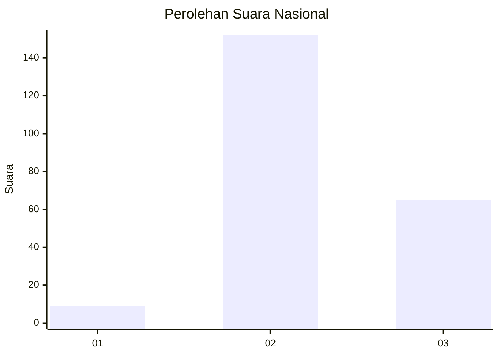

# Hasil

## Grafik

## Tabel

| No. | Nama Paslon    | Suara | Suara (raw) | Persentase |
|:--- |:-------------- | -----:| -----------:| ----------:|
| 1   | ANIES MUHAIMIN | 9     | [9][p-1]    | 3,98       |
| 2   | PRABOWO GIBRAN | 152   | [152][p-2]  | 67,26      |
| 3   | GANJAR MAHFUD  | 65    | [65][p-3]   | 28,76      |

[p-1]: https://github.com/gigit-pemilu/pemilu-2024/blob/main/pilpres/hitung-suara/sub/51-bali/sub/01-jembrana/sub/01-negara/sub/1006-baler-bale-agung/sub/005-tps/sub/paslon-1.txt
[p-2]: https://github.com/gigit-pemilu/pemilu-2024/blob/main/pilpres/hitung-suara/sub/51-bali/sub/01-jembrana/sub/01-negara/sub/1006-baler-bale-agung/sub/005-tps/sub/paslon-2.txt
[p-3]: https://github.com/gigit-pemilu/pemilu-2024/blob/main/pilpres/hitung-suara/sub/51-bali/sub/01-jembrana/sub/01-negara/sub/1006-baler-bale-agung/sub/005-tps/sub/paslon-3.txt

## Foto C Plano

https://sirekap-obj-formc.kpu.go.id/1f7c/pemilu/ppwp/51/01/01/10/06/5101011006005-20240214-141401--01cfb296-730a-4fc4-8773-6b9542b637c7.jpg

https://sirekap-obj-formc.kpu.go.id/1f7c/pemilu/ppwp/51/01/01/10/06/5101011006005-20240214-141910--720a9d26-c1c0-42a6-9087-849a833f08c3.jpg

https://sirekap-obj-formc.kpu.go.id/1f7c/pemilu/ppwp/51/01/01/10/06/5101011006005-20240214-141622--45ff2994-b1ee-4893-b655-c31201ef119f.jpg

## Metadata

| Key        | Value               |
| ---------- | ------------------- |
| Time Stamp | 2024-02-14 21:46:01 |

## DATA PEMILIH TETAP

Jumlah pemilih dalam DPT: **281**.
 * L: **134**.
 * P: **147**.

## DATA PENGGUNA HAK PILIH

Jumlah pengguna hak pilih dalam DPT: **230**.
 * L: **105**.
 * P: **125**.

Jumlah pengguna hak pilih dalam DPTb: **0**.
 * L: **0**.
 * P: **0**.

Jumlah pengguna hak pilih dalam DPK: **0**.
 * L: **0**.
 * P: **0**.

Jumlah pengguna hak pilih: **230**.
 * L: **105**.
 * P: **125**.

## JUMLAH SUARA SAH DAN TIDAK SAH

JUMLAH SELURUH SUARA SAH: **226**.

JUMLAH SUARA TIDAK SAH: **4**.

JUMLAH SELURUH SUARA SAH DAN SUARA TIDAK SAH: **230**.

