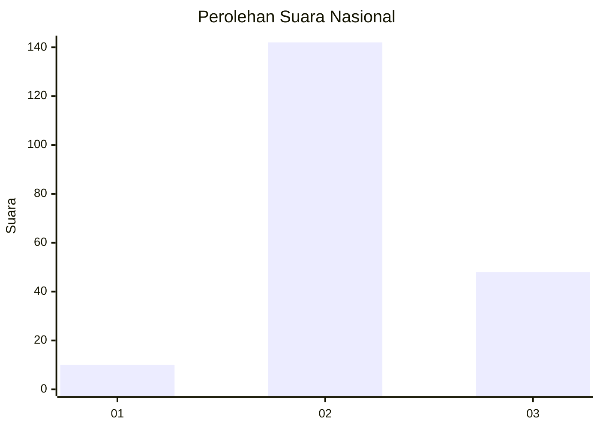
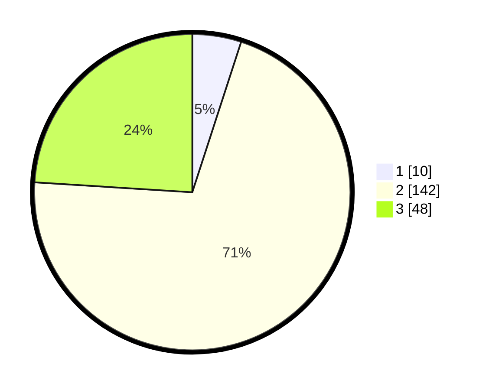

# Hasil

## Grafik

## Tabel

| No. | Nama Paslon    | Suara | Suara (raw) | Persentase |
|:--- |:-------------- | -----:| -----------:| ----------:|
| 1   | ANIES MUHAIMIN | 10    | [10][p-1]   | 5,00       |
| 2   | PRABOWO GIBRAN | 142   | [142][p-2]  | 71,00      |
| 3   | GANJAR MAHFUD  | 48    | [48][p-3]   | 24,00      |

[p-1]: https://github.com/gigit-pemilu/pemilu-2024/blob/main/pilpres/hitung-suara/sub/51-bali/sub/01-jembrana/sub/01-negara/sub/1006-baler-bale-agung/sub/009-tps/sub/paslon-1.txt
[p-2]: https://github.com/gigit-pemilu/pemilu-2024/blob/main/pilpres/hitung-suara/sub/51-bali/sub/01-jembrana/sub/01-negara/sub/1006-baler-bale-agung/sub/009-tps/sub/paslon-2.txt
[p-3]: https://github.com/gigit-pemilu/pemilu-2024/blob/main/pilpres/hitung-suara/sub/51-bali/sub/01-jembrana/sub/01-negara/sub/1006-baler-bale-agung/sub/009-tps/sub/paslon-3.txt

## Foto C Plano

https://sirekap-obj-formc.kpu.go.id/b535/pemilu/ppwp/51/01/01/10/06/5101011006009-20240214-141438--47292da8-d293-4bf5-b244-fabd2393cc78.jpg

https://sirekap-obj-formc.kpu.go.id/b535/pemilu/ppwp/51/01/01/10/06/5101011006009-20240214-141503--27db3ec4-f969-4485-9eba-2c3d98212b01.jpg

https://sirekap-obj-formc.kpu.go.id/b535/pemilu/ppwp/51/01/01/10/06/5101011006009-20240214-141510--72e8f535-eb46-4069-a593-39c5c54c8ab7.jpg

## Metadata

| Key        | Value               |
| ---------- | ------------------- |
| Time Stamp | 2024-02-14 21:46:01 |

## DATA PEMILIH TETAP

Jumlah pemilih dalam DPT: **280**.
 * L: **133**.
 * P: **147**.

## DATA PENGGUNA HAK PILIH

Jumlah pengguna hak pilih dalam DPT: **201**.
 * L: **93**.
 * P: **108**.

Jumlah pengguna hak pilih dalam DPTb: **0**.
 * L: **0**.
 * P: **0**.

Jumlah pengguna hak pilih dalam DPK: **2**.
 * L: **1**.
 * P: **1**.

Jumlah pengguna hak pilih: **203**.
 * L: **94**.
 * P: **109**.

## JUMLAH SUARA SAH DAN TIDAK SAH

JUMLAH SELURUH SUARA SAH: **200**.

JUMLAH SUARA TIDAK SAH: **3**.

JUMLAH SELURUH SUARA SAH DAN SUARA TIDAK SAH: **203**.

