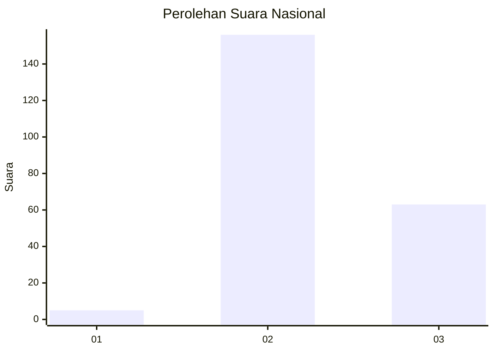
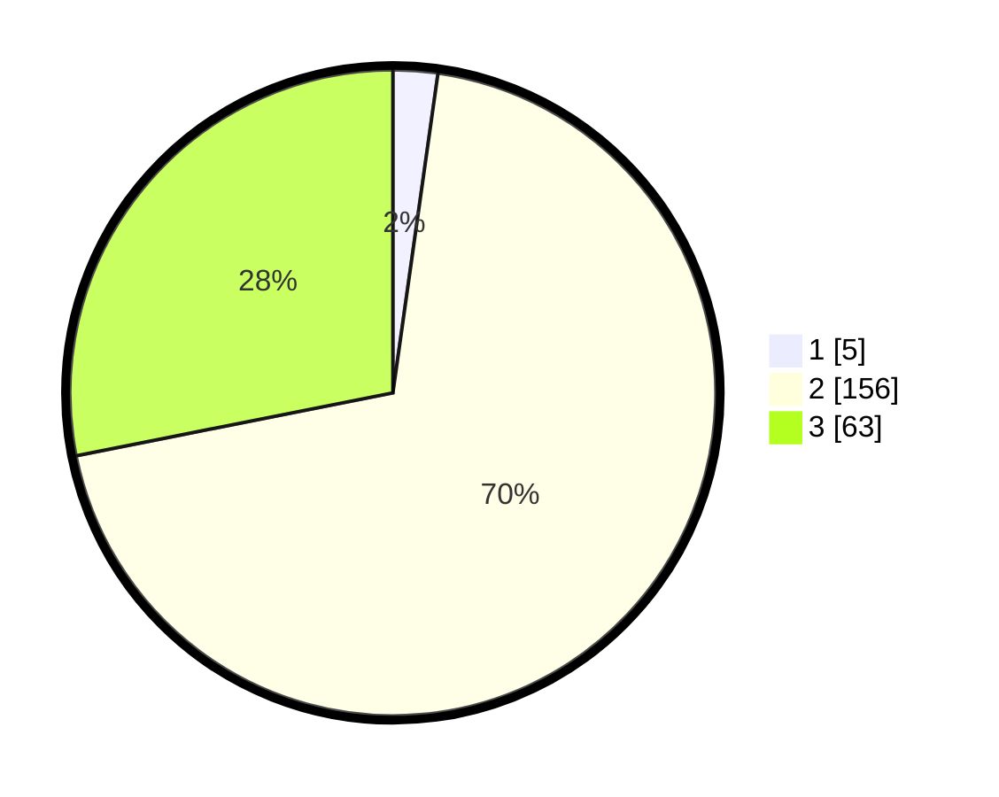

# Hasil

## Grafik

## Tabel

| No. | Nama Paslon    | Suara | Suara (raw) | Persentase |
|:--- |:-------------- | -----:| -----------:| ----------:|
| 1   | ANIES MUHAIMIN | 5     | [5][p-1]    | 2,23       |
| 2   | PRABOWO GIBRAN | 156   | [156][p-2]  | 69,64      |
| 3   | GANJAR MAHFUD  | 63    | [63][p-3]   | 28,13      |

[p-1]: https://github.com/gigit-pemilu/pemilu-2024/blob/main/pilpres/hitung-suara/sub/51-bali/sub/01-jembrana/sub/01-negara/sub/1006-baler-bale-agung/sub/011-tps/sub/paslon-1.txt
[p-2]: https://github.com/gigit-pemilu/pemilu-2024/blob/main/pilpres/hitung-suara/sub/51-bali/sub/01-jembrana/sub/01-negara/sub/1006-baler-bale-agung/sub/011-tps/sub/paslon-2.txt
[p-3]: https://github.com/gigit-pemilu/pemilu-2024/blob/main/pilpres/hitung-suara/sub/51-bali/sub/01-jembrana/sub/01-negara/sub/1006-baler-bale-agung/sub/011-tps/sub/paslon-3.txt

## Foto C Plano

https://sirekap-obj-formc.kpu.go.id/58b6/pemilu/ppwp/51/01/01/10/06/5101011006011-20240214-141136--a7be50a3-13b4-4306-b874-d0a57cfa2b87.jpg

https://sirekap-obj-formc.kpu.go.id/58b6/pemilu/ppwp/51/01/01/10/06/5101011006011-20240214-141209--ebc04919-9bd4-4618-b667-b678c6974661.jpg

https://sirekap-obj-formc.kpu.go.id/58b6/pemilu/ppwp/51/01/01/10/06/5101011006011-20240214-141243--462977b8-2022-4e21-83c7-98438c3d9ee6.jpg

## Metadata

| Key        | Value               |
| ---------- | ------------------- |
| Time Stamp | 2024-02-14 21:46:01 |

## DATA PEMILIH TETAP

Jumlah pemilih dalam DPT: **283**.
 * L: **136**.
 * P: **147**.

## DATA PENGGUNA HAK PILIH

Jumlah pengguna hak pilih dalam DPT: **222**.
 * L: **103**.
 * P: **119**.

Jumlah pengguna hak pilih dalam DPTb: **4**.
 * L: **2**.
 * P: **2**.

Jumlah pengguna hak pilih dalam DPK: **1**.
 * L: **1**.
 * P: **0**.

Jumlah pengguna hak pilih: **227**.
 * L: **106**.
 * P: **121**.

## JUMLAH SUARA SAH DAN TIDAK SAH

JUMLAH SELURUH SUARA SAH: **224**.

JUMLAH SUARA TIDAK SAH: **3**.

JUMLAH SELURUH SUARA SAH DAN SUARA TIDAK SAH: **227**.

