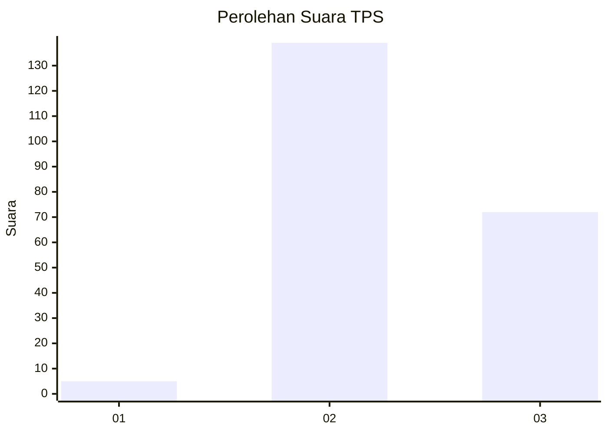
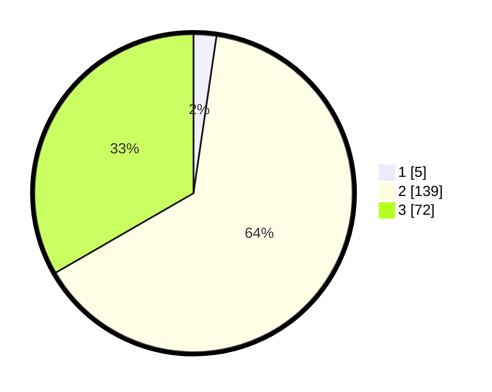

# Hasil

## Grafik

## Tabel

| No. | Nama Paslon    | Suara | Suara (raw) | Persentase |
|:--- |:-------------- | -----:| -----------:| ----------:|
| 1   | ANIES MUHAIMIN | 5     | [5][p-1]    | 2,31       |
| 2   | PRABOWO GIBRAN | 139   | [139][p-2]  | 64,35      |
| 3   | GANJAR MAHFUD  | 72    | [72][p-3]   | 33,33      |

[p-1]: https://github.com/gigit-pemilu/pemilu-2024-51-bali/blob/main/pilpres/hitung-suara/sub/51-bali/sub/01-jembrana/sub/01-negara/sub/1006-baler-bale-agung/sub/012-tps/sub/paslon-1.txt
[p-2]: https://github.com/gigit-pemilu/pemilu-2024-51-bali/blob/main/pilpres/hitung-suara/sub/51-bali/sub/01-jembrana/sub/01-negara/sub/1006-baler-bale-agung/sub/012-tps/sub/paslon-2.txt
[p-3]: https://github.com/gigit-pemilu/pemilu-2024-51-bali/blob/main/pilpres/hitung-suara/sub/51-bali/sub/01-jembrana/sub/01-negara/sub/1006-baler-bale-agung/sub/012-tps/sub/paslon-3.txt

## Foto C Plano

https://sirekap-obj-formc.kpu.go.id/f286/pemilu/ppwp/51/01/01/10/06/5101011006012-20240214-141046--14d0b771-139c-46d1-bca9-31297ed46130.jpg

https://sirekap-obj-formc.kpu.go.id/f286/pemilu/ppwp/51/01/01/10/06/5101011006012-20240214-141158--00d37039-4ade-4c25-82a8-0001b13445e4.jpg

https://sirekap-obj-formc.kpu.go.id/f286/pemilu/ppwp/51/01/01/10/06/5101011006012-20240214-141133--288e7963-8c1f-49b2-b52a-8a6315733ee9.jpg

## Metadata

| Key        | Value               |
| ---------- | ------------------- |
| Time Stamp | 2024-02-14 21:46:01 |

## DATA PEMILIH TETAP

Jumlah pemilih dalam DPT: **292**.
 * L: **147**.
 * P: **145**.

## DATA PENGGUNA HAK PILIH

Jumlah pengguna hak pilih dalam DPT: **215**.
 * L: **108**.
 * P: **107**.

Jumlah pengguna hak pilih dalam DPTb: **3**.
 * L: **1**.
 * P: **2**.

Jumlah pengguna hak pilih dalam DPK: **1**.
 * L: **1**.
 * P: **0**.

Jumlah pengguna hak pilih: **219**.
 * L: **110**.
 * P: **109**.

## JUMLAH SUARA SAH DAN TIDAK SAH

JUMLAH SELURUH SUARA SAH: **216**.

JUMLAH SUARA TIDAK SAH: **3**.

JUMLAH SELURUH SUARA SAH DAN SUARA TIDAK SAH: **219**.

