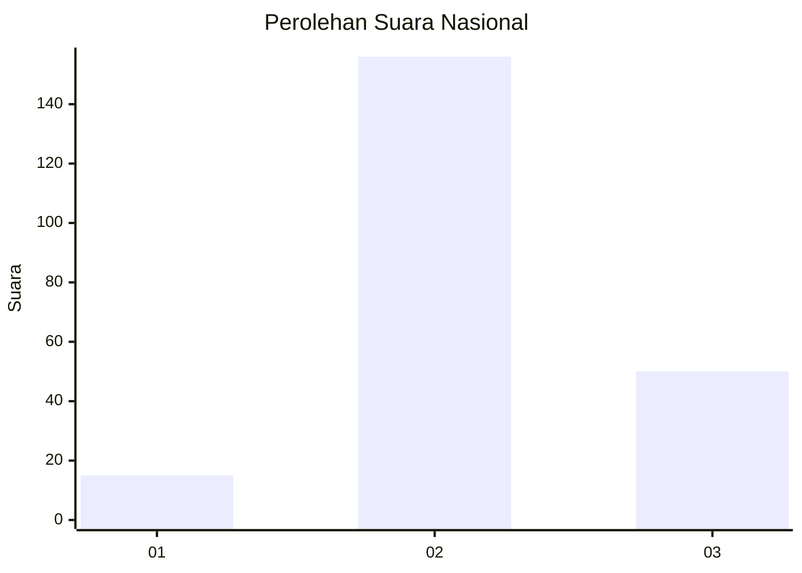
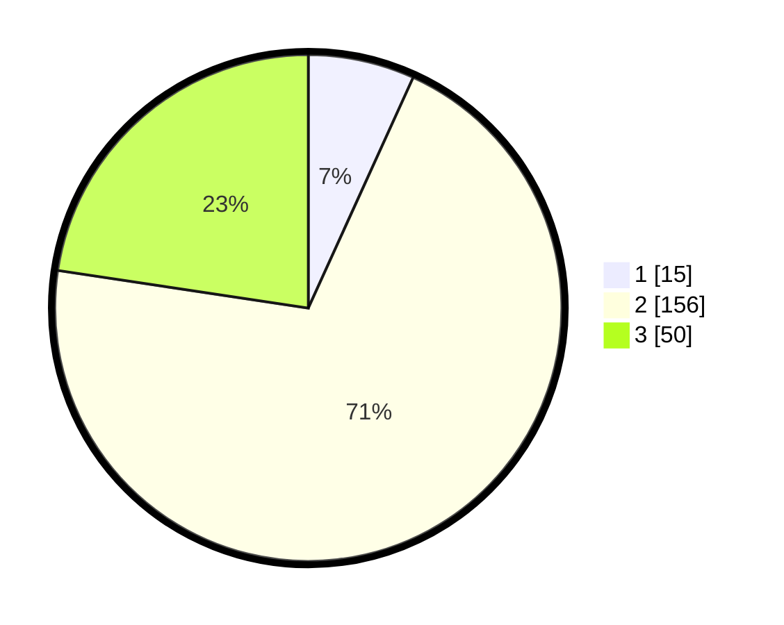

# Hasil

## Grafik

## Tabel

| No. | Nama Paslon    | Suara | Suara (raw) | Persentase |
|:--- |:-------------- | -----:| -----------:| ----------:|
| 1   | ANIES MUHAIMIN | 15    | [15][p-1]   | 6,79       |
| 2   | PRABOWO GIBRAN | 156   | [156][p-2]  | 70,59      |
| 3   | GANJAR MAHFUD  | 50    | [50][p-3]   | 22,62      |

[p-1]: https://github.com/gigit-pemilu/pemilu-2024/blob/main/pilpres/hitung-suara/sub/51-bali/sub/01-jembrana/sub/01-negara/sub/1006-baler-bale-agung/sub/015-tps/sub/paslon-1.txt
[p-2]: https://github.com/gigit-pemilu/pemilu-2024/blob/main/pilpres/hitung-suara/sub/51-bali/sub/01-jembrana/sub/01-negara/sub/1006-baler-bale-agung/sub/015-tps/sub/paslon-2.txt
[p-3]: https://github.com/gigit-pemilu/pemilu-2024/blob/main/pilpres/hitung-suara/sub/51-bali/sub/01-jembrana/sub/01-negara/sub/1006-baler-bale-agung/sub/015-tps/sub/paslon-3.txt

## Foto C Plano

https://sirekap-obj-formc.kpu.go.id/1658/pemilu/ppwp/51/01/01/10/06/5101011006015-20240214-231604--16f3722c-22e2-4008-96e9-e641847bddd7.jpg

https://sirekap-obj-formc.kpu.go.id/1658/pemilu/ppwp/51/01/01/10/06/5101011006015-20240214-231614--0854abc5-e1d2-40c8-bcf3-8a8e1aacfa6f.jpg

https://sirekap-obj-formc.kpu.go.id/1658/pemilu/ppwp/51/01/01/10/06/5101011006015-20240214-231619--af3bd2ac-96b5-4763-b5ec-96e15b5f5619.jpg

## Metadata

| Key        | Value               |
| ---------- | ------------------- |
| Time Stamp | 2024-02-15 12:00:28 |

