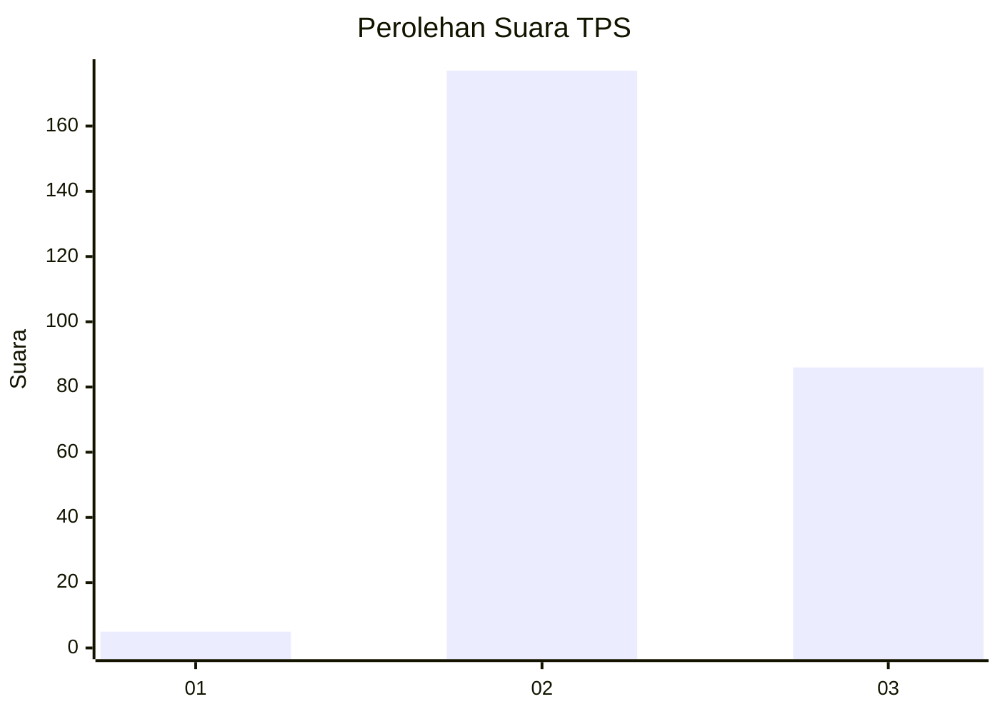
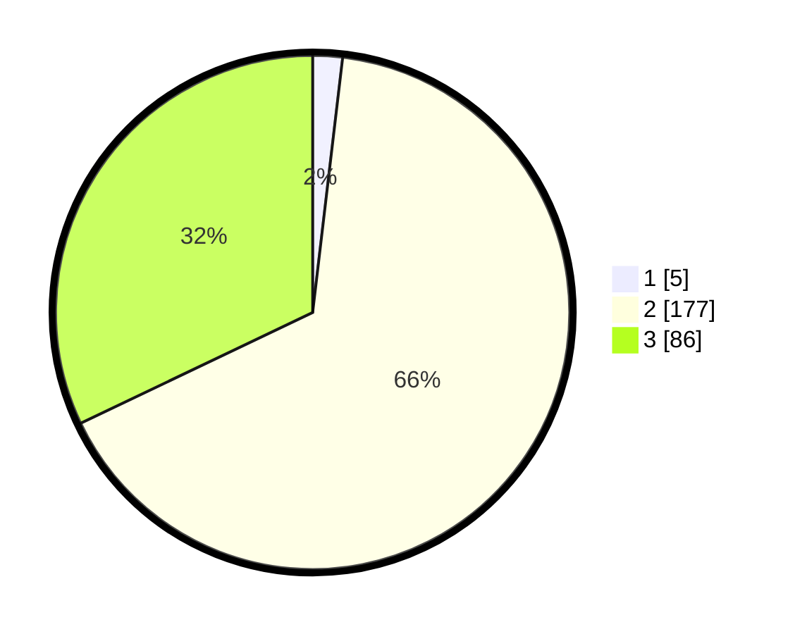

# Hasil

## Grafik

## Tabel

| No. | Nama Paslon    | Suara | Suara (raw) | Persentase |
|:--- |:-------------- | -----:| -----------:| ----------:|
| 1   | ANIES MUHAIMIN | 5     | [5][p-1]    | 1,87       |
| 2   | PRABOWO GIBRAN | 177   | [177][p-2]  | 66,04      |
| 3   | GANJAR MAHFUD  | 86    | [86][p-3]   | 32,09      |

[p-1]: https://github.com/gigit-pemilu/pemilu-2024-51-bali/blob/main/pilpres/hitung-suara/sub/51-bali/sub/01-jembrana/sub/01-negara/sub/1006-baler-bale-agung/sub/017-tps/sub/paslon-1.txt
[p-2]: https://github.com/gigit-pemilu/pemilu-2024-51-bali/blob/main/pilpres/hitung-suara/sub/51-bali/sub/01-jembrana/sub/01-negara/sub/1006-baler-bale-agung/sub/017-tps/sub/paslon-2.txt
[p-3]: https://github.com/gigit-pemilu/pemilu-2024-51-bali/blob/main/pilpres/hitung-suara/sub/51-bali/sub/01-jembrana/sub/01-negara/sub/1006-baler-bale-agung/sub/017-tps/sub/paslon-3.txt

## Foto C Plano

https://sirekap-obj-formc.kpu.go.id/915a/pemilu/ppwp/51/01/01/10/06/5101011006017-20240214-190422--93e3ca70-f5c6-437e-b0dd-69293ee61205.jpg

https://sirekap-obj-formc.kpu.go.id/915a/pemilu/ppwp/51/01/01/10/06/5101011006017-20240214-190434--fbd7b6af-1d50-4293-90d9-247a63e8628c.jpg

https://sirekap-obj-formc.kpu.go.id/915a/pemilu/ppwp/51/01/01/10/06/5101011006017-20240214-190442--f107f6c0-9c50-4f83-8a3c-bf70ddf2a0ee.jpg

## Metadata

| Key        | Value               |
| ---------- | ------------------- |
| Time Stamp | 2024-02-15 12:00:28 |

## DATA PEMILIH TETAP

Jumlah pemilih dalam DPT: **293**.
 * L: **147**.
 * P: **146**.

## DATA PENGGUNA HAK PILIH

Jumlah pengguna hak pilih dalam DPT: **266**.
 * L: **135**.
 * P: **131**.

Jumlah pengguna hak pilih dalam DPTb: **0**.
 * L: **0**.
 * P: **0**.

Jumlah pengguna hak pilih dalam DPK: **3**.
 * L: **2**.
 * P: **1**.

Jumlah pengguna hak pilih: **269**.
 * L: **137**.
 * P: **132**.

## JUMLAH SUARA SAH DAN TIDAK SAH

JUMLAH SELURUH SUARA SAH: **268**.

JUMLAH SUARA TIDAK SAH: **1**.

JUMLAH SELURUH SUARA SAH DAN SUARA TIDAK SAH: **269**.

