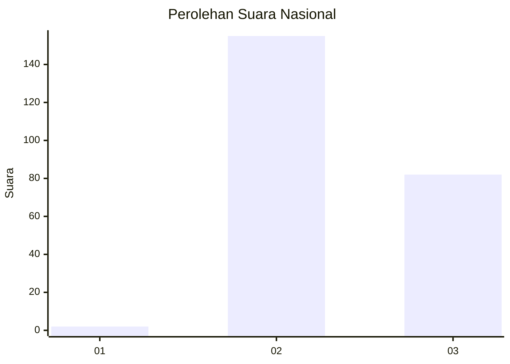
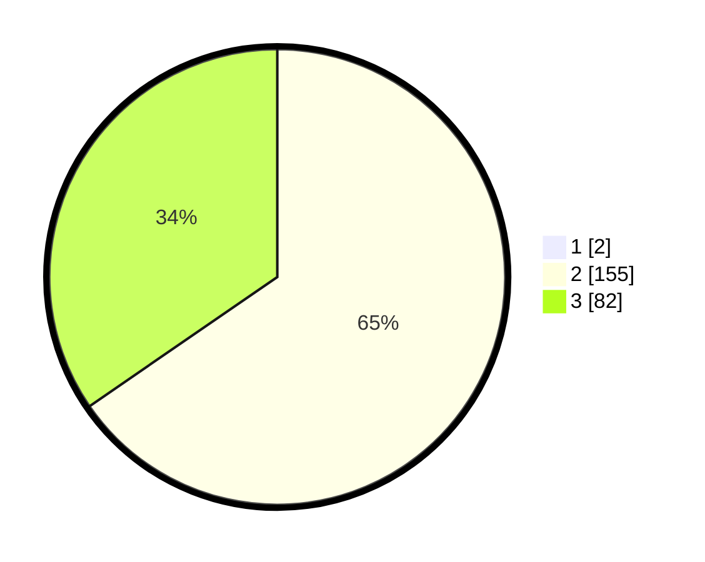

# Hasil

## Grafik

## Tabel

| No. | Nama Paslon    | Suara | Suara (raw) | Persentase |
|:--- |:-------------- | -----:| -----------:| ----------:|
| 1   | ANIES MUHAIMIN | 2     | [2][p-1]    | 0,84       |
| 2   | PRABOWO GIBRAN | 155   | [155][p-2]  | 64,85      |
| 3   | GANJAR MAHFUD  | 82    | [82][p-3]   | 34,31      |

[p-1]: https://github.com/gigit-pemilu/pemilu-2024/blob/main/pilpres/hitung-suara/sub/51-bali/sub/01-jembrana/sub/01-negara/sub/1006-baler-bale-agung/sub/018-tps/sub/paslon-1.txt
[p-2]: https://github.com/gigit-pemilu/pemilu-2024/blob/main/pilpres/hitung-suara/sub/51-bali/sub/01-jembrana/sub/01-negara/sub/1006-baler-bale-agung/sub/018-tps/sub/paslon-2.txt
[p-3]: https://github.com/gigit-pemilu/pemilu-2024/blob/main/pilpres/hitung-suara/sub/51-bali/sub/01-jembrana/sub/01-negara/sub/1006-baler-bale-agung/sub/018-tps/sub/paslon-3.txt

## Foto C Plano

https://sirekap-obj-formc.kpu.go.id/1fb8/pemilu/ppwp/51/01/01/10/06/5101011006018-20240215-110805--7f1f7bbc-e78c-4983-aa01-fe11c545a45c.jpg

https://sirekap-obj-formc.kpu.go.id/1fb8/pemilu/ppwp/51/01/01/10/06/5101011006018-20240215-110830--fd723e8f-5047-470b-a4bb-86d10ff7d900.jpg

https://sirekap-obj-formc.kpu.go.id/1fb8/pemilu/ppwp/51/01/01/10/06/5101011006018-20240215-110837--848edcf9-02ec-4a01-a62a-7cf5b783f71f.jpg

## Metadata

| Key        | Value               |
| ---------- | ------------------- |
| Time Stamp | 2024-02-16 06:30:27 |

## DATA PEMILIH TETAP

Jumlah pemilih dalam DPT: **295**.
 * L: **149**.
 * P: **146**.

## DATA PENGGUNA HAK PILIH

Jumlah pengguna hak pilih dalam DPT: **239**.
 * L: **123**.
 * P: **116**.

Jumlah pengguna hak pilih dalam DPTb: **0**.
 * L: **0**.
 * P: **0**.

Jumlah pengguna hak pilih dalam DPK: **1**.
 * L: **0**.
 * P: **1**.

Jumlah pengguna hak pilih: **240**.
 * L: **123**.
 * P: **117**.

## JUMLAH SUARA SAH DAN TIDAK SAH

JUMLAH SELURUH SUARA SAH: **239**.

JUMLAH SUARA TIDAK SAH: **1**.

JUMLAH SELURUH SUARA SAH DAN SUARA TIDAK SAH: **240**.

