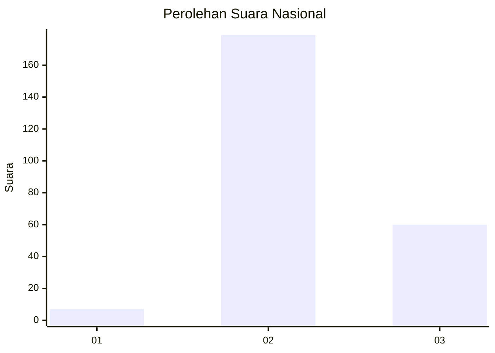
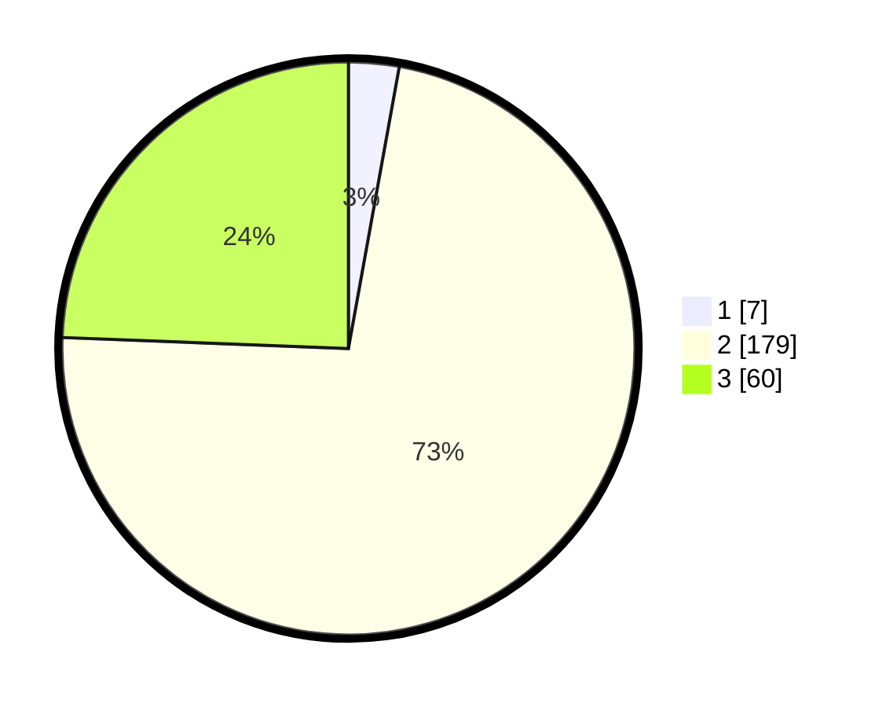

# Hasil

## Grafik

## Tabel

| No. | Nama Paslon    | Suara | Suara (raw) | Persentase |
|:--- |:-------------- | -----:| -----------:| ----------:|
| 1   | ANIES MUHAIMIN | 7     | [7][p-1]    | 2,85       |
| 2   | PRABOWO GIBRAN | 179   | [179][p-2]  | 72,76      |
| 3   | GANJAR MAHFUD  | 60    | [60][p-3]   | 24,39      |

[p-1]: https://github.com/gigit-pemilu/pemilu-2024/blob/main/pilpres/hitung-suara/sub/51-bali/sub/01-jembrana/sub/01-negara/sub/1006-baler-bale-agung/sub/019-tps/sub/paslon-1.txt
[p-2]: https://github.com/gigit-pemilu/pemilu-2024/blob/main/pilpres/hitung-suara/sub/51-bali/sub/01-jembrana/sub/01-negara/sub/1006-baler-bale-agung/sub/019-tps/sub/paslon-2.txt
[p-3]: https://github.com/gigit-pemilu/pemilu-2024/blob/main/pilpres/hitung-suara/sub/51-bali/sub/01-jembrana/sub/01-negara/sub/1006-baler-bale-agung/sub/019-tps/sub/paslon-3.txt

## Foto C Plano

https://sirekap-obj-formc.kpu.go.id/cbe3/pemilu/ppwp/51/01/01/10/06/5101011006019-20240214-141745--bdc4e067-fcd4-470b-997c-fa988a109fea.jpg

https://sirekap-obj-formc.kpu.go.id/cbe3/pemilu/ppwp/51/01/01/10/06/5101011006019-20240214-141832--1aa6ba04-8ae2-4bfa-9205-88910b46c894.jpg

https://sirekap-obj-formc.kpu.go.id/cbe3/pemilu/ppwp/51/01/01/10/06/5101011006019-20240214-141912--0e282b15-1764-4b0f-b1b1-de597190d508.jpg

## Metadata

| Key        | Value               |
| ---------- | ------------------- |
| Time Stamp | 2024-02-14 21:46:01 |

## DATA PEMILIH TETAP

Jumlah pemilih dalam DPT: **287**.
 * L: **155**.
 * P: **132**.

## DATA PENGGUNA HAK PILIH

Jumlah pengguna hak pilih dalam DPT: **237**.
 * L: **128**.
 * P: **109**.

Jumlah pengguna hak pilih dalam DPTb: **7**.
 * L: **4**.
 * P: **3**.

Jumlah pengguna hak pilih dalam DPK: **6**.
 * L: **1**.
 * P: **5**.

Jumlah pengguna hak pilih: **250**.
 * L: **133**.
 * P: **117**.

## JUMLAH SUARA SAH DAN TIDAK SAH

JUMLAH SELURUH SUARA SAH: **246**.

JUMLAH SUARA TIDAK SAH: **4**.

JUMLAH SELURUH SUARA SAH DAN SUARA TIDAK SAH: **250**.

