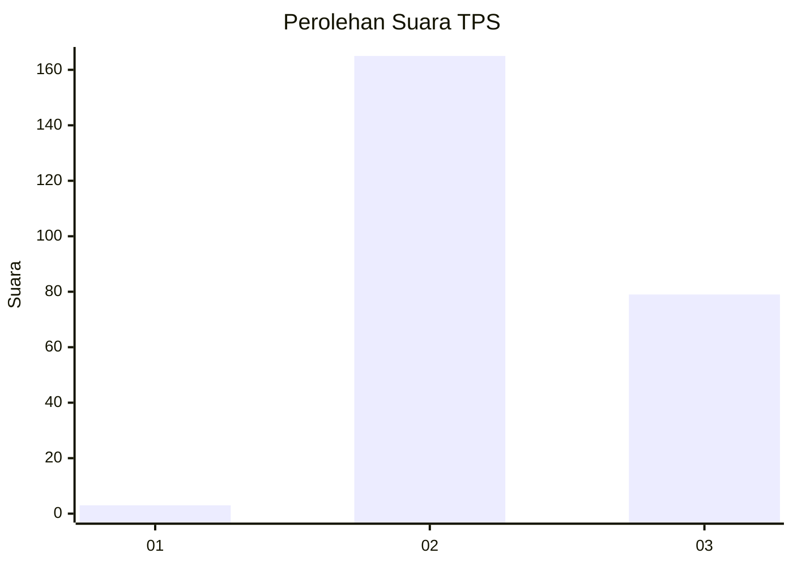
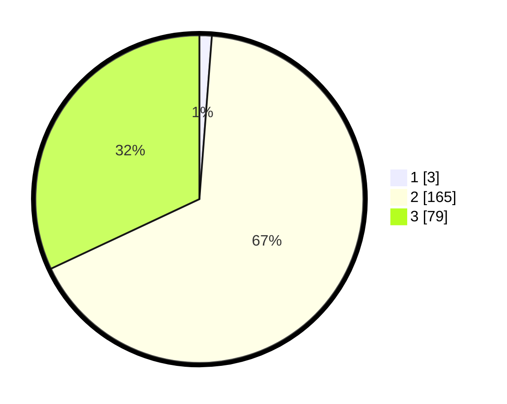

# Hasil

## Grafik

## Tabel

| No. | Nama Paslon    | Suara | Suara (raw) | Persentase |
|:--- |:-------------- | -----:| -----------:| ----------:|
| 1   | ANIES MUHAIMIN | 3     | [3][p-1]    | 1,21       |
| 2   | PRABOWO GIBRAN | 165   | [165][p-2]  | 66,80      |
| 3   | GANJAR MAHFUD  | 79    | [79][p-3]   | 31,98      |

[p-1]: https://github.com/gigit-pemilu/pemilu-2024-51-bali/blob/main/pilpres/hitung-suara/sub/51-bali/sub/01-jembrana/sub/01-negara/sub/1006-baler-bale-agung/sub/020-tps/sub/paslon-1.txt
[p-2]: https://github.com/gigit-pemilu/pemilu-2024-51-bali/blob/main/pilpres/hitung-suara/sub/51-bali/sub/01-jembrana/sub/01-negara/sub/1006-baler-bale-agung/sub/020-tps/sub/paslon-2.txt
[p-3]: https://github.com/gigit-pemilu/pemilu-2024-51-bali/blob/main/pilpres/hitung-suara/sub/51-bali/sub/01-jembrana/sub/01-negara/sub/1006-baler-bale-agung/sub/020-tps/sub/paslon-3.txt

## Foto C Plano

https://sirekap-obj-formc.kpu.go.id/88c9/pemilu/ppwp/51/01/01/10/06/5101011006020-20240214-141202--8056fb0b-fa71-46ef-bbf4-e299f611dd4d.jpg

https://sirekap-obj-formc.kpu.go.id/88c9/pemilu/ppwp/51/01/01/10/06/5101011006020-20240214-141227--e2144034-1f49-4dce-8dc4-9700df2f9910.jpg

https://sirekap-obj-formc.kpu.go.id/88c9/pemilu/ppwp/51/01/01/10/06/5101011006020-20240214-141234--48f825ac-e179-41d6-aff2-329501a11287.jpg

## Metadata

| Key        | Value               |
| ---------- | ------------------- |
| Time Stamp | 2024-02-14 21:46:01 |

## DATA PEMILIH TETAP

Jumlah pemilih dalam DPT: **296**.
 * L: **153**.
 * P: **143**.

## DATA PENGGUNA HAK PILIH

Jumlah pengguna hak pilih dalam DPT: **244**.
 * L: **126**.
 * P: **118**.

Jumlah pengguna hak pilih dalam DPTb: **2**.
 * L: **1**.
 * P: **1**.

Jumlah pengguna hak pilih dalam DPK: **2**.
 * L: **0**.
 * P: **2**.

Jumlah pengguna hak pilih: **248**.
 * L: **127**.
 * P: **121**.

## JUMLAH SUARA SAH DAN TIDAK SAH

JUMLAH SELURUH SUARA SAH: **247**.

JUMLAH SUARA TIDAK SAH: **1**.

JUMLAH SELURUH SUARA SAH DAN SUARA TIDAK SAH: **248**.

