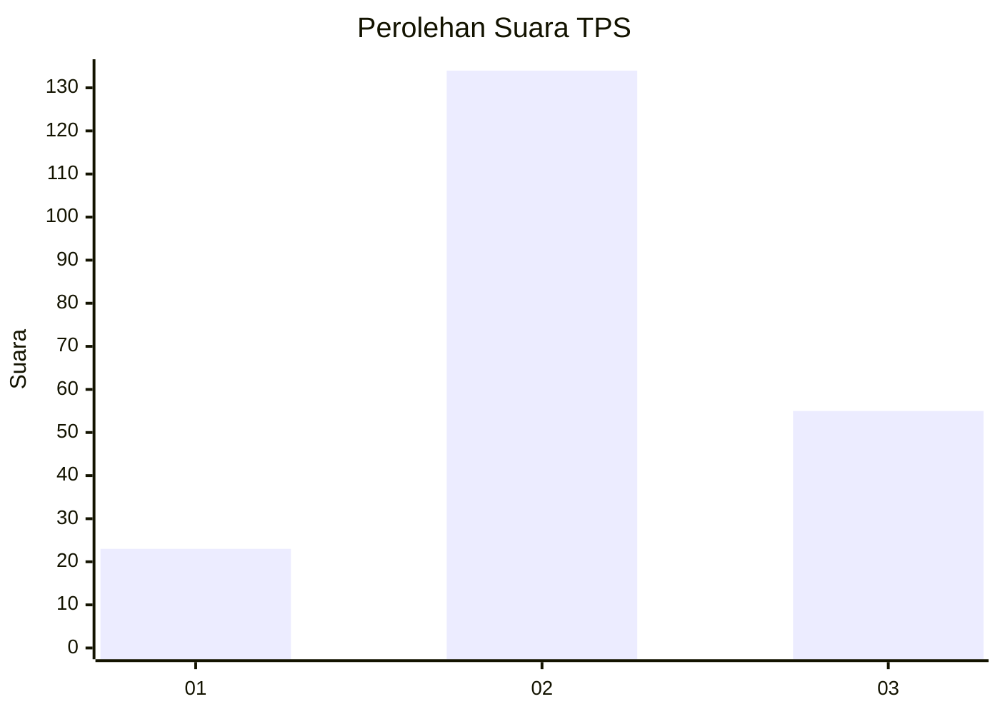
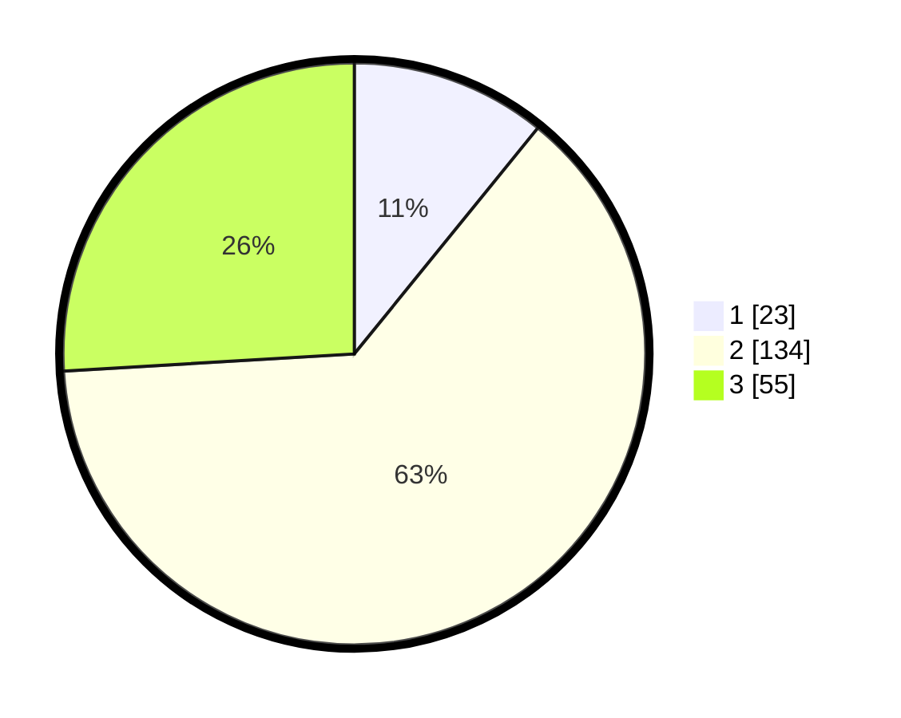

# Hasil

## Grafik

## Tabel

| No. | Nama Paslon    | Suara | Suara (raw) | Persentase |
|:--- |:-------------- | -----:| -----------:| ----------:|
| 1   | ANIES MUHAIMIN | 23    | [23][p-1]   | 10,85      |
| 2   | PRABOWO GIBRAN | 134   | [134][p-2]  | 63,21      |
| 3   | GANJAR MAHFUD  | 55    | [55][p-3]   | 25,94      |

[p-1]: https://github.com/gigit-pemilu/pemilu-2024-51-bali/blob/main/pilpres/hitung-suara/sub/51-bali/sub/01-jembrana/sub/01-negara/sub/1006-baler-bale-agung/sub/023-tps/sub/paslon-1.txt
[p-2]: https://github.com/gigit-pemilu/pemilu-2024-51-bali/blob/main/pilpres/hitung-suara/sub/51-bali/sub/01-jembrana/sub/01-negara/sub/1006-baler-bale-agung/sub/023-tps/sub/paslon-2.txt
[p-3]: https://github.com/gigit-pemilu/pemilu-2024-51-bali/blob/main/pilpres/hitung-suara/sub/51-bali/sub/01-jembrana/sub/01-negara/sub/1006-baler-bale-agung/sub/023-tps/sub/paslon-3.txt

## Foto C Plano

https://sirekap-obj-formc.kpu.go.id/dd59/pemilu/ppwp/51/01/01/10/06/5101011006023-20240215-002735--5274aea1-ec63-4a37-b438-7c0bbf862e6e.jpg

https://sirekap-obj-formc.kpu.go.id/dd59/pemilu/ppwp/51/01/01/10/06/5101011006023-20240215-002801--482365f0-a186-4c23-acfd-f4ebaffed809.jpg

https://sirekap-obj-formc.kpu.go.id/dd59/pemilu/ppwp/51/01/01/10/06/5101011006023-20240215-002819--cab5dbe6-7f1f-4114-a913-addfa53f7ecb.jpg

## Metadata

| Key        | Value               |
| ---------- | ------------------- |
| Time Stamp | 2024-02-15 15:00:29 |

## DATA PEMILIH TETAP

Jumlah pemilih dalam DPT: **288**.
 * L: **136**.
 * P: **152**.

## DATA PENGGUNA HAK PILIH

Jumlah pengguna hak pilih dalam DPT: **213**.
 * L: **92**.
 * P: **121**.

Jumlah pengguna hak pilih dalam DPTb: **1**.
 * L: **1**.
 * P: **0**.

Jumlah pengguna hak pilih dalam DPK: **2**.
 * L: **1**.
 * P: **1**.

Jumlah pengguna hak pilih: **216**.
 * L: **94**.
 * P: **122**.

## JUMLAH SUARA SAH DAN TIDAK SAH

JUMLAH SELURUH SUARA SAH: **212**.

JUMLAH SUARA TIDAK SAH: **4**.

JUMLAH SELURUH SUARA SAH DAN SUARA TIDAK SAH: **216**.

