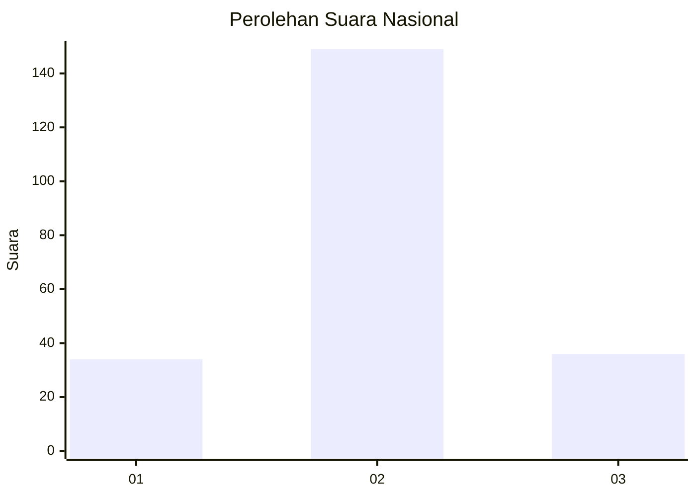
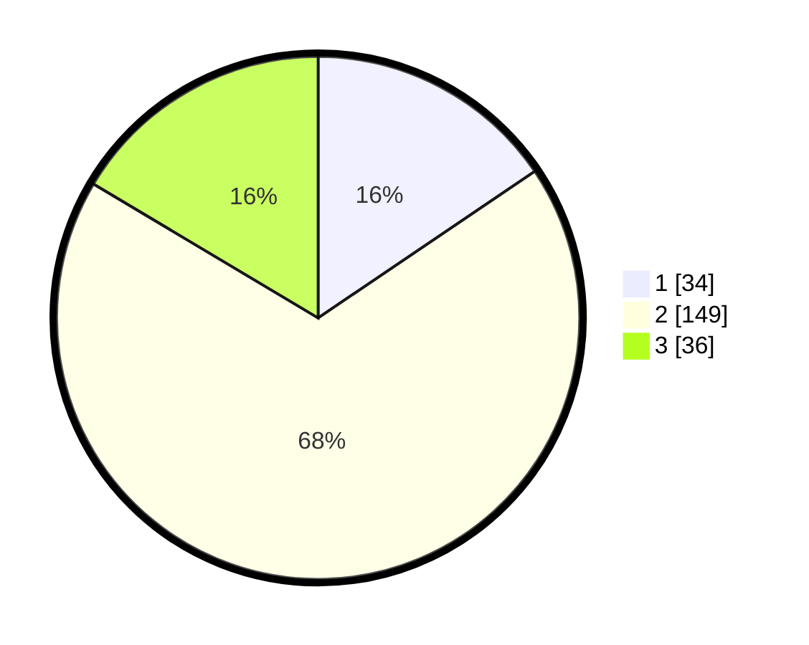

# Hasil

## Grafik

## Tabel

| No. | Nama Paslon    | Suara | Suara (raw) | Persentase |
|:--- |:-------------- | -----:| -----------:| ----------:|
| 1   | ANIES MUHAIMIN | 34    | [34][p-1]   | 15,53      |
| 2   | PRABOWO GIBRAN | 149   | [149][p-2]  | 68,04      |
| 3   | GANJAR MAHFUD  | 36    | [36][p-3]   | 16,44      |

[p-1]: https://github.com/gigit-pemilu/pemilu-2024/blob/main/pilpres/hitung-suara/sub/51-bali/sub/01-jembrana/sub/01-negara/sub/1006-baler-bale-agung/sub/026-tps/sub/paslon-1.txt
[p-2]: https://github.com/gigit-pemilu/pemilu-2024/blob/main/pilpres/hitung-suara/sub/51-bali/sub/01-jembrana/sub/01-negara/sub/1006-baler-bale-agung/sub/026-tps/sub/paslon-2.txt
[p-3]: https://github.com/gigit-pemilu/pemilu-2024/blob/main/pilpres/hitung-suara/sub/51-bali/sub/01-jembrana/sub/01-negara/sub/1006-baler-bale-agung/sub/026-tps/sub/paslon-3.txt

## Foto C Plano

https://sirekap-obj-formc.kpu.go.id/0b58/pemilu/ppwp/51/01/01/10/06/5101011006026-20240214-132922--d6c6d6d3-d0b7-4d89-8dbf-e4938161459c.jpg

https://sirekap-obj-formc.kpu.go.id/0b58/pemilu/ppwp/51/01/01/10/06/5101011006026-20240214-133127--0497ba6b-32cf-4b17-ae70-ee508753043c.jpg

## Metadata

| Key        | Value               |
| ---------- | ------------------- |
| Time Stamp | 2024-02-15 07:00:44 |

