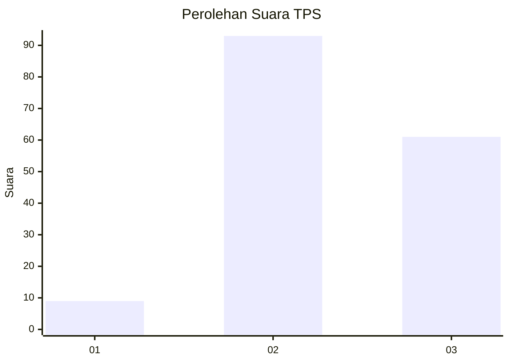
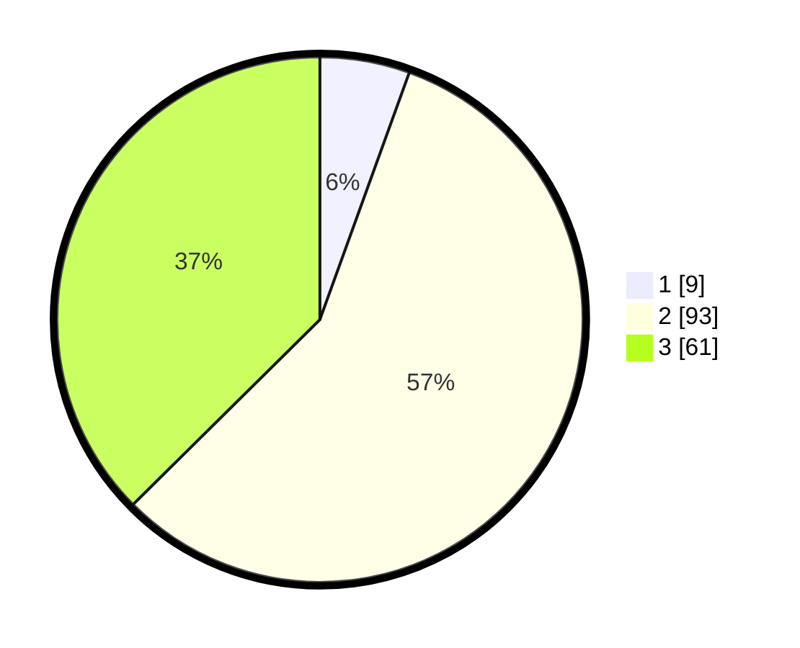

# Hasil

## Grafik

## Tabel

| No. | Nama Paslon    | Suara | Suara (raw) | Persentase |
|:--- |:-------------- | -----:| -----------:| ----------:|
| 1   | ANIES MUHAIMIN | 9     | [9][p-1]    | 5,52       |
| 2   | PRABOWO GIBRAN | 93    | [93][p-2]   | 57,06      |
| 3   | GANJAR MAHFUD  | 61    | [61][p-3]   | 37,42      |

[p-1]: https://github.com/gigit-pemilu/pemilu-2024-51-bali/blob/main/pilpres/hitung-suara/sub/51-bali/sub/01-jembrana/sub/01-negara/sub/1006-baler-bale-agung/sub/901-tps/sub/paslon-1.txt
[p-2]: https://github.com/gigit-pemilu/pemilu-2024-51-bali/blob/main/pilpres/hitung-suara/sub/51-bali/sub/01-jembrana/sub/01-negara/sub/1006-baler-bale-agung/sub/901-tps/sub/paslon-2.txt
[p-3]: https://github.com/gigit-pemilu/pemilu-2024-51-bali/blob/main/pilpres/hitung-suara/sub/51-bali/sub/01-jembrana/sub/01-negara/sub/1006-baler-bale-agung/sub/901-tps/sub/paslon-3.txt

## Foto C Plano

https://sirekap-obj-formc.kpu.go.id/61c2/pemilu/ppwp/51/01/01/10/06/5101011006901-20240214-193332--b773767c-2ca6-4350-a4e3-0d33e579c37a.jpg

https://sirekap-obj-formc.kpu.go.id/61c2/pemilu/ppwp/51/01/01/10/06/5101011006901-20240214-200615--1a221ac8-2cd6-40f0-bfac-79a2c8bbbfd7.jpg

https://sirekap-obj-formc.kpu.go.id/61c2/pemilu/ppwp/51/01/01/10/06/5101011006901-20240214-200755--963686a5-e361-4b2a-ae17-84552c1ac09e.jpg

## Metadata

| Key        | Value               |
| ---------- | ------------------- |
| Time Stamp | 2024-02-14 21:46:01 |

## DATA PEMILIH TETAP

Jumlah pemilih dalam DPT: **93**.
 * L: **90**.
 * P: **3**.

## DATA PENGGUNA HAK PILIH

Jumlah pengguna hak pilih dalam DPT: **93**.
 * L: **90**.
 * P: **3**.

Jumlah pengguna hak pilih dalam DPTb: **73**.
 * L: **64**.
 * P: **9**.

Jumlah pengguna hak pilih dalam DPK: **0**.
 * L: **0**.
 * P: **0**.

Jumlah pengguna hak pilih: **166**.
 * L: **154**.
 * P: **12**.

## JUMLAH SUARA SAH DAN TIDAK SAH

JUMLAH SELURUH SUARA SAH: **163**.

JUMLAH SUARA TIDAK SAH: **3**.

JUMLAH SELURUH SUARA SAH DAN SUARA TIDAK SAH: **166**.

