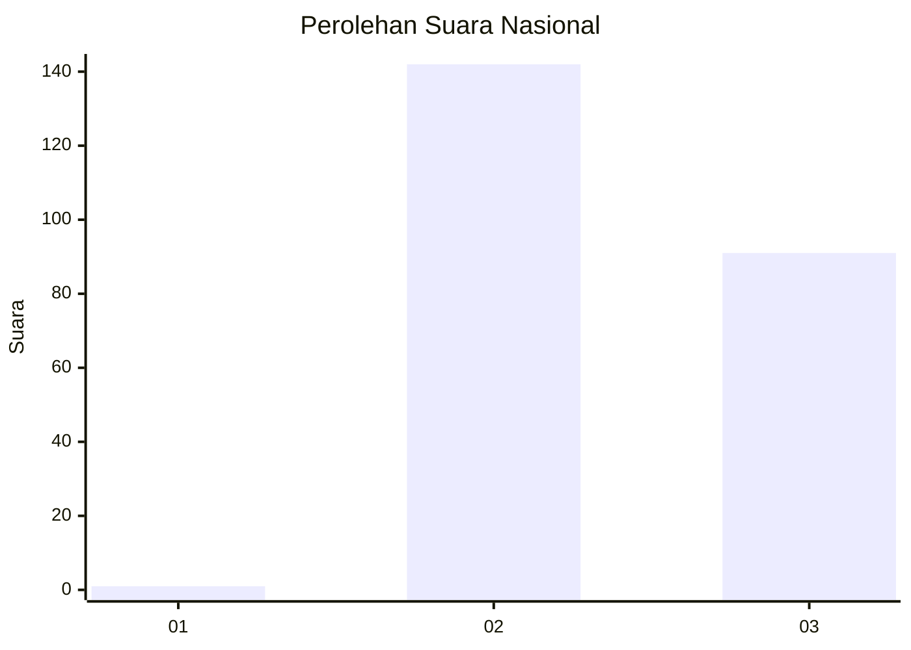
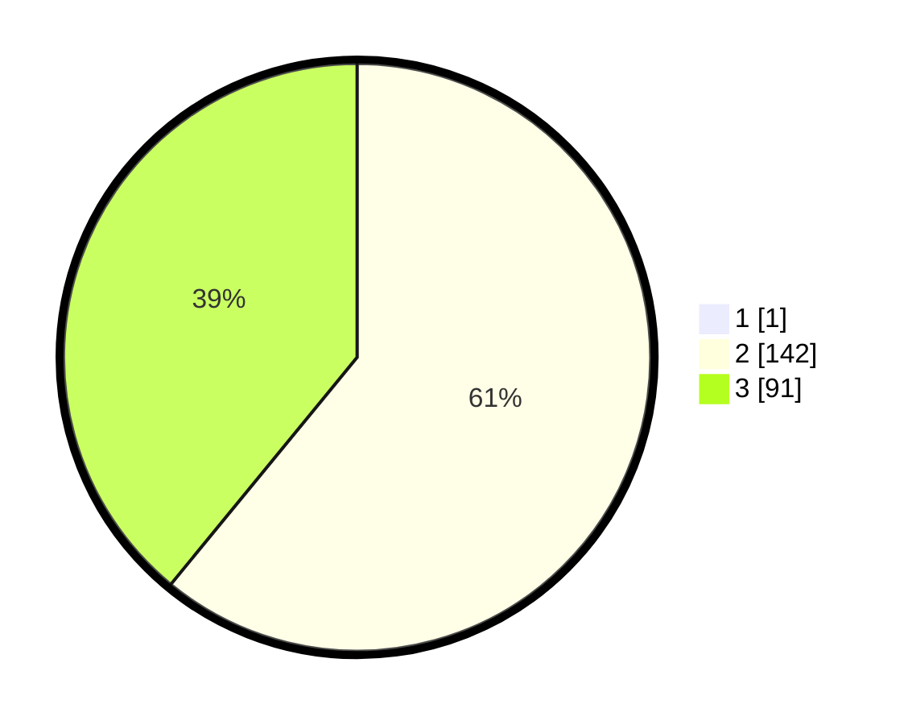

# Hasil

## Grafik

## Tabel

| No. | Nama Paslon    | Suara | Suara (raw) | Persentase |
|:--- |:-------------- | -----:| -----------:| ----------:|
| 1   | ANIES MUHAIMIN | 1     | [1][p-1]    | 0,43       |
| 2   | PRABOWO GIBRAN | 142   | [142][p-2]  | 60,68      |
| 3   | GANJAR MAHFUD  | 91    | [91][p-3]   | 38,89      |

[p-1]: https://github.com/gigit-pemilu/pemilu-2024/blob/main/pilpres/hitung-suara/sub/51-bali/sub/01-jembrana/sub/01-negara/sub/1008-banjar-tengah/sub/001-tps/sub/paslon-1.txt
[p-2]: https://github.com/gigit-pemilu/pemilu-2024/blob/main/pilpres/hitung-suara/sub/51-bali/sub/01-jembrana/sub/01-negara/sub/1008-banjar-tengah/sub/001-tps/sub/paslon-2.txt
[p-3]: https://github.com/gigit-pemilu/pemilu-2024/blob/main/pilpres/hitung-suara/sub/51-bali/sub/01-jembrana/sub/01-negara/sub/1008-banjar-tengah/sub/001-tps/sub/paslon-3.txt

## Foto C Plano

https://sirekap-obj-formc.kpu.go.id/c6f6/pemilu/ppwp/51/01/01/10/08/5101011008001-20240214-141444--a541ca1c-82e5-483d-a7ca-a9600f82dfeb.jpg

https://sirekap-obj-formc.kpu.go.id/c6f6/pemilu/ppwp/51/01/01/10/08/5101011008001-20240214-141528--f6fc7f0c-8ba6-43eb-a0bf-cc07ad331c65.jpg

https://sirekap-obj-formc.kpu.go.id/c6f6/pemilu/ppwp/51/01/01/10/08/5101011008001-20240214-141555--d8368e75-4ba3-4041-84bd-1417d065ea40.jpg

## Metadata

| Key        | Value               |
| ---------- | ------------------- |
| Time Stamp | 2024-02-15 00:41:44 |

## DATA PEMILIH TETAP

Jumlah pemilih dalam DPT: **294**.
 * L: **152**.
 * P: **142**.

## DATA PENGGUNA HAK PILIH

Jumlah pengguna hak pilih dalam DPT: **236**.
 * L: **121**.
 * P: **115**.

Jumlah pengguna hak pilih dalam DPTb: **0**.
 * L: **0**.
 * P: **0**.

Jumlah pengguna hak pilih dalam DPK: **1**.
 * L: **0**.
 * P: **1**.

Jumlah pengguna hak pilih: **237**.
 * L: **0**.
 * P: **0**.

## JUMLAH SUARA SAH DAN TIDAK SAH

JUMLAH SELURUH SUARA SAH: **234**.

JUMLAH SUARA TIDAK SAH: **3**.

JUMLAH SELURUH SUARA SAH DAN SUARA TIDAK SAH: **237**.

