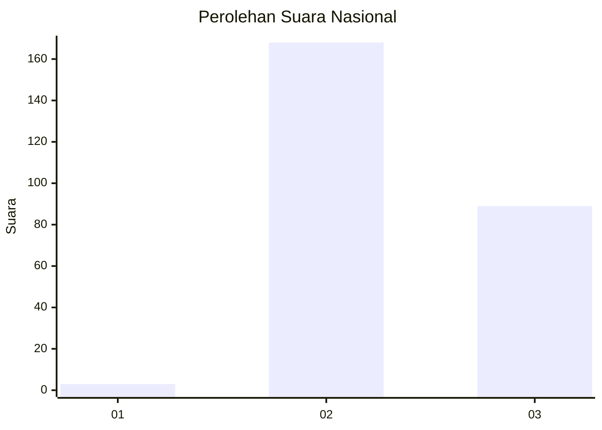
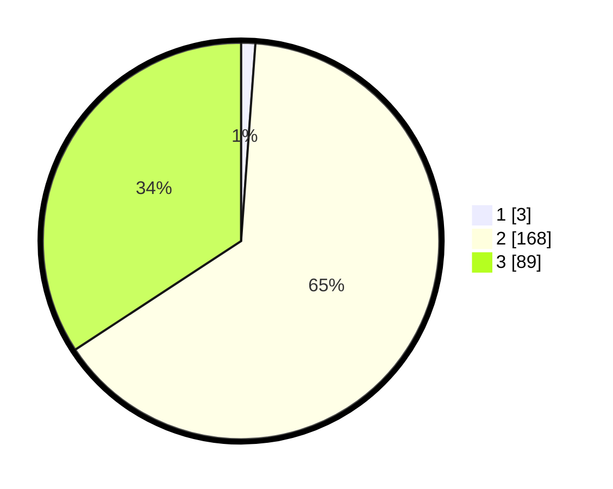

# Hasil

## Grafik

## Tabel

| No. | Nama Paslon    | Suara | Suara (raw) | Persentase |
|:--- |:-------------- | -----:| -----------:| ----------:|
| 1   | ANIES MUHAIMIN | 3     | [3][p-1]    | 1,15       |
| 2   | PRABOWO GIBRAN | 168   | [168][p-2]  | 64,62      |
| 3   | GANJAR MAHFUD  | 89    | [89][p-3]   | 34,23      |

[p-1]: https://github.com/gigit-pemilu/pemilu-2024/blob/main/pilpres/hitung-suara/sub/51-bali/sub/01-jembrana/sub/01-negara/sub/1013-lelateng/sub/001-tps/sub/paslon-1.txt
[p-2]: https://github.com/gigit-pemilu/pemilu-2024/blob/main/pilpres/hitung-suara/sub/51-bali/sub/01-jembrana/sub/01-negara/sub/1013-lelateng/sub/001-tps/sub/paslon-2.txt
[p-3]: https://github.com/gigit-pemilu/pemilu-2024/blob/main/pilpres/hitung-suara/sub/51-bali/sub/01-jembrana/sub/01-negara/sub/1013-lelateng/sub/001-tps/sub/paslon-3.txt

## Foto C Plano

https://sirekap-obj-formc.kpu.go.id/f8b6/pemilu/ppwp/51/01/01/10/13/5101011013001-20240215-072600--d3edd132-363f-4b97-8dfa-7ea137a0828f.jpg

https://sirekap-obj-formc.kpu.go.id/f8b6/pemilu/ppwp/51/01/01/10/13/5101011013001-20240215-072614--3d9b5d6e-4522-442d-86f2-ef80a3fd9864.jpg

https://sirekap-obj-formc.kpu.go.id/f8b6/pemilu/ppwp/51/01/01/10/13/5101011013001-20240215-072624--eb641551-7882-4ee5-bbdc-4c6011fa6435.jpg

## Metadata

| Key        | Value               |
| ---------- | ------------------- |
| Time Stamp | 2024-02-15 15:30:25 |

## DATA PEMILIH TETAP

Jumlah pemilih dalam DPT: **299**.
 * L: **155**.
 * P: **144**.

## DATA PENGGUNA HAK PILIH

Jumlah pengguna hak pilih dalam DPT: **256**.
 * L: **128**.
 * P: **128**.

Jumlah pengguna hak pilih dalam DPTb: **5**.
 * L: **3**.
 * P: **2**.

Jumlah pengguna hak pilih dalam DPK: **0**.
 * L: **0**.
 * P: **0**.

Jumlah pengguna hak pilih: **261**.
 * L: **131**.
 * P: **130**.

## JUMLAH SUARA SAH DAN TIDAK SAH

JUMLAH SELURUH SUARA SAH: **260**.

JUMLAH SUARA TIDAK SAH: **1**.

JUMLAH SELURUH SUARA SAH DAN SUARA TIDAK SAH: **261**.

