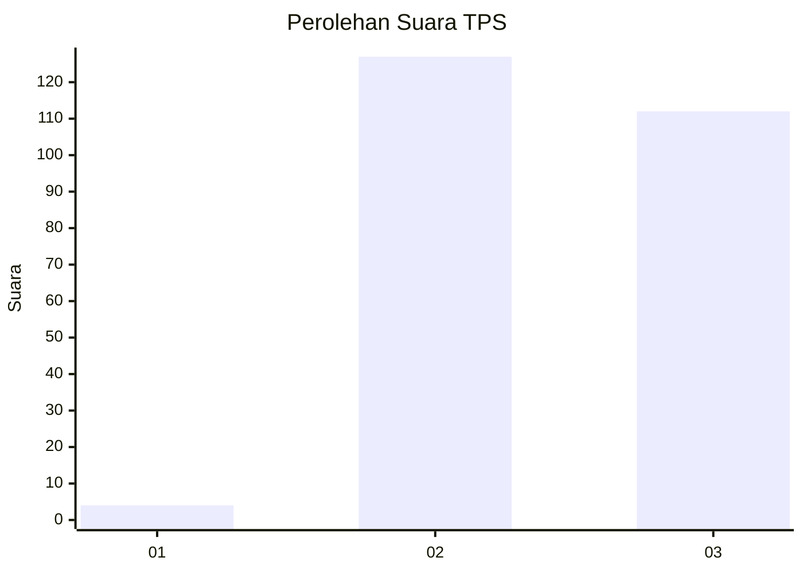
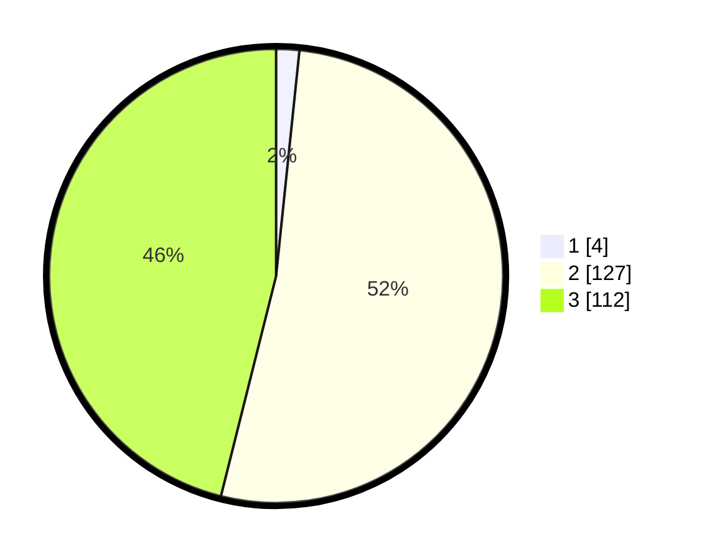

# Hasil

## Grafik

## Tabel

| No. | Nama Paslon    | Suara | Suara (raw) | Persentase |
|:--- |:-------------- | -----:| -----------:| ----------:|
| 1   | ANIES MUHAIMIN | 4     | [4][p-1]    | 1,65       |
| 2   | PRABOWO GIBRAN | 127   | [127][p-2]  | 52,26      |
| 3   | GANJAR MAHFUD  | 112   | [112][p-3]  | 46,09      |

[p-1]: https://github.com/gigit-pemilu/pemilu-2024-51-bali/blob/main/pilpres/hitung-suara/sub/51-bali/sub/01-jembrana/sub/01-negara/sub/1013-lelateng/sub/005-tps/sub/paslon-1.txt
[p-2]: https://github.com/gigit-pemilu/pemilu-2024-51-bali/blob/main/pilpres/hitung-suara/sub/51-bali/sub/01-jembrana/sub/01-negara/sub/1013-lelateng/sub/005-tps/sub/paslon-2.txt
[p-3]: https://github.com/gigit-pemilu/pemilu-2024-51-bali/blob/main/pilpres/hitung-suara/sub/51-bali/sub/01-jembrana/sub/01-negara/sub/1013-lelateng/sub/005-tps/sub/paslon-3.txt

## Foto C Plano

https://sirekap-obj-formc.kpu.go.id/ed22/pemilu/ppwp/51/01/01/10/13/5101011013005-20240214-194845--91733201-7973-49cf-9edc-51c2936204f9.jpg

https://sirekap-obj-formc.kpu.go.id/ed22/pemilu/ppwp/51/01/01/10/13/5101011013005-20240214-194907--37e9a970-c92e-4822-a4ba-db5ca49cfd46.jpg

https://sirekap-obj-formc.kpu.go.id/ed22/pemilu/ppwp/51/01/01/10/13/5101011013005-20240214-202010--8f2eeb05-67dc-40b6-a228-ce0a8bd8dca3.jpg

## Metadata

| Key        | Value               |
| ---------- | ------------------- |
| Time Stamp | 2024-02-15 15:30:25 |

## DATA PEMILIH TETAP

Jumlah pemilih dalam DPT: **297**.
 * L: **148**.
 * P: **149**.

## DATA PENGGUNA HAK PILIH

Jumlah pengguna hak pilih dalam DPT: **250**.
 * L: **121**.
 * P: **129**.

Jumlah pengguna hak pilih dalam DPTb: **0**.
 * L: **0**.
 * P: **0**.

Jumlah pengguna hak pilih dalam DPK: **0**.
 * L: **0**.
 * P: **0**.

Jumlah pengguna hak pilih: **250**.
 * L: **121**.
 * P: **129**.

## JUMLAH SUARA SAH DAN TIDAK SAH

JUMLAH SELURUH SUARA SAH: **243**.

JUMLAH SUARA TIDAK SAH: **7**.

JUMLAH SELURUH SUARA SAH DAN SUARA TIDAK SAH: **250**.

