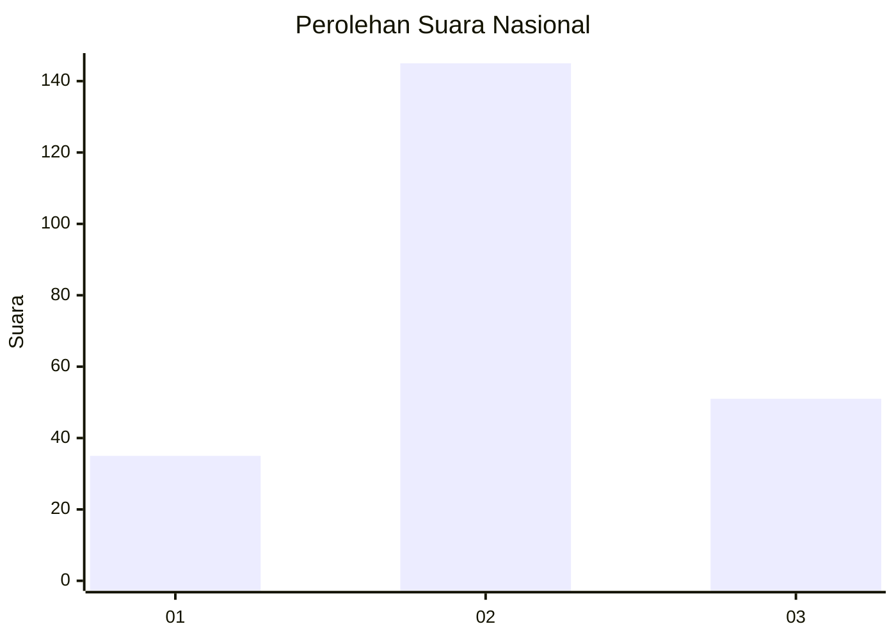
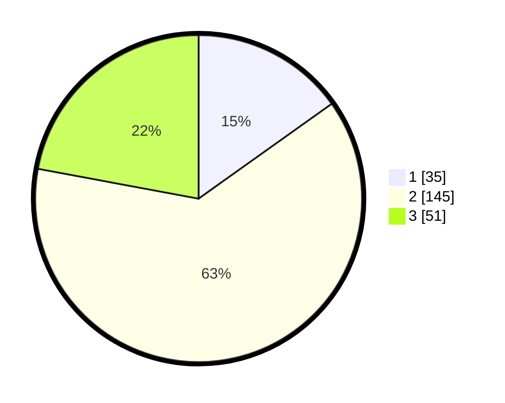

# Hasil

## Grafik

## Tabel

| No. | Nama Paslon    | Suara | Suara (raw) | Persentase |
|:--- |:-------------- | -----:| -----------:| ----------:|
| 1   | ANIES MUHAIMIN | 35    | [35][p-1]   | 15,15      |
| 2   | PRABOWO GIBRAN | 145   | [145][p-2]  | 62,77      |
| 3   | GANJAR MAHFUD  | 51    | [51][p-3]   | 22,08      |

[p-1]: https://github.com/gigit-pemilu/pemilu-2024/blob/main/pilpres/hitung-suara/sub/51-bali/sub/01-jembrana/sub/01-negara/sub/1013-lelateng/sub/007-tps/sub/paslon-1.txt
[p-2]: https://github.com/gigit-pemilu/pemilu-2024/blob/main/pilpres/hitung-suara/sub/51-bali/sub/01-jembrana/sub/01-negara/sub/1013-lelateng/sub/007-tps/sub/paslon-2.txt
[p-3]: https://github.com/gigit-pemilu/pemilu-2024/blob/main/pilpres/hitung-suara/sub/51-bali/sub/01-jembrana/sub/01-negara/sub/1013-lelateng/sub/007-tps/sub/paslon-3.txt

## Foto C Plano

https://sirekap-obj-formc.kpu.go.id/a6b3/pemilu/ppwp/51/01/01/10/13/5101011013007-20240214-212956--b23dc1a5-9d6e-4d35-bf7b-0b59beb463eb.jpg

https://sirekap-obj-formc.kpu.go.id/a6b3/pemilu/ppwp/51/01/01/10/13/5101011013007-20240214-213006--13fe4963-5c06-40ec-a4cf-9589cd7b7147.jpg

## Metadata

| Key        | Value               |
| ---------- | ------------------- |
| Time Stamp | 2024-02-15 09:00:24 |

