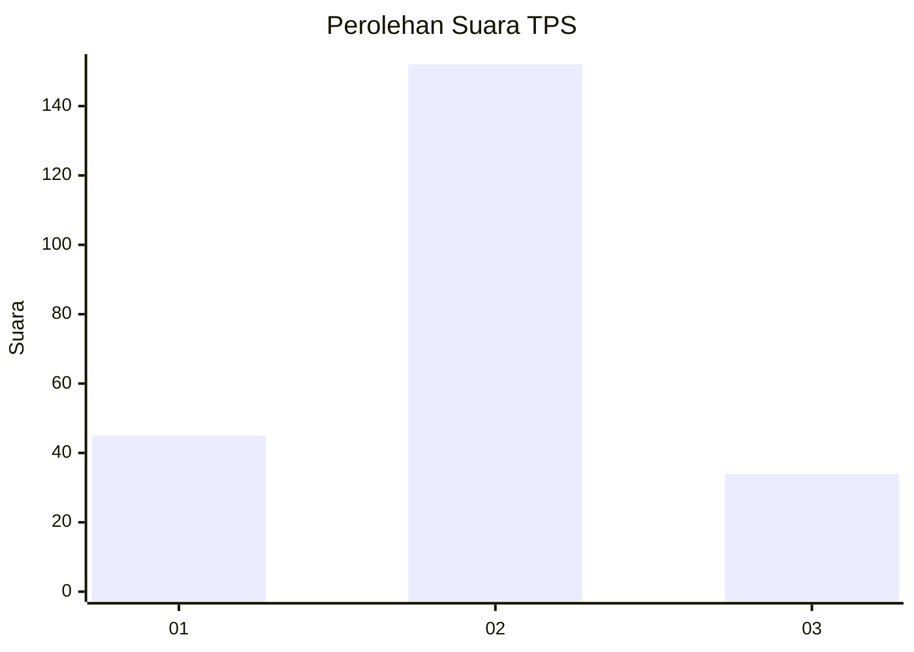
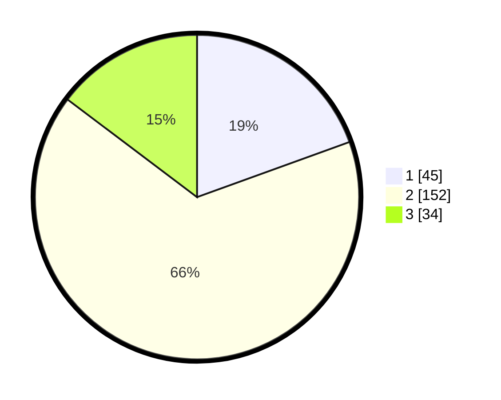

# Hasil

## Grafik

## Tabel

| No. | Nama Paslon    | Suara | Suara (raw) | Persentase |
|:--- |:-------------- | -----:| -----------:| ----------:|
| 1   | ANIES MUHAIMIN | 45    | [45][p-1]   | 19,48      |
| 2   | PRABOWO GIBRAN | 152   | [152][p-2]  | 65,80      |
| 3   | GANJAR MAHFUD  | 34    | [34][p-3]   | 14,72      |

[p-1]: https://github.com/gigit-pemilu/pemilu-2024-51-bali/blob/main/pilpres/hitung-suara/sub/51-bali/sub/01-jembrana/sub/01-negara/sub/1013-lelateng/sub/008-tps/sub/paslon-1.txt
[p-2]: https://github.com/gigit-pemilu/pemilu-2024-51-bali/blob/main/pilpres/hitung-suara/sub/51-bali/sub/01-jembrana/sub/01-negara/sub/1013-lelateng/sub/008-tps/sub/paslon-2.txt
[p-3]: https://github.com/gigit-pemilu/pemilu-2024-51-bali/blob/main/pilpres/hitung-suara/sub/51-bali/sub/01-jembrana/sub/01-negara/sub/1013-lelateng/sub/008-tps/sub/paslon-3.txt

## Foto C Plano

https://sirekap-obj-formc.kpu.go.id/8852/pemilu/ppwp/51/01/01/10/13/5101011013008-20240216-132222--6a9230a6-f3a8-4139-9a4a-0d0ffab99a89.jpg

https://sirekap-obj-formc.kpu.go.id/8852/pemilu/ppwp/51/01/01/10/13/5101011013008-20240216-132223--14c3b165-5858-4d4a-ab86-a886d4e24124.jpg

https://sirekap-obj-formc.kpu.go.id/8852/pemilu/ppwp/51/01/01/10/13/5101011013008-20240216-132222--abe59f0d-1123-4785-8e4c-1f97633999d1.jpg

## Metadata

| Key        | Value               |
| ---------- | ------------------- |
| Time Stamp | 2024-02-16 16:25:10 |

## DATA PEMILIH TETAP

Jumlah pemilih dalam DPT: **282**.
 * L: **140**.
 * P: **142**.

## DATA PENGGUNA HAK PILIH

Jumlah pengguna hak pilih dalam DPT: **232**.
 * L: **113**.
 * P: **119**.

Jumlah pengguna hak pilih dalam DPTb: **0**.
 * L: **0**.
 * P: **0**.

Jumlah pengguna hak pilih dalam DPK: **2**.
 * L: **1**.
 * P: **1**.

Jumlah pengguna hak pilih: **234**.
 * L: **114**.
 * P: **120**.

## JUMLAH SUARA SAH DAN TIDAK SAH

JUMLAH SELURUH SUARA SAH: **231**.

JUMLAH SUARA TIDAK SAH: **3**.

JUMLAH SELURUH SUARA SAH DAN SUARA TIDAK SAH: **234**.

