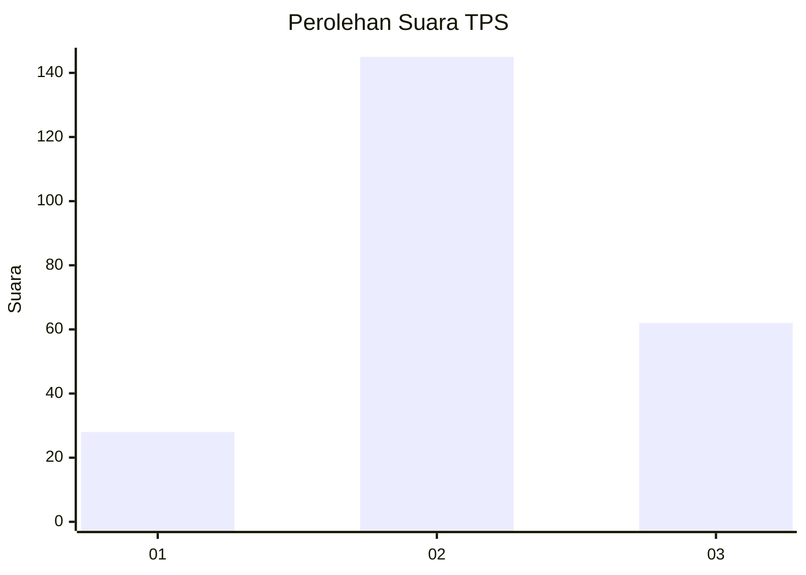
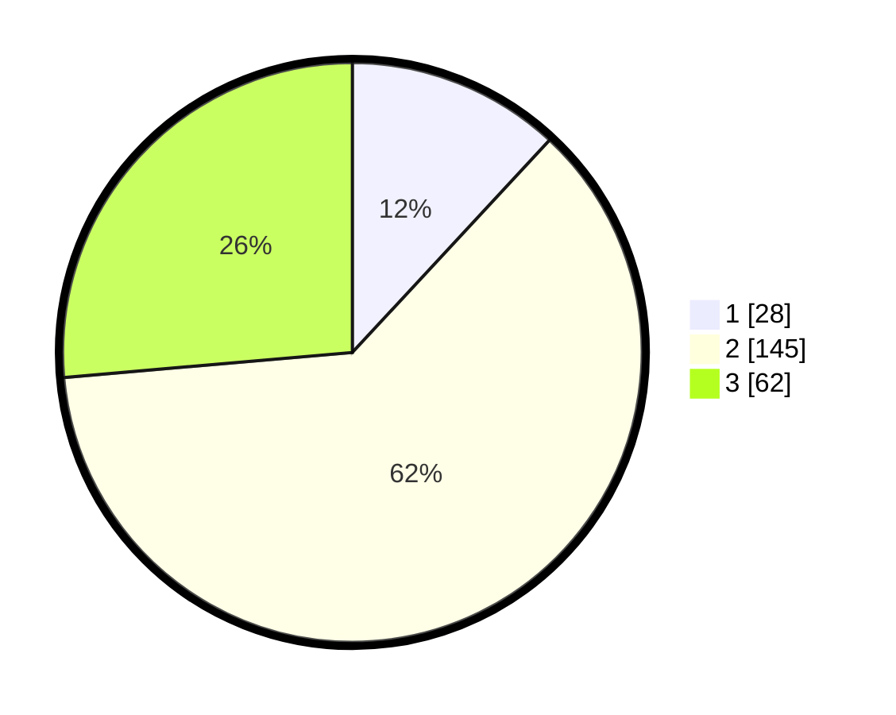

# Hasil

## Grafik

## Tabel

| No. | Nama Paslon    | Suara | Suara (raw) | Persentase |
|:--- |:-------------- | -----:| -----------:| ----------:|
| 1   | ANIES MUHAIMIN | 28    | [28][p-1]   | 11,91      |
| 2   | PRABOWO GIBRAN | 145   | [145][p-2]  | 61,70      |
| 3   | GANJAR MAHFUD  | 62    | [62][p-3]   | 26,38      |

[p-1]: https://github.com/gigit-pemilu/pemilu-2024-51-bali/blob/main/pilpres/hitung-suara/sub/51-bali/sub/01-jembrana/sub/01-negara/sub/1013-lelateng/sub/011-tps/sub/paslon-1.txt
[p-2]: https://github.com/gigit-pemilu/pemilu-2024-51-bali/blob/main/pilpres/hitung-suara/sub/51-bali/sub/01-jembrana/sub/01-negara/sub/1013-lelateng/sub/011-tps/sub/paslon-2.txt
[p-3]: https://github.com/gigit-pemilu/pemilu-2024-51-bali/blob/main/pilpres/hitung-suara/sub/51-bali/sub/01-jembrana/sub/01-negara/sub/1013-lelateng/sub/011-tps/sub/paslon-3.txt

## Foto C Plano

https://sirekap-obj-formc.kpu.go.id/c2c0/pemilu/ppwp/51/01/01/10/13/5101011013011-20240214-141533--623eef2f-f36b-4c11-94d1-f3bd986f8a35.jpg

https://sirekap-obj-formc.kpu.go.id/c2c0/pemilu/ppwp/51/01/01/10/13/5101011013011-20240214-141604--79c8a27c-3de0-431e-8507-91ef44e27069.jpg

https://sirekap-obj-formc.kpu.go.id/c2c0/pemilu/ppwp/51/01/01/10/13/5101011013011-20240214-141755--371ba2e2-c1ce-4a60-832d-328db818754f.jpg

## Metadata

| Key        | Value               |
| ---------- | ------------------- |
| Time Stamp | 2024-02-24 22:31:28 |

## DATA PEMILIH TETAP

Jumlah pemilih dalam DPT: **289**.
 * L: **148**.
 * P: **141**.

## DATA PENGGUNA HAK PILIH

Jumlah pengguna hak pilih dalam DPT: **240**.
 * L: **122**.
 * P: **118**.

Jumlah pengguna hak pilih dalam DPTb: **1**.
 * L: **0**.
 * P: **1**.

Jumlah pengguna hak pilih dalam DPK: **0**.
 * L: **0**.
 * P: **0**.

Jumlah pengguna hak pilih: **241**.
 * L: **122**.
 * P: **119**.

## JUMLAH SUARA SAH DAN TIDAK SAH

JUMLAH SELURUH SUARA SAH: **0**.

JUMLAH SUARA TIDAK SAH: **0**.

JUMLAH SELURUH SUARA SAH DAN SUARA TIDAK SAH: **0**.

