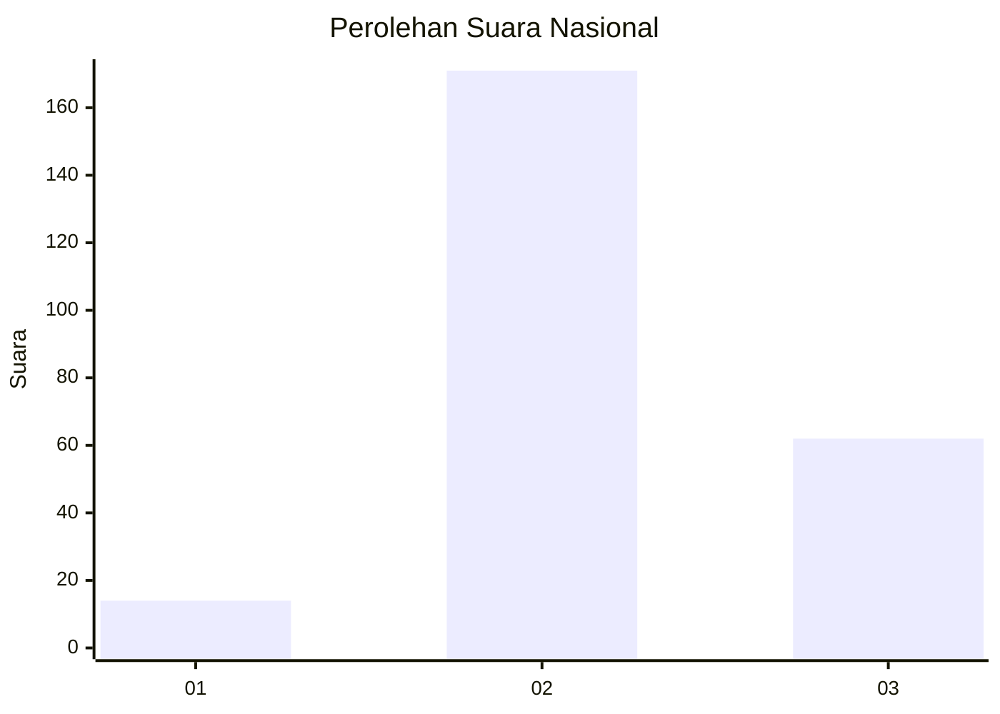
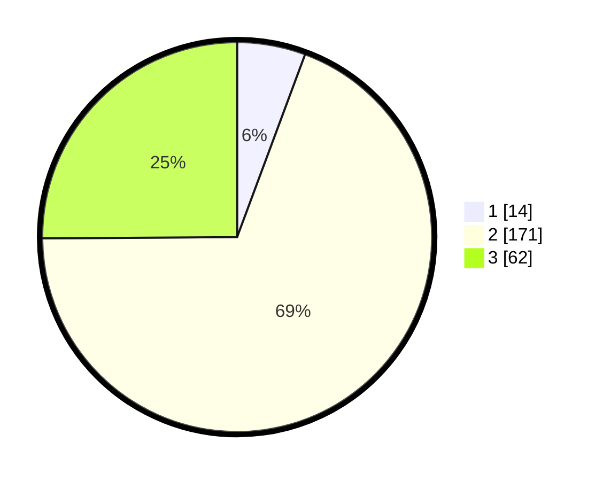

# Hasil

## Grafik

## Tabel

| No. | Nama Paslon    | Suara | Suara (raw) | Persentase |
|:--- |:-------------- | -----:| -----------:| ----------:|
| 1   | ANIES MUHAIMIN | 14    | [14][p-1]   | 5,67       |
| 2   | PRABOWO GIBRAN | 171   | [171][p-2]  | 69,23      |
| 3   | GANJAR MAHFUD  | 62    | [62][p-3]   | 25,10      |

[p-1]: https://github.com/gigit-pemilu/pemilu-2024/blob/main/pilpres/hitung-suara/sub/51-bali/sub/01-jembrana/sub/01-negara/sub/1013-lelateng/sub/012-tps/sub/paslon-1.txt
[p-2]: https://github.com/gigit-pemilu/pemilu-2024/blob/main/pilpres/hitung-suara/sub/51-bali/sub/01-jembrana/sub/01-negara/sub/1013-lelateng/sub/012-tps/sub/paslon-2.txt
[p-3]: https://github.com/gigit-pemilu/pemilu-2024/blob/main/pilpres/hitung-suara/sub/51-bali/sub/01-jembrana/sub/01-negara/sub/1013-lelateng/sub/012-tps/sub/paslon-3.txt

## Foto C Plano

https://sirekap-obj-formc.kpu.go.id/ea41/pemilu/ppwp/51/01/01/10/13/5101011013012-20240215-014040--8119b4fb-9a90-43c7-9966-b51e70b179ae.jpg

https://sirekap-obj-formc.kpu.go.id/ea41/pemilu/ppwp/51/01/01/10/13/5101011013012-20240215-014100--72abcdb6-e8a7-4978-a521-2c68c0922291.jpg

https://sirekap-obj-formc.kpu.go.id/ea41/pemilu/ppwp/51/01/01/10/13/5101011013012-20240215-014118--b648ad49-7f5c-4f7b-a5a9-8a3a81866377.jpg

## Metadata

| Key        | Value               |
| ---------- | ------------------- |
| Time Stamp | 2024-02-15 07:00:44 |

## DATA PEMILIH TETAP

Jumlah pemilih dalam DPT: **297**.
 * L: **148**.
 * P: **149**.

## DATA PENGGUNA HAK PILIH

Jumlah pengguna hak pilih dalam DPT: **250**.
 * L: **122**.
 * P: **128**.

Jumlah pengguna hak pilih dalam DPTb: **1**.
 * L: **0**.
 * P: **1**.

Jumlah pengguna hak pilih dalam DPK: **0**.
 * L: **0**.
 * P: **0**.

Jumlah pengguna hak pilih: **251**.
 * L: **122**.
 * P: **129**.

## JUMLAH SUARA SAH DAN TIDAK SAH

JUMLAH SELURUH SUARA SAH: **247**.

JUMLAH SUARA TIDAK SAH: **4**.

JUMLAH SELURUH SUARA SAH DAN SUARA TIDAK SAH: **251**.

