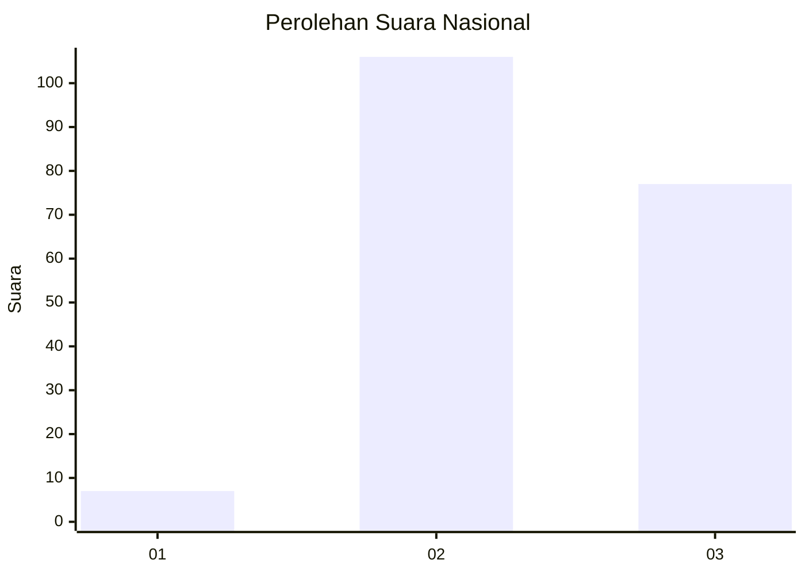
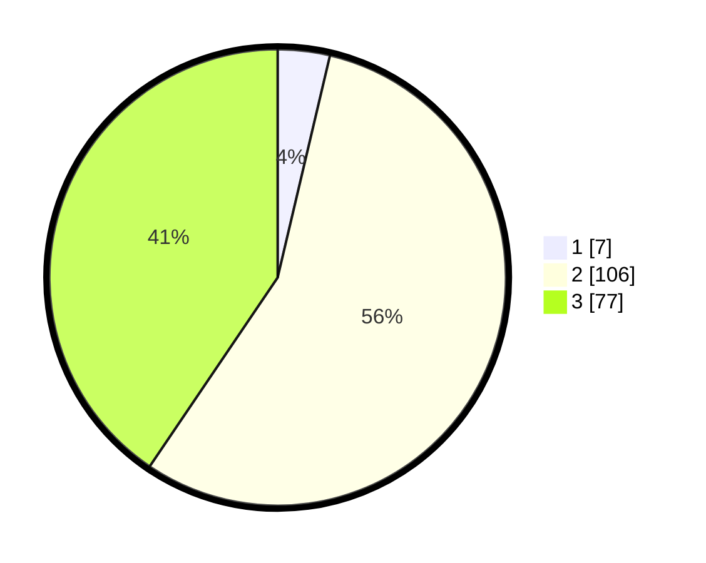

# Hasil

## Grafik

## Tabel

| No. | Nama Paslon    | Suara | Suara (raw) | Persentase |
|:--- |:-------------- | -----:| -----------:| ----------:|
| 1   | ANIES MUHAIMIN | 7     | [7][p-1]    | 3,68       |
| 2   | PRABOWO GIBRAN | 106   | [106][p-2]  | 55,79      |
| 3   | GANJAR MAHFUD  | 77    | [77][p-3]   | 40,53      |

[p-1]: https://github.com/gigit-pemilu/pemilu-2024/blob/main/pilpres/hitung-suara/sub/51-bali/sub/01-jembrana/sub/01-negara/sub/1013-lelateng/sub/015-tps/sub/paslon-1.txt
[p-2]: https://github.com/gigit-pemilu/pemilu-2024/blob/main/pilpres/hitung-suara/sub/51-bali/sub/01-jembrana/sub/01-negara/sub/1013-lelateng/sub/015-tps/sub/paslon-2.txt
[p-3]: https://github.com/gigit-pemilu/pemilu-2024/blob/main/pilpres/hitung-suara/sub/51-bali/sub/01-jembrana/sub/01-negara/sub/1013-lelateng/sub/015-tps/sub/paslon-3.txt

## Foto C Plano

https://sirekap-obj-formc.kpu.go.id/a48d/pemilu/ppwp/51/01/01/10/13/5101011013015-20240214-141821--28df042b-b9a7-4002-8b43-dd7c3406ee67.jpg

https://sirekap-obj-formc.kpu.go.id/a48d/pemilu/ppwp/51/01/01/10/13/5101011013015-20240214-141916--6345a772-66f8-4bce-a44f-fc03fa6cf83a.jpg

## Metadata

| Key        | Value               |
| ---------- | ------------------- |
| Time Stamp | 2024-02-24 22:31:28 |

