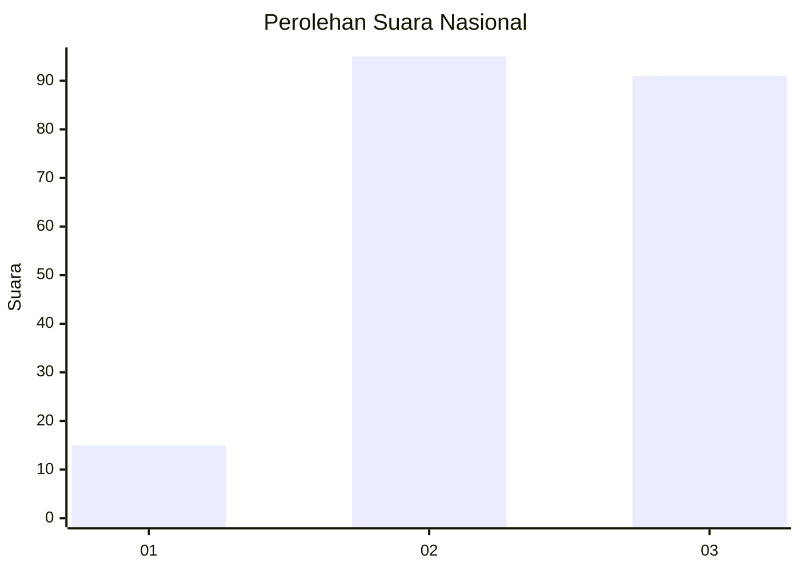
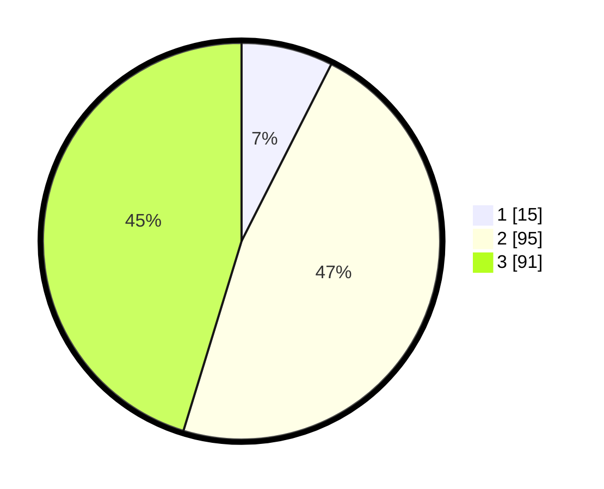

# Hasil

## Grafik

## Tabel

| No. | Nama Paslon    | Suara | Suara (raw) | Persentase |
|:--- |:-------------- | -----:| -----------:| ----------:|
| 1   | ANIES MUHAIMIN | 15    | [15][p-1]   | 7,46       |
| 2   | PRABOWO GIBRAN | 95    | [95][p-2]   | 47,26      |
| 3   | GANJAR MAHFUD  | 91    | [91][p-3]   | 45,27      |

[p-1]: https://github.com/gigit-pemilu/pemilu-2024/blob/main/pilpres/hitung-suara/sub/51-bali/sub/01-jembrana/sub/01-negara/sub/1013-lelateng/sub/016-tps/sub/paslon-1.txt
[p-2]: https://github.com/gigit-pemilu/pemilu-2024/blob/main/pilpres/hitung-suara/sub/51-bali/sub/01-jembrana/sub/01-negara/sub/1013-lelateng/sub/016-tps/sub/paslon-2.txt
[p-3]: https://github.com/gigit-pemilu/pemilu-2024/blob/main/pilpres/hitung-suara/sub/51-bali/sub/01-jembrana/sub/01-negara/sub/1013-lelateng/sub/016-tps/sub/paslon-3.txt

## Foto C Plano

https://sirekap-obj-formc.kpu.go.id/3997/pemilu/ppwp/51/01/01/10/13/5101011013016-20240214-132223--82f17323-1729-4897-95b9-83e676d0eefb.jpg

https://sirekap-obj-formc.kpu.go.id/3997/pemilu/ppwp/51/01/01/10/13/5101011013016-20240214-132315--2d5f3f04-bdfb-4b8e-a6b7-4967f3fadfe1.jpg

https://sirekap-obj-formc.kpu.go.id/3997/pemilu/ppwp/51/01/01/10/13/5101011013016-20240214-132432--264d9d10-56d6-4b34-8122-a00031557424.jpg

## Metadata

| Key        | Value               |
| ---------- | ------------------- |
| Time Stamp | 2024-02-14 21:46:01 |

## DATA PEMILIH TETAP

Jumlah pemilih dalam DPT: **254**.
 * L: **121**.
 * P: **133**.

## DATA PENGGUNA HAK PILIH

Jumlah pengguna hak pilih dalam DPT: **201**.
 * L: **92**.
 * P: **109**.

Jumlah pengguna hak pilih dalam DPTb: **0**.
 * L: **0**.
 * P: **0**.

Jumlah pengguna hak pilih dalam DPK: **0**.
 * L: **0**.
 * P: **0**.

Jumlah pengguna hak pilih: **201**.
 * L: **92**.
 * P: **109**.

## JUMLAH SUARA SAH DAN TIDAK SAH

JUMLAH SELURUH SUARA SAH: **201**.

JUMLAH SUARA TIDAK SAH: **0**.

JUMLAH SELURUH SUARA SAH DAN SUARA TIDAK SAH: **201**.

