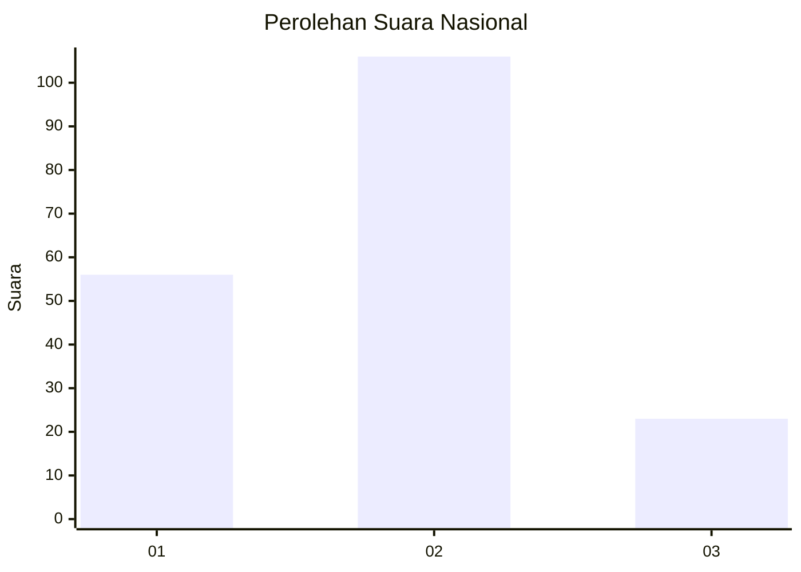
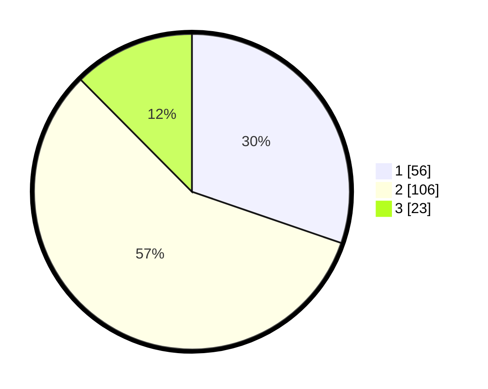

# Hasil

## Grafik

## Tabel

| No. | Nama Paslon    | Suara | Suara (raw) | Persentase |
|:--- |:-------------- | -----:| -----------:| ----------:|
| 1   | ANIES MUHAIMIN | 56    | [56][p-1]   | 30,27      |
| 2   | PRABOWO GIBRAN | 106   | [106][p-2]  | 57,30      |
| 3   | GANJAR MAHFUD  | 23    | [23][p-3]   | 12,43      |

[p-1]: https://github.com/gigit-pemilu/pemilu-2024/blob/main/pilpres/hitung-suara/sub/51-bali/sub/01-jembrana/sub/01-negara/sub/1013-lelateng/sub/017-tps/sub/paslon-1.txt
[p-2]: https://github.com/gigit-pemilu/pemilu-2024/blob/main/pilpres/hitung-suara/sub/51-bali/sub/01-jembrana/sub/01-negara/sub/1013-lelateng/sub/017-tps/sub/paslon-2.txt
[p-3]: https://github.com/gigit-pemilu/pemilu-2024/blob/main/pilpres/hitung-suara/sub/51-bali/sub/01-jembrana/sub/01-negara/sub/1013-lelateng/sub/017-tps/sub/paslon-3.txt

## Foto C Plano

https://sirekap-obj-formc.kpu.go.id/7af7/pemilu/ppwp/51/01/01/10/13/5101011013017-20240214-123805--c3745094-b7b3-4f4d-80de-a83d218ad967.jpg

https://sirekap-obj-formc.kpu.go.id/7af7/pemilu/ppwp/51/01/01/10/13/5101011013017-20240214-123909--144027aa-61d4-4921-973d-892743097bbf.jpg

https://sirekap-obj-formc.kpu.go.id/7af7/pemilu/ppwp/51/01/01/10/13/5101011013017-20240214-123947--2dd247a1-2f1e-4406-ab9a-55fba71d9f25.jpg

## Metadata

| Key        | Value               |
| ---------- | ------------------- |
| Time Stamp | 2024-02-14 21:46:01 |

## DATA PEMILIH TETAP

Jumlah pemilih dalam DPT: **225**.
 * L: **133**.
 * P: **92**.

## DATA PENGGUNA HAK PILIH

Jumlah pengguna hak pilih dalam DPT: **188**.
 * L: **109**.
 * P: **79**.

Jumlah pengguna hak pilih dalam DPTb: **0**.
 * L: **0**.
 * P: **0**.

Jumlah pengguna hak pilih dalam DPK: **0**.
 * L: **0**.
 * P: **0**.

Jumlah pengguna hak pilih: **188**.
 * L: **109**.
 * P: **79**.

## JUMLAH SUARA SAH DAN TIDAK SAH

JUMLAH SELURUH SUARA SAH: **185**.

JUMLAH SUARA TIDAK SAH: **3**.

JUMLAH SELURUH SUARA SAH DAN SUARA TIDAK SAH: **188**.

