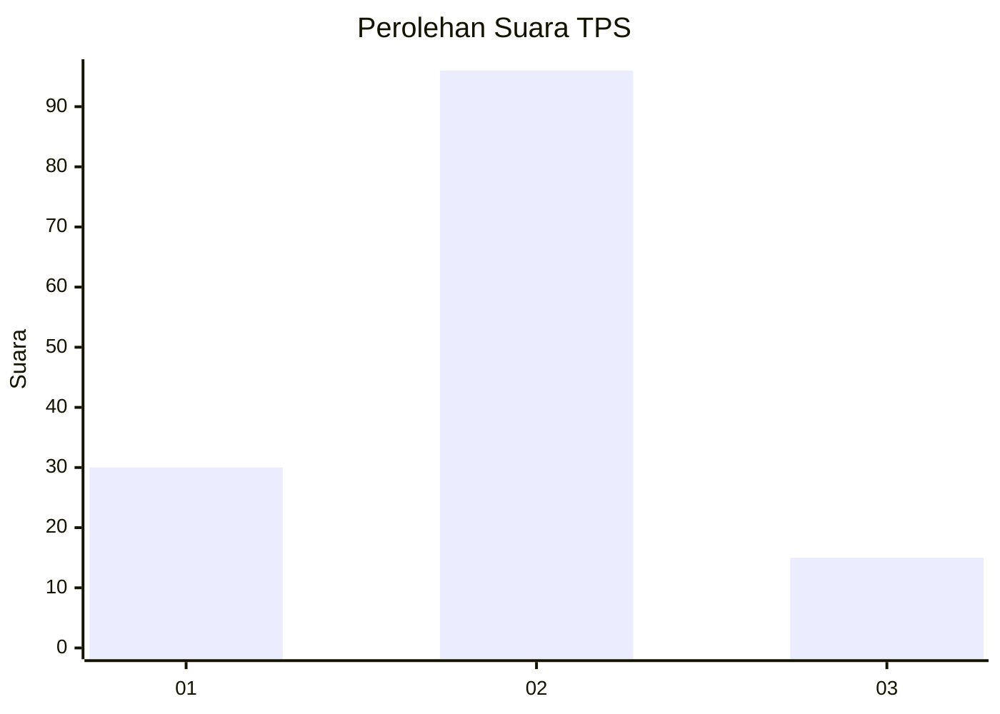

# Hasil

## Grafik

## Tabel

| No. | Nama Paslon    | Suara | Suara (raw) | Persentase |
|:--- |:-------------- | -----:| -----------:| ----------:|
| 1   | ANIES MUHAIMIN | 30    | [30][p-1]   | 21,28      |
| 2   | PRABOWO GIBRAN | 96    | [96][p-2]   | 68,09      |
| 3   | GANJAR MAHFUD  | 15    | [15][p-3]   | 10,64      |

[p-1]: https://github.com/gigit-pemilu/pemilu-2024-51-bali/blob/main/pilpres/hitung-suara/sub/51-bali/sub/01-jembrana/sub/01-negara/sub/1013-lelateng/sub/018-tps/sub/paslon-1.txt
[p-2]: https://github.com/gigit-pemilu/pemilu-2024-51-bali/blob/main/pilpres/hitung-suara/sub/51-bali/sub/01-jembrana/sub/01-negara/sub/1013-lelateng/sub/018-tps/sub/paslon-2.txt
[p-3]: https://github.com/gigit-pemilu/pemilu-2024-51-bali/blob/main/pilpres/hitung-suara/sub/51-bali/sub/01-jembrana/sub/01-negara/sub/1013-lelateng/sub/018-tps/sub/paslon-3.txt

## Foto C Plano

https://sirekap-obj-formc.kpu.go.id/47b1/pemilu/ppwp/51/01/01/10/13/5101011013018-20240214-140957--ade5bd1e-1458-4802-8001-956ebccdaae8.jpg

https://sirekap-obj-formc.kpu.go.id/47b1/pemilu/ppwp/51/01/01/10/13/5101011013018-20240214-141020--71801cb3-fda5-49cb-81b5-005d7c99f700.jpg

https://sirekap-obj-formc.kpu.go.id/47b1/pemilu/ppwp/51/01/01/10/13/5101011013018-20240214-155729--60a9bbd7-01c0-460d-8f23-71870551897c.jpg

## Metadata

| Key        | Value               |
| ---------- | ------------------- |
| Time Stamp | 2024-02-15 01:47:43 |

## DATA PEMILIH TETAP

Jumlah pemilih dalam DPT: **210**.
 * L: **101**.
 * P: **109**.

## DATA PENGGUNA HAK PILIH

Jumlah pengguna hak pilih dalam DPT: **140**.
 * L: **69**.
 * P: **71**.

Jumlah pengguna hak pilih dalam DPTb: **1**.
 * L: **0**.
 * P: **1**.

Jumlah pengguna hak pilih dalam DPK: **2**.
 * L: **1**.
 * P: **1**.

Jumlah pengguna hak pilih: **143**.
 * L: **70**.
 * P: **73**.

## JUMLAH SUARA SAH DAN TIDAK SAH

JUMLAH SELURUH SUARA SAH: **141**.

JUMLAH SUARA TIDAK SAH: **2**.

JUMLAH SELURUH SUARA SAH DAN SUARA TIDAK SAH: **143**.

