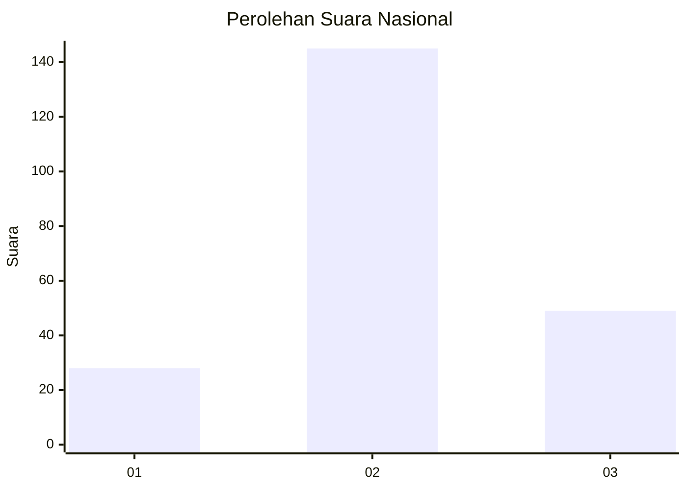
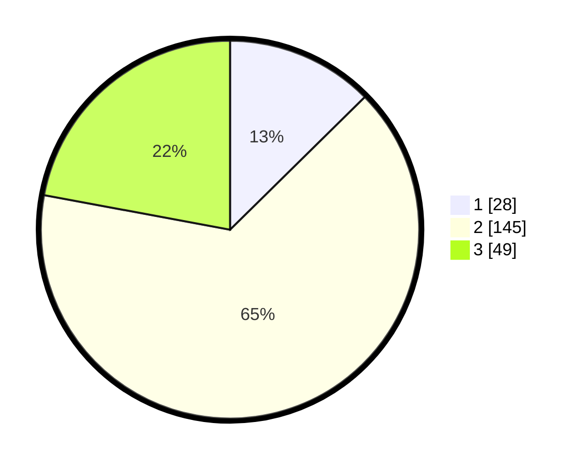

# Hasil

## Grafik

## Tabel

| No. | Nama Paslon    | Suara | Suara (raw) | Persentase |
|:--- |:-------------- | -----:| -----------:| ----------:|
| 1   | ANIES MUHAIMIN | 28    | [28][p-1]   | 12,61      |
| 2   | PRABOWO GIBRAN | 145   | [145][p-2]  | 65,32      |
| 3   | GANJAR MAHFUD  | 49    | [49][p-3]   | 22,07      |

[p-1]: https://github.com/gigit-pemilu/pemilu-2024/blob/main/pilpres/hitung-suara/sub/51-bali/sub/01-jembrana/sub/01-negara/sub/1013-lelateng/sub/024-tps/sub/paslon-1.txt
[p-2]: https://github.com/gigit-pemilu/pemilu-2024/blob/main/pilpres/hitung-suara/sub/51-bali/sub/01-jembrana/sub/01-negara/sub/1013-lelateng/sub/024-tps/sub/paslon-2.txt
[p-3]: https://github.com/gigit-pemilu/pemilu-2024/blob/main/pilpres/hitung-suara/sub/51-bali/sub/01-jembrana/sub/01-negara/sub/1013-lelateng/sub/024-tps/sub/paslon-3.txt

## Foto C Plano

https://sirekap-obj-formc.kpu.go.id/1dfe/pemilu/ppwp/51/01/01/10/13/5101011013024-20240214-141758--aa27eafb-0ec3-418c-899e-353dcc0176f6.jpg

https://sirekap-obj-formc.kpu.go.id/1dfe/pemilu/ppwp/51/01/01/10/13/5101011013024-20240214-141834--b052e2cf-4f8c-4c93-917b-954a447186e5.jpg

https://sirekap-obj-formc.kpu.go.id/1dfe/pemilu/ppwp/51/01/01/10/13/5101011013024-20240214-141942--24281304-29af-4f87-a606-e4527d0d1541.jpg

## Metadata

| Key        | Value               |
| ---------- | ------------------- |
| Time Stamp | 2024-02-14 21:46:01 |

## DATA PEMILIH TETAP

Jumlah pemilih dalam DPT: **285**.
 * L: **138**.
 * P: **147**.

## DATA PENGGUNA HAK PILIH

Jumlah pengguna hak pilih dalam DPT: **225**.
 * L: **110**.
 * P: **115**.

Jumlah pengguna hak pilih dalam DPTb: **2**.
 * L: **0**.
 * P: **2**.

Jumlah pengguna hak pilih dalam DPK: **1**.
 * L: **1**.
 * P: **0**.

Jumlah pengguna hak pilih: **228**.
 * L: **111**.
 * P: **117**.

## JUMLAH SUARA SAH DAN TIDAK SAH

JUMLAH SELURUH SUARA SAH: **222**.

JUMLAH SUARA TIDAK SAH: **6**.

JUMLAH SELURUH SUARA SAH DAN SUARA TIDAK SAH: **228**.

