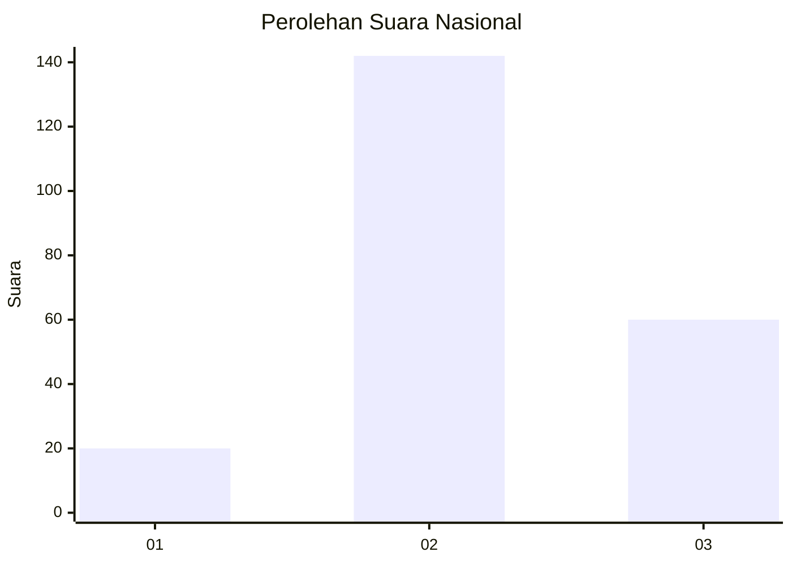
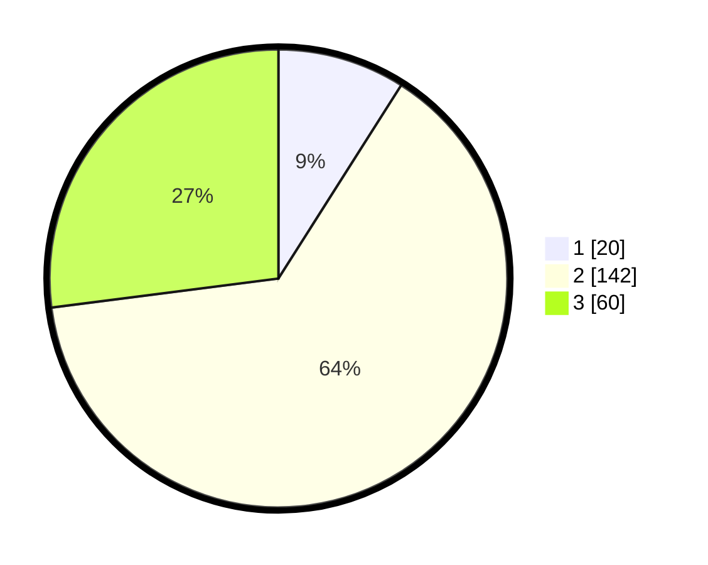

# Hasil

## Grafik

## Tabel

| No. | Nama Paslon    | Suara | Suara (raw) | Persentase |
|:--- |:-------------- | -----:| -----------:| ----------:|
| 1   | ANIES MUHAIMIN | 20    | [20][p-1]   | 9,01       |
| 2   | PRABOWO GIBRAN | 142   | [142][p-2]  | 63,96      |
| 3   | GANJAR MAHFUD  | 60    | [60][p-3]   | 27,03      |

[p-1]: https://github.com/gigit-pemilu/pemilu-2024/blob/main/pilpres/hitung-suara/sub/51-bali/sub/01-jembrana/sub/01-negara/sub/1013-lelateng/sub/025-tps/sub/paslon-1.txt
[p-2]: https://github.com/gigit-pemilu/pemilu-2024/blob/main/pilpres/hitung-suara/sub/51-bali/sub/01-jembrana/sub/01-negara/sub/1013-lelateng/sub/025-tps/sub/paslon-2.txt
[p-3]: https://github.com/gigit-pemilu/pemilu-2024/blob/main/pilpres/hitung-suara/sub/51-bali/sub/01-jembrana/sub/01-negara/sub/1013-lelateng/sub/025-tps/sub/paslon-3.txt

## Foto C Plano

https://sirekap-obj-formc.kpu.go.id/bd8c/pemilu/ppwp/51/01/01/10/13/5101011013025-20240214-194004--737355e0-7afc-4c0f-b719-28befbaa29e1.jpg

https://sirekap-obj-formc.kpu.go.id/bd8c/pemilu/ppwp/51/01/01/10/13/5101011013025-20240214-194025--9b874aef-423c-4330-99dc-05b702bd4021.jpg

https://sirekap-obj-formc.kpu.go.id/bd8c/pemilu/ppwp/51/01/01/10/13/5101011013025-20240214-194030--03135cfe-f98c-41a7-8048-a1448e2034b1.jpg

## Metadata

| Key        | Value               |
| ---------- | ------------------- |
| Time Stamp | 2024-02-14 21:46:01 |

## DATA PEMILIH TETAP

Jumlah pemilih dalam DPT: **295**.
 * L: **146**.
 * P: **149**.

## DATA PENGGUNA HAK PILIH

Jumlah pengguna hak pilih dalam DPT: **230**.
 * L: **108**.
 * P: **122**.

Jumlah pengguna hak pilih dalam DPTb: **0**.
 * L: **0**.
 * P: **0**.

Jumlah pengguna hak pilih dalam DPK: **0**.
 * L: **0**.
 * P: **0**.

Jumlah pengguna hak pilih: **230**.
 * L: **108**.
 * P: **122**.

## JUMLAH SUARA SAH DAN TIDAK SAH

JUMLAH SELURUH SUARA SAH: **222**.

JUMLAH SUARA TIDAK SAH: **8**.

JUMLAH SELURUH SUARA SAH DAN SUARA TIDAK SAH: **230**.

