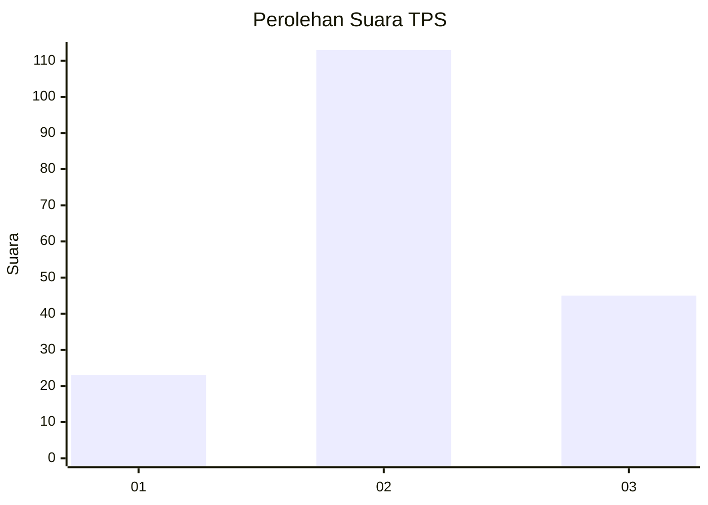
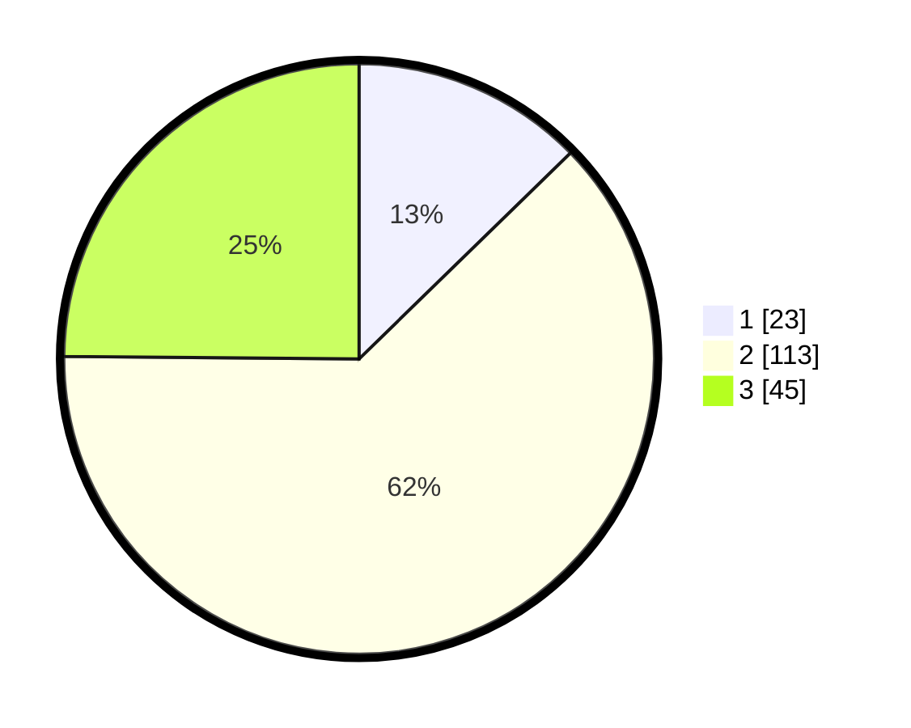

# Hasil

## Grafik

## Tabel

| No. | Nama Paslon    | Suara | Suara (raw) | Persentase |
|:--- |:-------------- | -----:| -----------:| ----------:|
| 1   | ANIES MUHAIMIN | 23    | [23][p-1]   | 12,71      |
| 2   | PRABOWO GIBRAN | 113   | [113][p-2]  | 62,43      |
| 3   | GANJAR MAHFUD  | 45    | [45][p-3]   | 24,86      |

[p-1]: https://github.com/gigit-pemilu/pemilu-2024-51-bali/blob/main/pilpres/hitung-suara/sub/51-bali/sub/01-jembrana/sub/01-negara/sub/1013-lelateng/sub/029-tps/sub/paslon-1.txt
[p-2]: https://github.com/gigit-pemilu/pemilu-2024-51-bali/blob/main/pilpres/hitung-suara/sub/51-bali/sub/01-jembrana/sub/01-negara/sub/1013-lelateng/sub/029-tps/sub/paslon-2.txt
[p-3]: https://github.com/gigit-pemilu/pemilu-2024-51-bali/blob/main/pilpres/hitung-suara/sub/51-bali/sub/01-jembrana/sub/01-negara/sub/1013-lelateng/sub/029-tps/sub/paslon-3.txt

## Foto C Plano

https://sirekap-obj-formc.kpu.go.id/9f15/pemilu/ppwp/51/01/01/10/13/5101011013029-20240214-141729--f6b92edb-6d73-4fa9-86b8-10fb6a14999b.jpg

https://sirekap-obj-formc.kpu.go.id/9f15/pemilu/ppwp/51/01/01/10/13/5101011013029-20240214-141334--ffb82463-2b1e-4d38-9501-aba5fd4d0bcf.jpg

https://sirekap-obj-formc.kpu.go.id/9f15/pemilu/ppwp/51/01/01/10/13/5101011013029-20240214-141412--687fd2c3-baf1-40af-b43e-c252d34c606a.jpg

## Metadata

| Key        | Value               |
| ---------- | ------------------- |
| Time Stamp | 2024-02-14 21:46:01 |

## DATA PEMILIH TETAP

Jumlah pemilih dalam DPT: **271**.
 * L: **127**.
 * P: **144**.

## DATA PENGGUNA HAK PILIH

Jumlah pengguna hak pilih dalam DPT: **183**.
 * L: **88**.
 * P: **95**.

Jumlah pengguna hak pilih dalam DPTb: **0**.
 * L: **0**.
 * P: **0**.

Jumlah pengguna hak pilih dalam DPK: **0**.
 * L: **0**.
 * P: **0**.

Jumlah pengguna hak pilih: **183**.
 * L: **88**.
 * P: **95**.

## JUMLAH SUARA SAH DAN TIDAK SAH

JUMLAH SELURUH SUARA SAH: **181**.

JUMLAH SUARA TIDAK SAH: **2**.

JUMLAH SELURUH SUARA SAH DAN SUARA TIDAK SAH: **183**.

