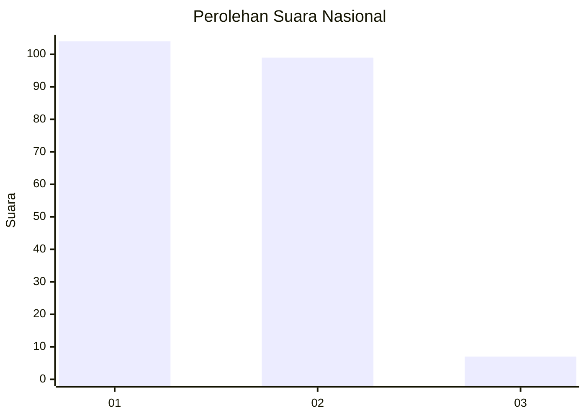
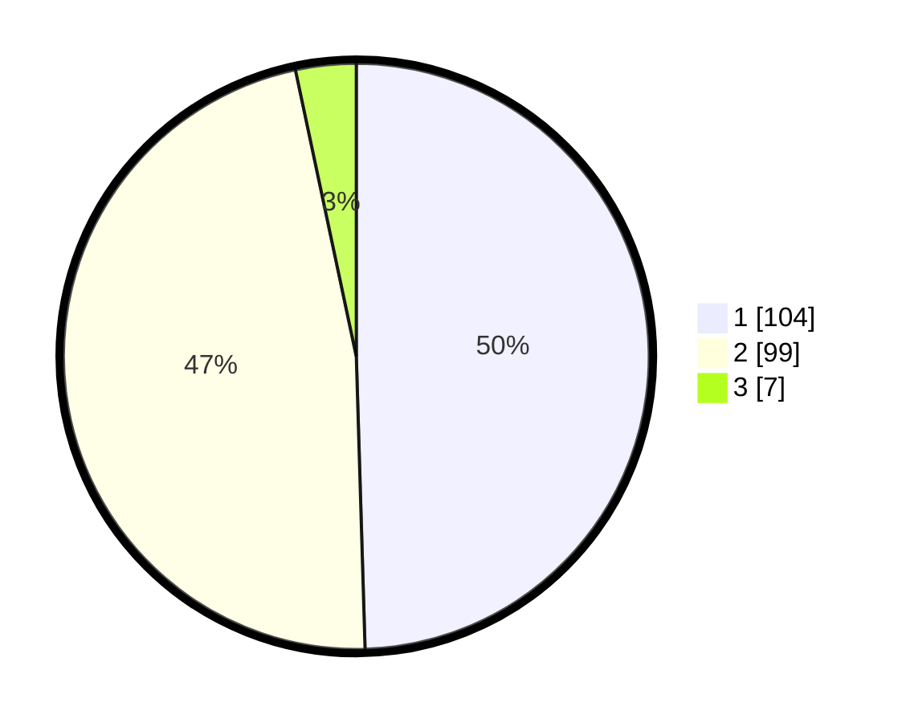

# Hasil

## Grafik

## Tabel

| No. | Nama Paslon    | Suara | Suara (raw) | Persentase |
|:--- |:-------------- | -----:| -----------:| ----------:|
| 1   | ANIES MUHAIMIN | 104   | [104][p-1]  | 49,52      |
| 2   | PRABOWO GIBRAN | 99    | [99][p-2]   | 47,14      |
| 3   | GANJAR MAHFUD  | 7     | [7][p-3]    | 3,33       |

[p-1]: https://github.com/gigit-pemilu/pemilu-2024/blob/main/pilpres/hitung-suara/sub/51-bali/sub/01-jembrana/sub/01-negara/sub/1014-loloan-barat/sub/005-tps/sub/paslon-1.txt
[p-2]: https://github.com/gigit-pemilu/pemilu-2024/blob/main/pilpres/hitung-suara/sub/51-bali/sub/01-jembrana/sub/01-negara/sub/1014-loloan-barat/sub/005-tps/sub/paslon-2.txt
[p-3]: https://github.com/gigit-pemilu/pemilu-2024/blob/main/pilpres/hitung-suara/sub/51-bali/sub/01-jembrana/sub/01-negara/sub/1014-loloan-barat/sub/005-tps/sub/paslon-3.txt

## Foto C Plano

https://sirekap-obj-formc.kpu.go.id/97b7/pemilu/ppwp/51/01/01/10/14/5101011014005-20240214-210726--9803475e-39f3-44ec-963f-935b2f0faeb4.jpg

https://sirekap-obj-formc.kpu.go.id/97b7/pemilu/ppwp/51/01/01/10/14/5101011014005-20240214-203448--7c9d0983-990c-40a4-b84e-7928f02c494b.jpg

https://sirekap-obj-formc.kpu.go.id/97b7/pemilu/ppwp/51/01/01/10/14/5101011014005-20240214-203543--1986865f-c024-4cd6-80c1-237fa401c7ca.jpg

## Metadata

| Key        | Value               |
| ---------- | ------------------- |
| Time Stamp | 2024-02-15 12:00:28 |

