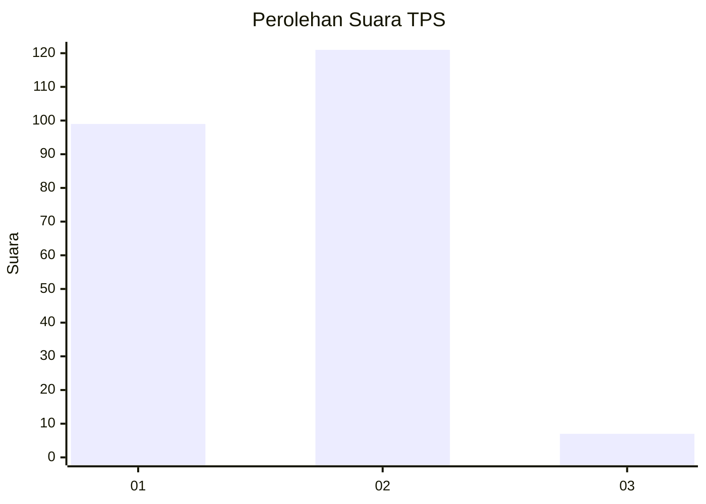
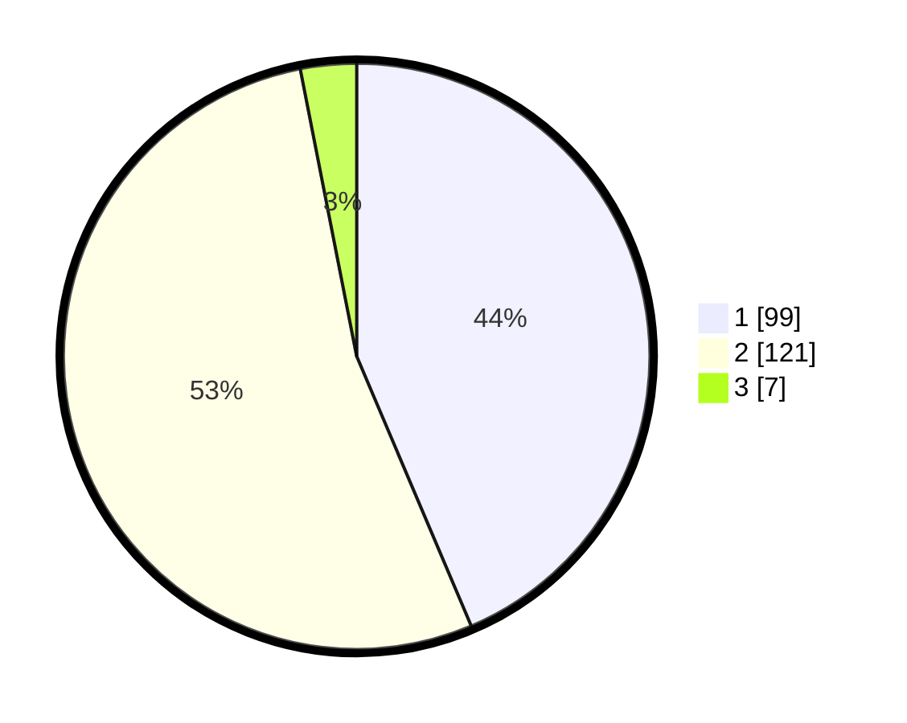

# Hasil

## Grafik

## Tabel

| No. | Nama Paslon    | Suara | Suara (raw) | Persentase |
|:--- |:-------------- | -----:| -----------:| ----------:|
| 1   | ANIES MUHAIMIN | 99    | [99][p-1]   | 43,61      |
| 2   | PRABOWO GIBRAN | 121   | [121][p-2]  | 53,30      |
| 3   | GANJAR MAHFUD  | 7     | [7][p-3]    | 3,08       |

[p-1]: https://github.com/gigit-pemilu/pemilu-2024-51-bali/blob/main/pilpres/hitung-suara/sub/51-bali/sub/01-jembrana/sub/01-negara/sub/1014-loloan-barat/sub/006-tps/sub/paslon-1.txt
[p-2]: https://github.com/gigit-pemilu/pemilu-2024-51-bali/blob/main/pilpres/hitung-suara/sub/51-bali/sub/01-jembrana/sub/01-negara/sub/1014-loloan-barat/sub/006-tps/sub/paslon-2.txt
[p-3]: https://github.com/gigit-pemilu/pemilu-2024-51-bali/blob/main/pilpres/hitung-suara/sub/51-bali/sub/01-jembrana/sub/01-negara/sub/1014-loloan-barat/sub/006-tps/sub/paslon-3.txt

## Foto C Plano

https://sirekap-obj-formc.kpu.go.id/d768/pemilu/ppwp/51/01/01/10/14/5101011014006-20240216-154416--5a8d787a-b62c-400a-84e6-8abd604faed6.jpg

https://sirekap-obj-formc.kpu.go.id/d768/pemilu/ppwp/51/01/01/10/14/5101011014006-20240216-154418--6bd58600-3ae1-45cd-be49-835976982188.jpg

https://sirekap-obj-formc.kpu.go.id/d768/pemilu/ppwp/51/01/01/10/14/5101011014006-20240216-154417--692963a1-abf8-4cd6-90c3-e0eaeb67165c.jpg

## Metadata

| Key        | Value               |
| ---------- | ------------------- |
| Time Stamp | 2024-02-16 16:25:10 |

## DATA PEMILIH TETAP

Jumlah pemilih dalam DPT: **285**.
 * L: **133**.
 * P: **152**.

## DATA PENGGUNA HAK PILIH

Jumlah pengguna hak pilih dalam DPT: **225**.
 * L: **101**.
 * P: **124**.

Jumlah pengguna hak pilih dalam DPTb: **2**.
 * L: **1**.
 * P: **1**.

Jumlah pengguna hak pilih dalam DPK: **4**.
 * L: **2**.
 * P: **2**.

Jumlah pengguna hak pilih: **231**.
 * L: **104**.
 * P: **127**.

## JUMLAH SUARA SAH DAN TIDAK SAH

JUMLAH SELURUH SUARA SAH: **227**.

JUMLAH SUARA TIDAK SAH: **4**.

JUMLAH SELURUH SUARA SAH DAN SUARA TIDAK SAH: **231**.

