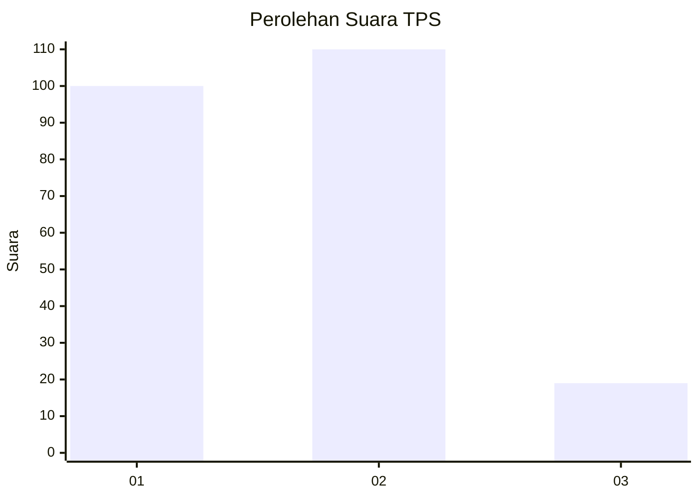
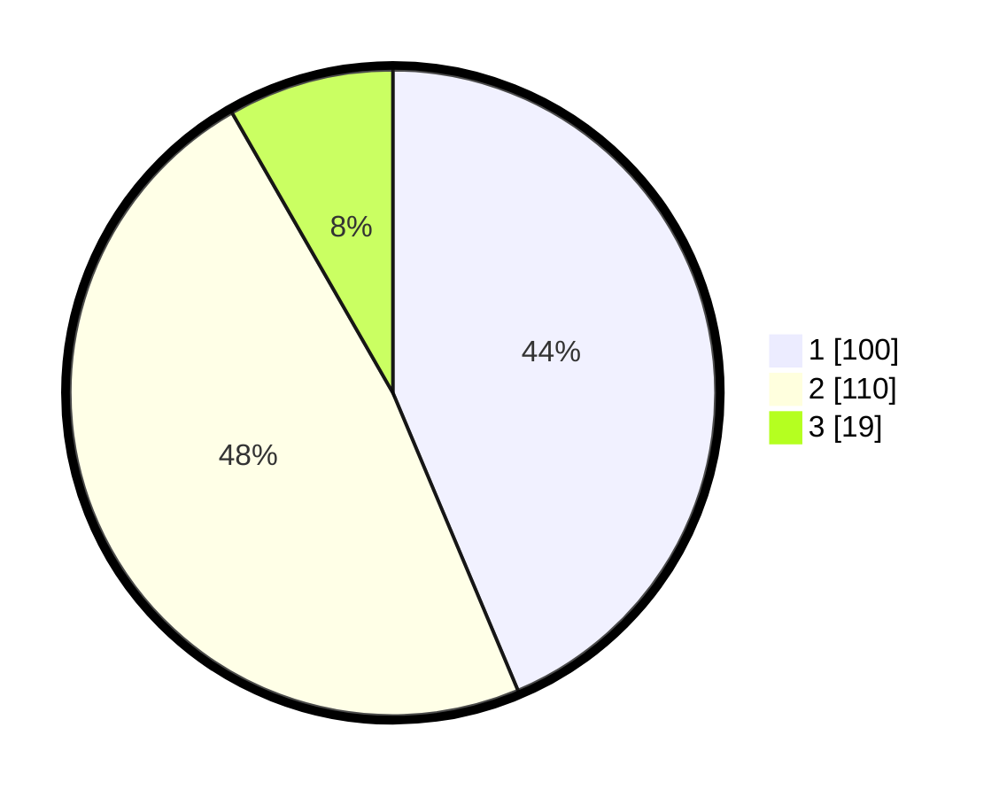

# Hasil

## Grafik

## Tabel

| No. | Nama Paslon    | Suara | Suara (raw) | Persentase |
|:--- |:-------------- | -----:| -----------:| ----------:|
| 1   | ANIES MUHAIMIN | 100   | [100][p-1]  | 43,67      |
| 2   | PRABOWO GIBRAN | 110   | [110][p-2]  | 48,03      |
| 3   | GANJAR MAHFUD  | 19    | [19][p-3]   | 8,30       |

[p-1]: https://github.com/gigit-pemilu/pemilu-2024-51-bali/blob/main/pilpres/hitung-suara/sub/51-bali/sub/01-jembrana/sub/01-negara/sub/1014-loloan-barat/sub/010-tps/sub/paslon-1.txt
[p-2]: https://github.com/gigit-pemilu/pemilu-2024-51-bali/blob/main/pilpres/hitung-suara/sub/51-bali/sub/01-jembrana/sub/01-negara/sub/1014-loloan-barat/sub/010-tps/sub/paslon-2.txt
[p-3]: https://github.com/gigit-pemilu/pemilu-2024-51-bali/blob/main/pilpres/hitung-suara/sub/51-bali/sub/01-jembrana/sub/01-negara/sub/1014-loloan-barat/sub/010-tps/sub/paslon-3.txt

## Foto C Plano

https://sirekap-obj-formc.kpu.go.id/7b73/pemilu/ppwp/51/01/01/10/14/5101011014010-20240214-195001--548243be-0d5a-4af0-975a-85b898846726.jpg

https://sirekap-obj-formc.kpu.go.id/7b73/pemilu/ppwp/51/01/01/10/14/5101011014010-20240214-195040--ee96e0fb-a633-445a-bd30-d502dafeeaa7.jpg

https://sirekap-obj-formc.kpu.go.id/7b73/pemilu/ppwp/51/01/01/10/14/5101011014010-20240214-195118--4574358f-e10f-4cdd-951a-fb4a7863e61e.jpg

## Metadata

| Key        | Value               |
| ---------- | ------------------- |
| Time Stamp | 2024-02-15 15:00:29 |

## DATA PEMILIH TETAP

Jumlah pemilih dalam DPT: **275**.
 * L: **143**.
 * P: **132**.

## DATA PENGGUNA HAK PILIH

Jumlah pengguna hak pilih dalam DPT: **227**.
 * L: **116**.
 * P: **111**.

Jumlah pengguna hak pilih dalam DPTb: **3**.
 * L: **1**.
 * P: **2**.

Jumlah pengguna hak pilih dalam DPK: **1**.
 * L: **1**.
 * P: **0**.

Jumlah pengguna hak pilih: **231**.
 * L: **118**.
 * P: **113**.

## JUMLAH SUARA SAH DAN TIDAK SAH

JUMLAH SELURUH SUARA SAH: **229**.

JUMLAH SUARA TIDAK SAH: **2**.

JUMLAH SELURUH SUARA SAH DAN SUARA TIDAK SAH: **231**.

