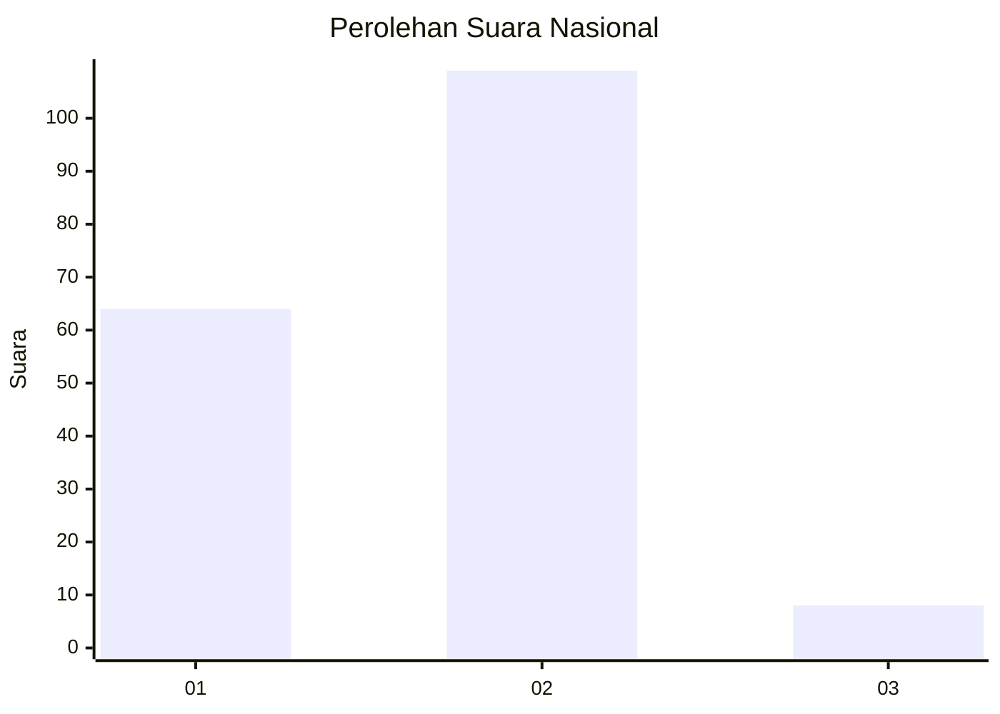
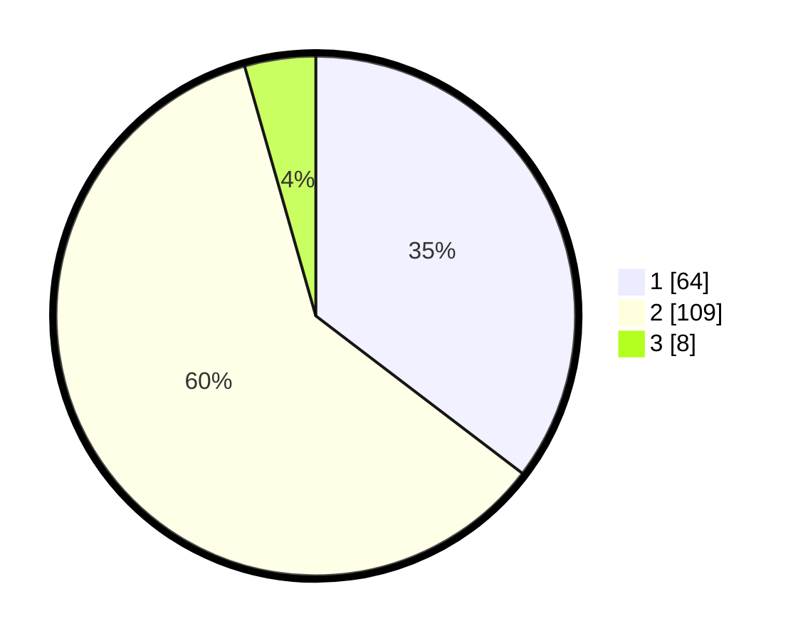

# Hasil

## Grafik

## Tabel

| No. | Nama Paslon    | Suara | Suara (raw) | Persentase |
|:--- |:-------------- | -----:| -----------:| ----------:|
| 1   | ANIES MUHAIMIN | 64    | [64][p-1]   | 35,36      |
| 2   | PRABOWO GIBRAN | 109   | [109][p-2]  | 60,22      |
| 3   | GANJAR MAHFUD  | 8     | [8][p-3]    | 4,42       |

[p-1]: https://github.com/gigit-pemilu/pemilu-2024/blob/main/pilpres/hitung-suara/sub/51-bali/sub/01-jembrana/sub/01-negara/sub/1014-loloan-barat/sub/012-tps/sub/paslon-1.txt
[p-2]: https://github.com/gigit-pemilu/pemilu-2024/blob/main/pilpres/hitung-suara/sub/51-bali/sub/01-jembrana/sub/01-negara/sub/1014-loloan-barat/sub/012-tps/sub/paslon-2.txt
[p-3]: https://github.com/gigit-pemilu/pemilu-2024/blob/main/pilpres/hitung-suara/sub/51-bali/sub/01-jembrana/sub/01-negara/sub/1014-loloan-barat/sub/012-tps/sub/paslon-3.txt

## Foto C Plano

https://sirekap-obj-formc.kpu.go.id/8a65/pemilu/ppwp/51/01/01/10/14/5101011014012-20240214-194037--1b7c73e0-3b1f-43d7-810e-3b0a98a895a2.jpg

https://sirekap-obj-formc.kpu.go.id/8a65/pemilu/ppwp/51/01/01/10/14/5101011014012-20240214-194046--4142082b-9939-4ce7-9d5f-f0fe0008acfa.jpg

https://sirekap-obj-formc.kpu.go.id/8a65/pemilu/ppwp/51/01/01/10/14/5101011014012-20240214-194052--b04461dc-2e35-4260-860a-85a14ac10aa3.jpg

## Metadata

| Key        | Value               |
| ---------- | ------------------- |
| Time Stamp | 2024-02-15 15:30:25 |

## DATA PEMILIH TETAP

Jumlah pemilih dalam DPT: **226**.
 * L: **111**.
 * P: **115**.

## DATA PENGGUNA HAK PILIH

Jumlah pengguna hak pilih dalam DPT: **181**.
 * L: **87**.
 * P: **94**.

Jumlah pengguna hak pilih dalam DPTb: **1**.
 * L: **1**.
 * P: **0**.

Jumlah pengguna hak pilih dalam DPK: **2**.
 * L: **0**.
 * P: **2**.

Jumlah pengguna hak pilih: **184**.
 * L: **85**.
 * P: **96**.

## JUMLAH SUARA SAH DAN TIDAK SAH

JUMLAH SELURUH SUARA SAH: **181**.

JUMLAH SUARA TIDAK SAH: **3**.

JUMLAH SELURUH SUARA SAH DAN SUARA TIDAK SAH: **184**.

