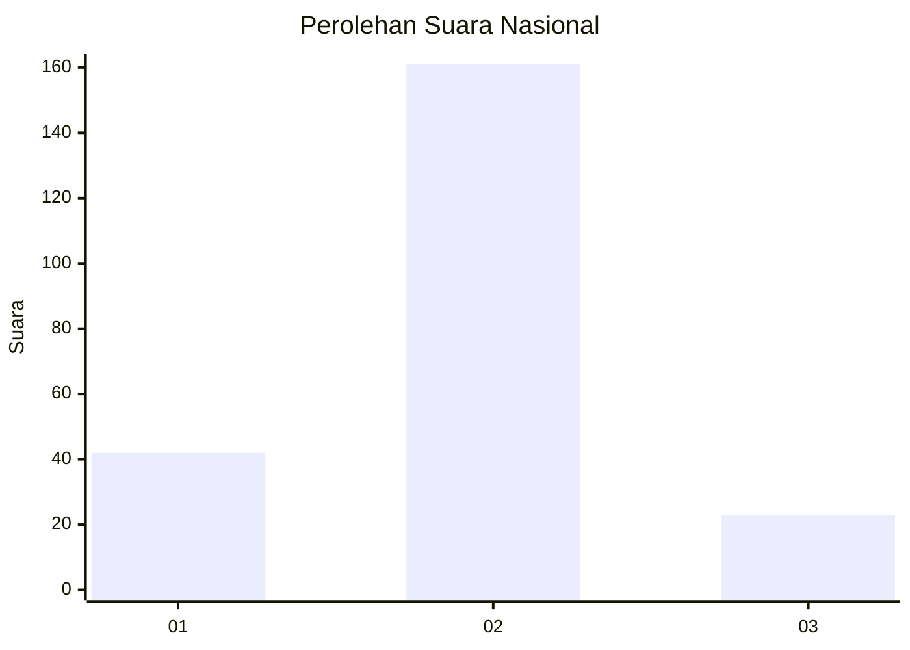
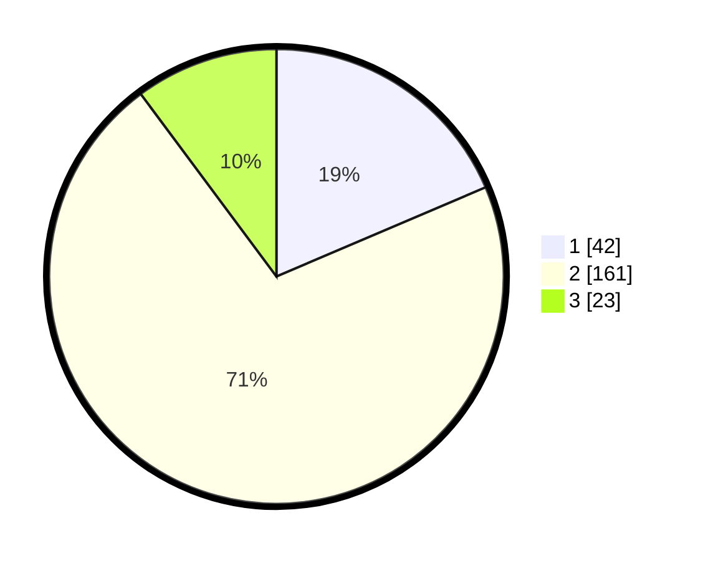

# Hasil

## Grafik

## Tabel

| No. | Nama Paslon    | Suara | Suara (raw) | Persentase |
|:--- |:-------------- | -----:| -----------:| ----------:|
| 1   | ANIES MUHAIMIN | 42    | [42][p-1]   | 18,58      |
| 2   | PRABOWO GIBRAN | 161   | [161][p-2]  | 71,24      |
| 3   | GANJAR MAHFUD  | 23    | [23][p-3]   | 10,18      |

[p-1]: https://github.com/gigit-pemilu/pemilu-2024/blob/main/pilpres/hitung-suara/sub/51-bali/sub/01-jembrana/sub/01-negara/sub/2001-cupel/sub/001-tps/sub/paslon-1.txt
[p-2]: https://github.com/gigit-pemilu/pemilu-2024/blob/main/pilpres/hitung-suara/sub/51-bali/sub/01-jembrana/sub/01-negara/sub/2001-cupel/sub/001-tps/sub/paslon-2.txt
[p-3]: https://github.com/gigit-pemilu/pemilu-2024/blob/main/pilpres/hitung-suara/sub/51-bali/sub/01-jembrana/sub/01-negara/sub/2001-cupel/sub/001-tps/sub/paslon-3.txt

## Foto C Plano

https://sirekap-obj-formc.kpu.go.id/bff8/pemilu/ppwp/51/01/01/20/01/5101012001001-20240214-190952--2f884c3c-11cf-4794-a8db-1c32108b1a88.jpg

https://sirekap-obj-formc.kpu.go.id/bff8/pemilu/ppwp/51/01/01/20/01/5101012001001-20240215-165242--e1d6abb2-8373-4bcf-ad9e-afffeae95b82.jpg

https://sirekap-obj-formc.kpu.go.id/bff8/pemilu/ppwp/51/01/01/20/01/5101012001001-20240214-191013--e76486b7-598f-4c53-8146-b1d8a6cb2a32.jpg

## Metadata

| Key        | Value               |
| ---------- | ------------------- |
| Time Stamp | 2024-02-16 06:00:27 |

## DATA PEMILIH TETAP

Jumlah pemilih dalam DPT: **297**.
 * L: **154**.
 * P: **143**.

## DATA PENGGUNA HAK PILIH

Jumlah pengguna hak pilih dalam DPT: **237**.
 * L: **128**.
 * P: **109**.

Jumlah pengguna hak pilih dalam DPTb: **0**.
 * L: **0**.
 * P: **0**.

Jumlah pengguna hak pilih dalam DPK: **0**.
 * L: **0**.
 * P: **0**.

Jumlah pengguna hak pilih: **237**.
 * L: **128**.
 * P: **109**.

## JUMLAH SUARA SAH DAN TIDAK SAH

JUMLAH SELURUH SUARA SAH: **226**.

JUMLAH SUARA TIDAK SAH: **11**.

JUMLAH SELURUH SUARA SAH DAN SUARA TIDAK SAH: **237**.

