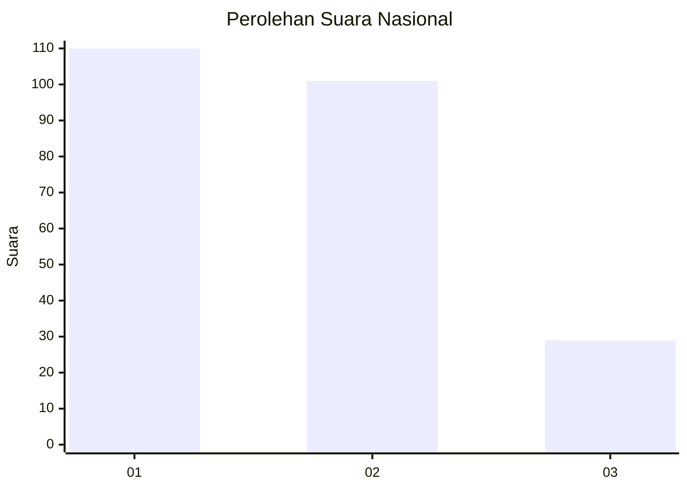
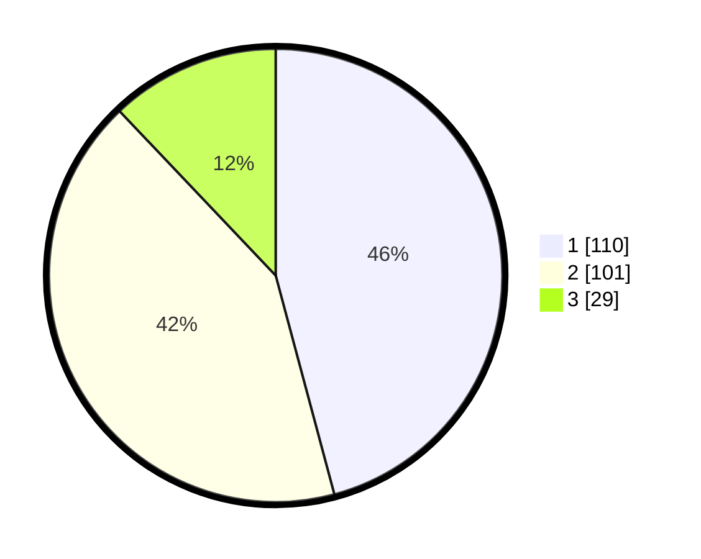

# Hasil

## Grafik

## Tabel

| No. | Nama Paslon    | Suara | Suara (raw) | Persentase |
|:--- |:-------------- | -----:| -----------:| ----------:|
| 1   | ANIES MUHAIMIN | 110   | [110][p-1]  | 45,83      |
| 2   | PRABOWO GIBRAN | 101   | [101][p-2]  | 42,08      |
| 3   | GANJAR MAHFUD  | 29    | [29][p-3]   | 12,08      |

[p-1]: https://github.com/gigit-pemilu/pemilu-2024/blob/main/pilpres/hitung-suara/sub/51-bali/sub/01-jembrana/sub/01-negara/sub/2001-cupel/sub/004-tps/sub/paslon-1.txt
[p-2]: https://github.com/gigit-pemilu/pemilu-2024/blob/main/pilpres/hitung-suara/sub/51-bali/sub/01-jembrana/sub/01-negara/sub/2001-cupel/sub/004-tps/sub/paslon-2.txt
[p-3]: https://github.com/gigit-pemilu/pemilu-2024/blob/main/pilpres/hitung-suara/sub/51-bali/sub/01-jembrana/sub/01-negara/sub/2001-cupel/sub/004-tps/sub/paslon-3.txt

## Foto C Plano

https://sirekap-obj-formc.kpu.go.id/8c42/pemilu/ppwp/51/01/01/20/01/5101012001004-20240214-200032--e596fe0c-8984-49f5-be5e-b5ab4b805925.jpg

https://sirekap-obj-formc.kpu.go.id/8c42/pemilu/ppwp/51/01/01/20/01/5101012001004-20240214-200419--81300f42-3e7e-4af4-819e-35bb722716a3.jpg

https://sirekap-obj-formc.kpu.go.id/8c42/pemilu/ppwp/51/01/01/20/01/5101012001004-20240214-200610--84317889-875f-4cd9-9652-377d9cb77afa.jpg

## Metadata

| Key        | Value               |
| ---------- | ------------------- |
| Time Stamp | 2024-02-15 12:00:28 |

## DATA PEMILIH TETAP

Jumlah pemilih dalam DPT: **296**.
 * L: **149**.
 * P: **147**.

## DATA PENGGUNA HAK PILIH

Jumlah pengguna hak pilih dalam DPT: **243**.
 * L: **119**.
 * P: **124**.

Jumlah pengguna hak pilih dalam DPTb: **2**.
 * L: **1**.
 * P: **1**.

Jumlah pengguna hak pilih dalam DPK: **0**.
 * L: **0**.
 * P: **0**.

Jumlah pengguna hak pilih: **245**.
 * L: **120**.
 * P: **125**.

## JUMLAH SUARA SAH DAN TIDAK SAH

JUMLAH SELURUH SUARA SAH: **240**.

JUMLAH SUARA TIDAK SAH: **5**.

JUMLAH SELURUH SUARA SAH DAN SUARA TIDAK SAH: **245**.

