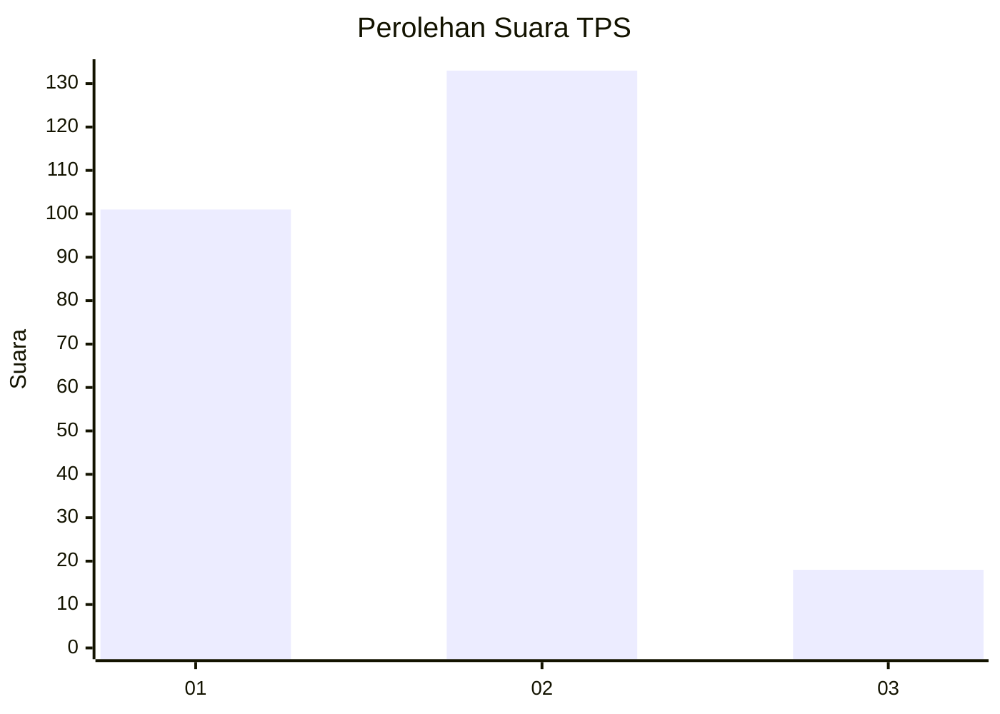

# Hasil

## Grafik

## Tabel

| No. | Nama Paslon    | Suara | Suara (raw) | Persentase |
|:--- |:-------------- | -----:| -----------:| ----------:|
| 1   | ANIES MUHAIMIN | 101   | [101][p-1]  | 40,08      |
| 2   | PRABOWO GIBRAN | 133   | [133][p-2]  | 52,78      |
| 3   | GANJAR MAHFUD  | 18    | [18][p-3]   | 7,14       |

[p-1]: https://github.com/gigit-pemilu/pemilu-2024-51-bali/blob/main/pilpres/hitung-suara/sub/51-bali/sub/01-jembrana/sub/01-negara/sub/2001-cupel/sub/005-tps/sub/paslon-1.txt
[p-2]: https://github.com/gigit-pemilu/pemilu-2024-51-bali/blob/main/pilpres/hitung-suara/sub/51-bali/sub/01-jembrana/sub/01-negara/sub/2001-cupel/sub/005-tps/sub/paslon-2.txt
[p-3]: https://github.com/gigit-pemilu/pemilu-2024-51-bali/blob/main/pilpres/hitung-suara/sub/51-bali/sub/01-jembrana/sub/01-negara/sub/2001-cupel/sub/005-tps/sub/paslon-3.txt

## Foto C Plano

https://sirekap-obj-formc.kpu.go.id/5a11/pemilu/ppwp/51/01/01/20/01/5101012001005-20240214-211429--5f404d2f-911d-44c0-9dcd-659deb3da524.jpg

https://sirekap-obj-formc.kpu.go.id/5a11/pemilu/ppwp/51/01/01/20/01/5101012001005-20240214-211432--99837719-fce3-4c83-be5f-c37c007d888a.jpg

https://sirekap-obj-formc.kpu.go.id/5a11/pemilu/ppwp/51/01/01/20/01/5101012001005-20240214-211434--cdbcc66f-9b49-4bf3-a323-bd26ef58720a.jpg

## Metadata

| Key        | Value               |
| ---------- | ------------------- |
| Time Stamp | 2024-02-15 06:00:23 |

## DATA PEMILIH TETAP

Jumlah pemilih dalam DPT: **291**.
 * L: **150**.
 * P: **141**.

## DATA PENGGUNA HAK PILIH

Jumlah pengguna hak pilih dalam DPT: **255**.
 * L: **132**.
 * P: **123**.

Jumlah pengguna hak pilih dalam DPTb: **1**.
 * L: **0**.
 * P: **1**.

Jumlah pengguna hak pilih dalam DPK: **1**.
 * L: **0**.
 * P: **1**.

Jumlah pengguna hak pilih: **257**.
 * L: **132**.
 * P: **125**.

## JUMLAH SUARA SAH DAN TIDAK SAH

JUMLAH SELURUH SUARA SAH: **252**.

JUMLAH SUARA TIDAK SAH: **5**.

JUMLAH SELURUH SUARA SAH DAN SUARA TIDAK SAH: **257**.

