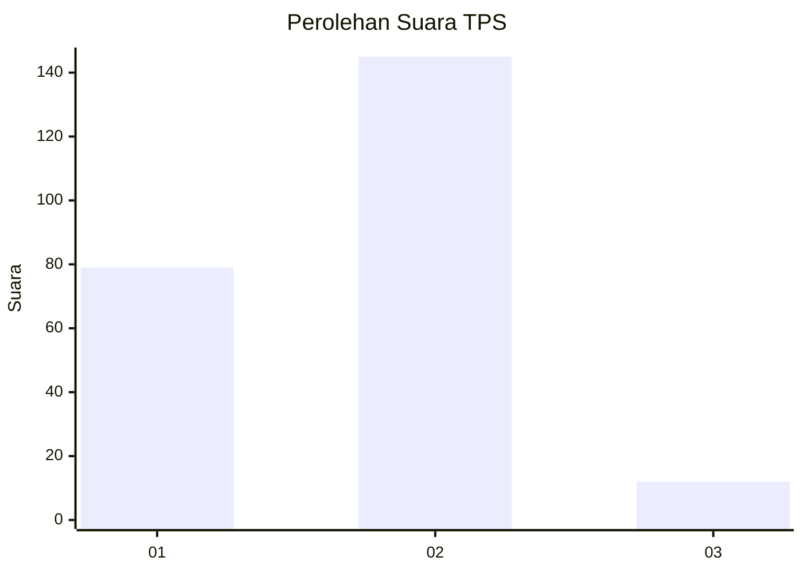
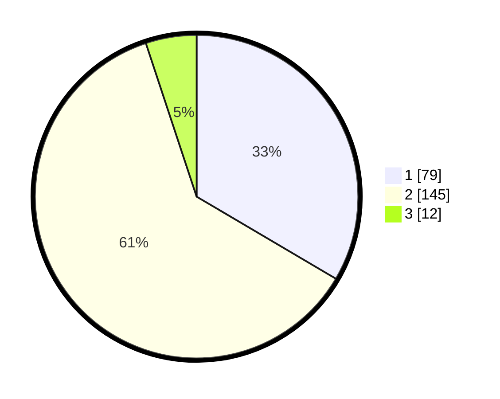

# Hasil

## Grafik

## Tabel

| No. | Nama Paslon    | Suara | Suara (raw) | Persentase |
|:--- |:-------------- | -----:| -----------:| ----------:|
| 1   | ANIES MUHAIMIN | 79    | [79][p-1]   | 33,47      |
| 2   | PRABOWO GIBRAN | 145   | [145][p-2]  | 61,44      |
| 3   | GANJAR MAHFUD  | 12    | [12][p-3]   | 5,08       |

[p-1]: https://github.com/gigit-pemilu/pemilu-2024-51-bali/blob/main/pilpres/hitung-suara/sub/51-bali/sub/01-jembrana/sub/01-negara/sub/2001-cupel/sub/007-tps/sub/paslon-1.txt
[p-2]: https://github.com/gigit-pemilu/pemilu-2024-51-bali/blob/main/pilpres/hitung-suara/sub/51-bali/sub/01-jembrana/sub/01-negara/sub/2001-cupel/sub/007-tps/sub/paslon-2.txt
[p-3]: https://github.com/gigit-pemilu/pemilu-2024-51-bali/blob/main/pilpres/hitung-suara/sub/51-bali/sub/01-jembrana/sub/01-negara/sub/2001-cupel/sub/007-tps/sub/paslon-3.txt

## Foto C Plano

https://sirekap-obj-formc.kpu.go.id/9b7b/pemilu/ppwp/51/01/01/20/01/5101012001007-20240214-193627--d7eb3c33-19b4-41a5-8d7d-cc7951d6b1f5.jpg

https://sirekap-obj-formc.kpu.go.id/9b7b/pemilu/ppwp/51/01/01/20/01/5101012001007-20240215-010237--90aff88d-911a-4ea1-a086-b3b19903476d.jpg

https://sirekap-obj-formc.kpu.go.id/9b7b/pemilu/ppwp/51/01/01/20/01/5101012001007-20240215-010335--0eff6659-5729-4e82-a96b-488eac64a537.jpg

## Metadata

| Key        | Value               |
| ---------- | ------------------- |
| Time Stamp | 2024-02-15 09:00:24 |

## DATA PEMILIH TETAP

Jumlah pemilih dalam DPT: **292**.
 * L: **143**.
 * P: **149**.

## DATA PENGGUNA HAK PILIH

Jumlah pengguna hak pilih dalam DPT: **236**.
 * L: **119**.
 * P: **117**.

Jumlah pengguna hak pilih dalam DPTb: **3**.
 * L: **1**.
 * P: **2**.

Jumlah pengguna hak pilih dalam DPK: **1**.
 * L: **0**.
 * P: **1**.

Jumlah pengguna hak pilih: **240**.
 * L: **120**.
 * P: **120**.

## JUMLAH SUARA SAH DAN TIDAK SAH

JUMLAH SELURUH SUARA SAH: **236**.

JUMLAH SUARA TIDAK SAH: **4**.

JUMLAH SELURUH SUARA SAH DAN SUARA TIDAK SAH: **240**.

