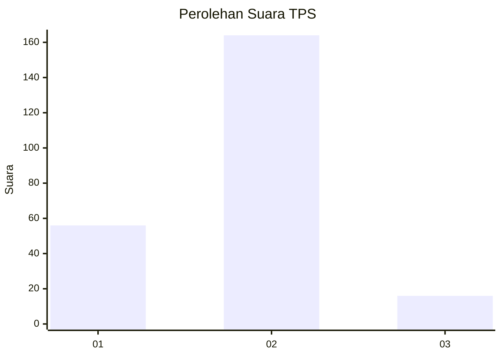
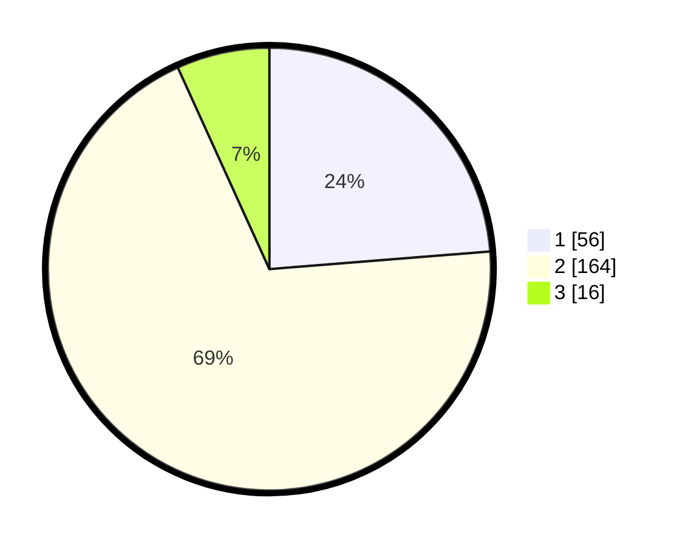

# Hasil

## Grafik

## Tabel

| No. | Nama Paslon    | Suara | Suara (raw) | Persentase |
|:--- |:-------------- | -----:| -----------:| ----------:|
| 1   | ANIES MUHAIMIN | 56    | [56][p-1]   | 23,73      |
| 2   | PRABOWO GIBRAN | 164   | [164][p-2]  | 69,49      |
| 3   | GANJAR MAHFUD  | 16    | [16][p-3]   | 6,78       |

[p-1]: https://github.com/gigit-pemilu/pemilu-2024-51-bali/blob/main/pilpres/hitung-suara/sub/51-bali/sub/01-jembrana/sub/01-negara/sub/2001-cupel/sub/008-tps/sub/paslon-1.txt
[p-2]: https://github.com/gigit-pemilu/pemilu-2024-51-bali/blob/main/pilpres/hitung-suara/sub/51-bali/sub/01-jembrana/sub/01-negara/sub/2001-cupel/sub/008-tps/sub/paslon-2.txt
[p-3]: https://github.com/gigit-pemilu/pemilu-2024-51-bali/blob/main/pilpres/hitung-suara/sub/51-bali/sub/01-jembrana/sub/01-negara/sub/2001-cupel/sub/008-tps/sub/paslon-3.txt

## Foto C Plano

https://sirekap-obj-formc.kpu.go.id/c7c7/pemilu/ppwp/51/01/01/20/01/5101012001008-20240214-141250--44356323-acab-4eb6-bd02-cb43ff1ffffc.jpg

https://sirekap-obj-formc.kpu.go.id/c7c7/pemilu/ppwp/51/01/01/20/01/5101012001008-20240214-141750--7617cc6a-69b3-41ac-914b-27d6c7b720d8.jpg

https://sirekap-obj-formc.kpu.go.id/c7c7/pemilu/ppwp/51/01/01/20/01/5101012001008-20240214-141551--f0653a3b-cf16-40a4-9915-62dc35815ba3.jpg

## Metadata

| Key        | Value               |
| ---------- | ------------------- |
| Time Stamp | 2024-02-14 21:46:01 |

## DATA PEMILIH TETAP

Jumlah pemilih dalam DPT: **292**.
 * L: **150**.
 * P: **142**.

## DATA PENGGUNA HAK PILIH

Jumlah pengguna hak pilih dalam DPT: **245**.
 * L: **122**.
 * P: **123**.

Jumlah pengguna hak pilih dalam DPTb: **0**.
 * L: **0**.
 * P: **0**.

Jumlah pengguna hak pilih dalam DPK: **3**.
 * L: **2**.
 * P: **1**.

Jumlah pengguna hak pilih: **248**.
 * L: **124**.
 * P: **124**.

## JUMLAH SUARA SAH DAN TIDAK SAH

JUMLAH SELURUH SUARA SAH: **236**.

JUMLAH SUARA TIDAK SAH: **12**.

JUMLAH SELURUH SUARA SAH DAN SUARA TIDAK SAH: **248**.

