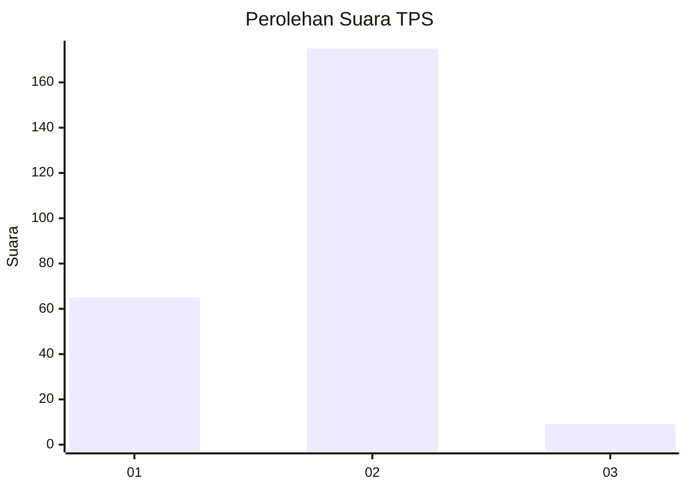
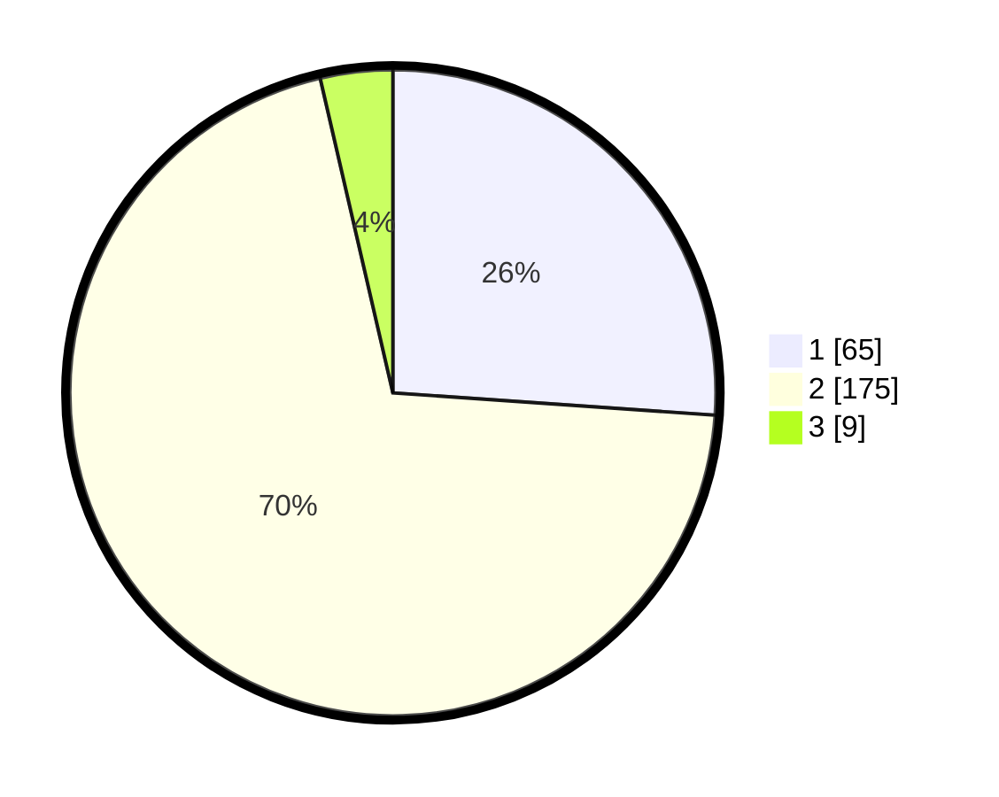

# Hasil

## Grafik

## Tabel

| No. | Nama Paslon    | Suara | Suara (raw) | Persentase |
|:--- |:-------------- | -----:| -----------:| ----------:|
| 1   | ANIES MUHAIMIN | 65    | [65][p-1]   | 26,10      |
| 2   | PRABOWO GIBRAN | 175   | [175][p-2]  | 70,28      |
| 3   | GANJAR MAHFUD  | 9     | [9][p-3]    | 3,61       |

[p-1]: https://github.com/gigit-pemilu/pemilu-2024-51-bali/blob/main/pilpres/hitung-suara/sub/51-bali/sub/01-jembrana/sub/01-negara/sub/2001-cupel/sub/009-tps/sub/paslon-1.txt
[p-2]: https://github.com/gigit-pemilu/pemilu-2024-51-bali/blob/main/pilpres/hitung-suara/sub/51-bali/sub/01-jembrana/sub/01-negara/sub/2001-cupel/sub/009-tps/sub/paslon-2.txt
[p-3]: https://github.com/gigit-pemilu/pemilu-2024-51-bali/blob/main/pilpres/hitung-suara/sub/51-bali/sub/01-jembrana/sub/01-negara/sub/2001-cupel/sub/009-tps/sub/paslon-3.txt

## Foto C Plano

https://sirekap-obj-formc.kpu.go.id/ffca/pemilu/ppwp/51/01/01/20/01/5101012001009-20240214-185435--ea0189db-c43b-46a6-a6ed-d9c30a87df89.jpg

https://sirekap-obj-formc.kpu.go.id/ffca/pemilu/ppwp/51/01/01/20/01/5101012001009-20240214-190637--ba4bf68d-de67-4a54-a1ee-3e62ab3b5c35.jpg

https://sirekap-obj-formc.kpu.go.id/ffca/pemilu/ppwp/51/01/01/20/01/5101012001009-20240214-190457--a2c20792-6fe2-488d-8a2f-6ea2c6244f3e.jpg

## Metadata

| Key        | Value               |
| ---------- | ------------------- |
| Time Stamp | 2024-02-14 21:46:01 |

## DATA PEMILIH TETAP

Jumlah pemilih dalam DPT: **285**.
 * L: **144**.
 * P: **141**.

## DATA PENGGUNA HAK PILIH

Jumlah pengguna hak pilih dalam DPT: **251**.
 * L: **126**.
 * P: **125**.

Jumlah pengguna hak pilih dalam DPTb: **2**.
 * L: **2**.
 * P: **0**.

Jumlah pengguna hak pilih dalam DPK: **5**.
 * L: **2**.
 * P: **3**.

Jumlah pengguna hak pilih: **258**.
 * L: **130**.
 * P: **128**.

## JUMLAH SUARA SAH DAN TIDAK SAH

JUMLAH SELURUH SUARA SAH: **249**.

JUMLAH SUARA TIDAK SAH: **9**.

JUMLAH SELURUH SUARA SAH DAN SUARA TIDAK SAH: **258**.

