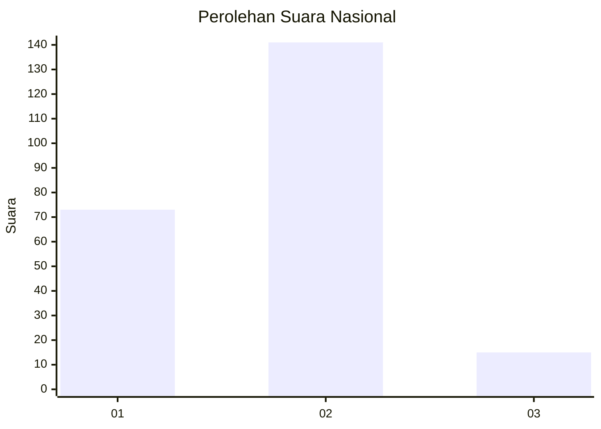
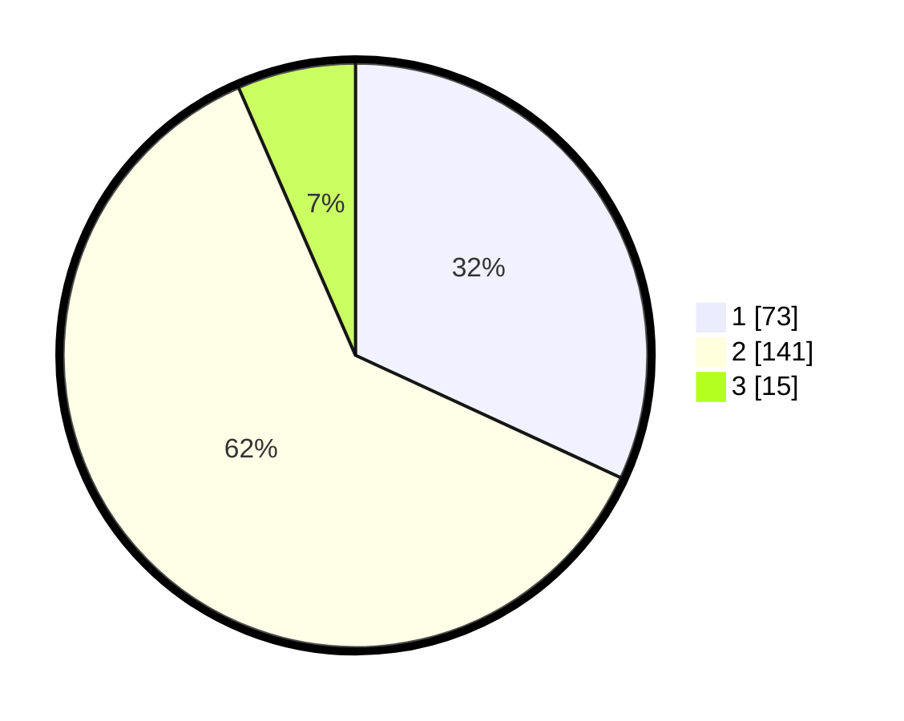

# Hasil

## Grafik

## Tabel

| No. | Nama Paslon    | Suara | Suara (raw) | Persentase |
|:--- |:-------------- | -----:| -----------:| ----------:|
| 1   | ANIES MUHAIMIN | 73    | [73][p-1]   | 31,88      |
| 2   | PRABOWO GIBRAN | 141   | [141][p-2]  | 61,57      |
| 3   | GANJAR MAHFUD  | 15    | [15][p-3]   | 6,55       |

[p-1]: https://github.com/gigit-pemilu/pemilu-2024/blob/main/pilpres/hitung-suara/sub/51-bali/sub/01-jembrana/sub/01-negara/sub/2001-cupel/sub/010-tps/sub/paslon-1.txt
[p-2]: https://github.com/gigit-pemilu/pemilu-2024/blob/main/pilpres/hitung-suara/sub/51-bali/sub/01-jembrana/sub/01-negara/sub/2001-cupel/sub/010-tps/sub/paslon-2.txt
[p-3]: https://github.com/gigit-pemilu/pemilu-2024/blob/main/pilpres/hitung-suara/sub/51-bali/sub/01-jembrana/sub/01-negara/sub/2001-cupel/sub/010-tps/sub/paslon-3.txt

## Foto C Plano

https://sirekap-obj-formc.kpu.go.id/5532/pemilu/ppwp/51/01/01/20/01/5101012001010-20240215-042617--843b09fa-68fe-4a52-beb0-bc63706e506f.jpg

https://sirekap-obj-formc.kpu.go.id/5532/pemilu/ppwp/51/01/01/20/01/5101012001010-20240214-224654--2f2f6c85-2014-474e-9b8a-832b373ccd98.jpg

https://sirekap-obj-formc.kpu.go.id/5532/pemilu/ppwp/51/01/01/20/01/5101012001010-20240214-200622--e531306b-b593-46e1-8051-2b6fcb945751.jpg

## Metadata

| Key        | Value               |
| ---------- | ------------------- |
| Time Stamp | 2024-02-16 06:00:27 |

## DATA PEMILIH TETAP

Jumlah pemilih dalam DPT: **266**.
 * L: **129**.
 * P: **137**.

## DATA PENGGUNA HAK PILIH

Jumlah pengguna hak pilih dalam DPT: **239**.
 * L: **118**.
 * P: **121**.

Jumlah pengguna hak pilih dalam DPTb: **0**.
 * L: **0**.
 * P: **0**.

Jumlah pengguna hak pilih dalam DPK: **0**.
 * L: **0**.
 * P: **0**.

Jumlah pengguna hak pilih: **239**.
 * L: **118**.
 * P: **121**.

## JUMLAH SUARA SAH DAN TIDAK SAH

JUMLAH SELURUH SUARA SAH: **229**.

JUMLAH SUARA TIDAK SAH: **10**.

JUMLAH SELURUH SUARA SAH DAN SUARA TIDAK SAH: **239**.

