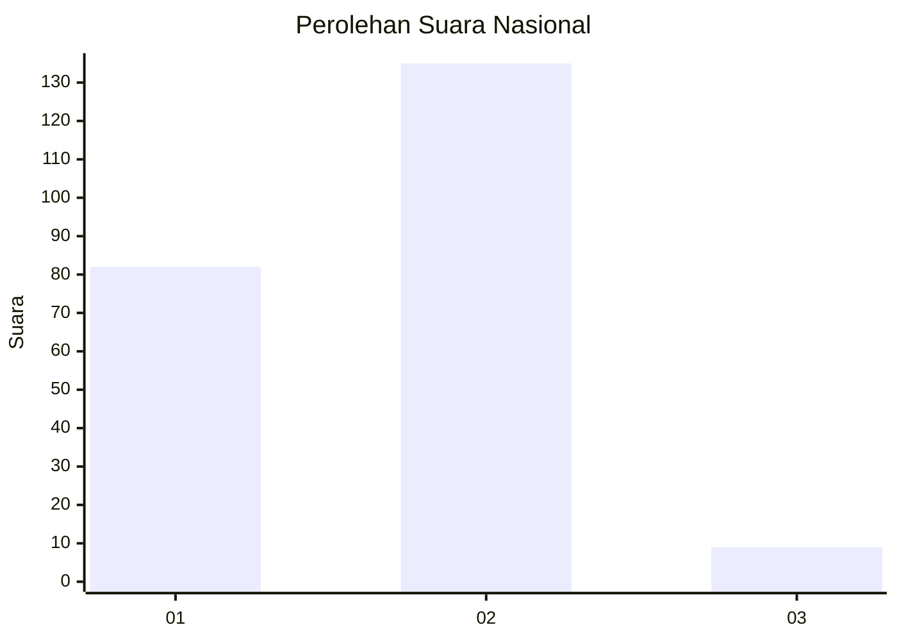
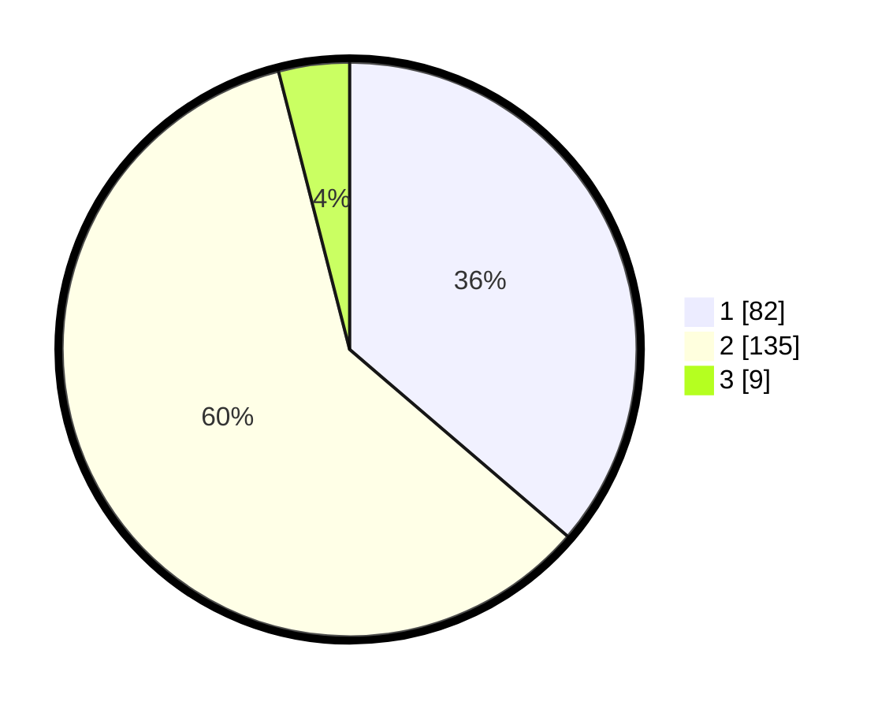

# Hasil

## Grafik

## Tabel

| No. | Nama Paslon    | Suara | Suara (raw) | Persentase |
|:--- |:-------------- | -----:| -----------:| ----------:|
| 1   | ANIES MUHAIMIN | 82    | [82][p-1]   | 36,28      |
| 2   | PRABOWO GIBRAN | 135   | [135][p-2]  | 59,73      |
| 3   | GANJAR MAHFUD  | 9     | [9][p-3]    | 3,98       |

[p-1]: https://github.com/gigit-pemilu/pemilu-2024/blob/main/pilpres/hitung-suara/sub/51-bali/sub/01-jembrana/sub/01-negara/sub/2001-cupel/sub/011-tps/sub/paslon-1.txt
[p-2]: https://github.com/gigit-pemilu/pemilu-2024/blob/main/pilpres/hitung-suara/sub/51-bali/sub/01-jembrana/sub/01-negara/sub/2001-cupel/sub/011-tps/sub/paslon-2.txt
[p-3]: https://github.com/gigit-pemilu/pemilu-2024/blob/main/pilpres/hitung-suara/sub/51-bali/sub/01-jembrana/sub/01-negara/sub/2001-cupel/sub/011-tps/sub/paslon-3.txt

## Foto C Plano

https://sirekap-obj-formc.kpu.go.id/b660/pemilu/ppwp/51/01/01/20/01/5101012001011-20240215-045552--ffff9a96-98b5-460b-b6be-0d5de9d2f0c7.jpg

https://sirekap-obj-formc.kpu.go.id/b660/pemilu/ppwp/51/01/01/20/01/5101012001011-20240215-045659--1c7c794e-60ec-404f-a04f-15394db737e9.jpg

https://sirekap-obj-formc.kpu.go.id/b660/pemilu/ppwp/51/01/01/20/01/5101012001011-20240215-045756--d52c0f91-6950-4ce1-9a3d-441c8217952b.jpg

## Metadata

| Key        | Value               |
| ---------- | ------------------- |
| Time Stamp | 2024-02-16 06:00:27 |

## DATA PEMILIH TETAP

Jumlah pemilih dalam DPT: **257**.
 * L: **126**.
 * P: **131**.

## DATA PENGGUNA HAK PILIH

Jumlah pengguna hak pilih dalam DPT: **232**.
 * L: **115**.
 * P: **117**.

Jumlah pengguna hak pilih dalam DPTb: **1**.
 * L: **1**.
 * P: **0**.

Jumlah pengguna hak pilih dalam DPK: **0**.
 * L: **0**.
 * P: **0**.

Jumlah pengguna hak pilih: **233**.
 * L: **116**.
 * P: **117**.

## JUMLAH SUARA SAH DAN TIDAK SAH

JUMLAH SELURUH SUARA SAH: **226**.

JUMLAH SUARA TIDAK SAH: **7**.

JUMLAH SELURUH SUARA SAH DAN SUARA TIDAK SAH: **233**.

