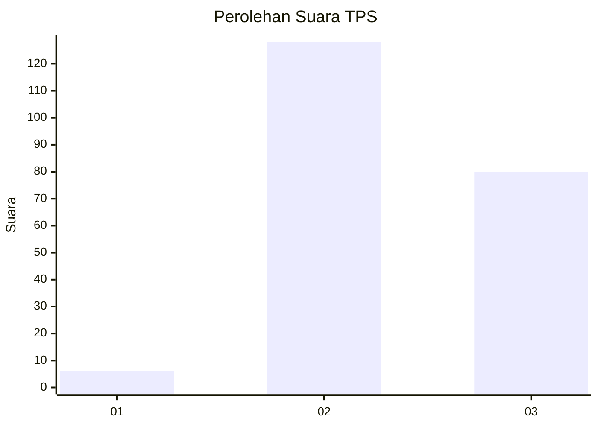
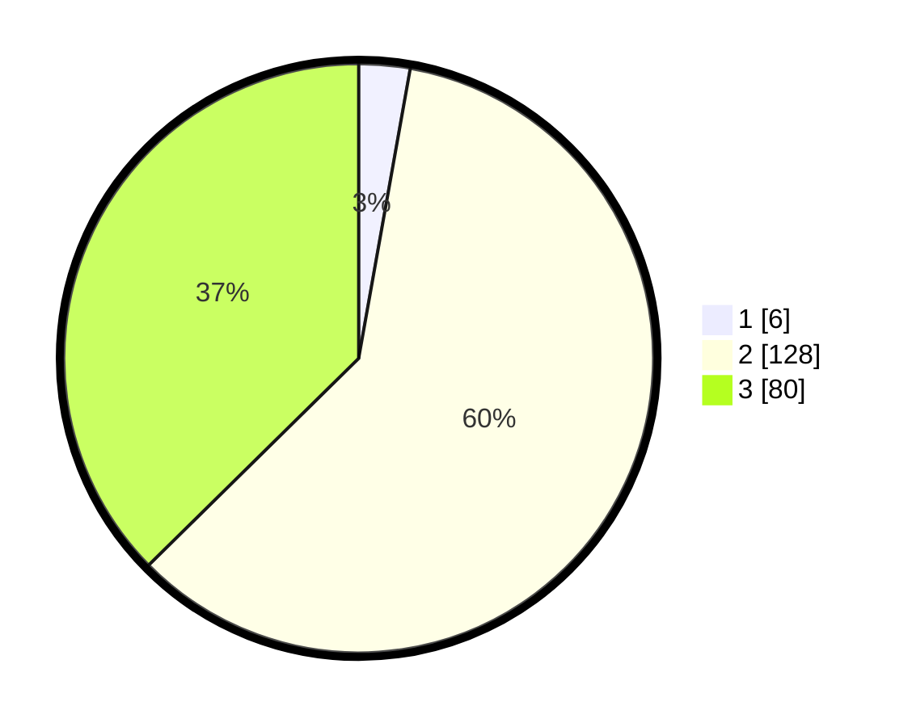

# Hasil

## Grafik

## Tabel

| No. | Nama Paslon    | Suara | Suara (raw) | Persentase |
|:--- |:-------------- | -----:| -----------:| ----------:|
| 1   | ANIES MUHAIMIN | 6     | [6][p-1]    | 2,80       |
| 2   | PRABOWO GIBRAN | 128   | [128][p-2]  | 59,81      |
| 3   | GANJAR MAHFUD  | 80    | [80][p-3]   | 37,38      |

[p-1]: https://github.com/gigit-pemilu/pemilu-2024-51-bali/blob/main/pilpres/hitung-suara/sub/51-bali/sub/01-jembrana/sub/01-negara/sub/2002-baluk/sub/017-tps/sub/paslon-1.txt
[p-2]: https://github.com/gigit-pemilu/pemilu-2024-51-bali/blob/main/pilpres/hitung-suara/sub/51-bali/sub/01-jembrana/sub/01-negara/sub/2002-baluk/sub/017-tps/sub/paslon-2.txt
[p-3]: https://github.com/gigit-pemilu/pemilu-2024-51-bali/blob/main/pilpres/hitung-suara/sub/51-bali/sub/01-jembrana/sub/01-negara/sub/2002-baluk/sub/017-tps/sub/paslon-3.txt

## Foto C Plano

https://sirekap-obj-formc.kpu.go.id/914f/pemilu/ppwp/51/01/01/20/02/5101012002017-20240216-140846--340a42f8-2a82-4c62-83ba-6c6c18322a7b.jpg

https://sirekap-obj-formc.kpu.go.id/914f/pemilu/ppwp/51/01/01/20/02/5101012002017-20240216-140847--5f5295d7-0b78-4d23-969c-1df39d6bc11b.jpg

https://sirekap-obj-formc.kpu.go.id/914f/pemilu/ppwp/51/01/01/20/02/5101012002017-20240216-140846--caf744ec-3d6b-462d-860c-e306a17b1b32.jpg

## Metadata

| Key        | Value               |
| ---------- | ------------------- |
| Time Stamp | 2024-02-16 16:25:10 |

## DATA PEMILIH TETAP

Jumlah pemilih dalam DPT: **267**.
 * L: **134**.
 * P: **133**.

## DATA PENGGUNA HAK PILIH

Jumlah pengguna hak pilih dalam DPT: **211**.
 * L: **107**.
 * P: **104**.

Jumlah pengguna hak pilih dalam DPTb: **2**.
 * L: **1**.
 * P: **1**.

Jumlah pengguna hak pilih dalam DPK: **3**.
 * L: **0**.
 * P: **3**.

Jumlah pengguna hak pilih: **216**.
 * L: **108**.
 * P: **108**.

## JUMLAH SUARA SAH DAN TIDAK SAH

JUMLAH SELURUH SUARA SAH: **214**.

JUMLAH SUARA TIDAK SAH: **2**.

JUMLAH SELURUH SUARA SAH DAN SUARA TIDAK SAH: **216**.

