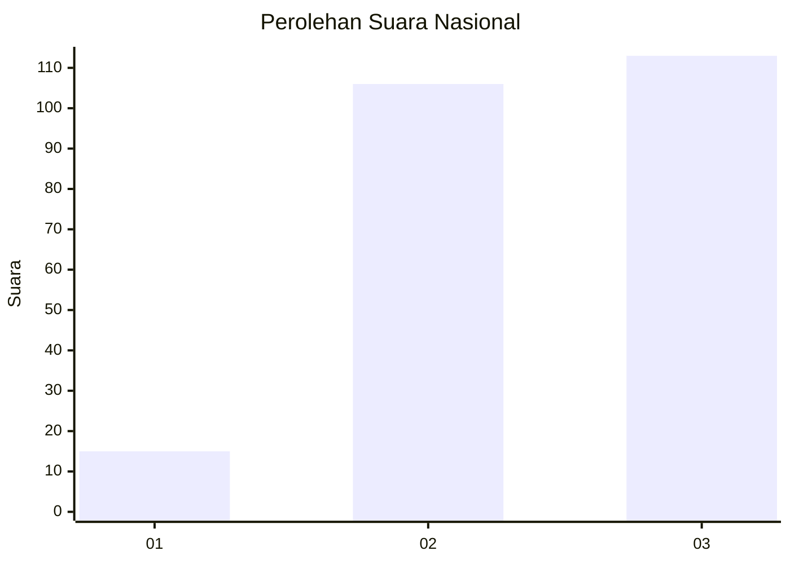
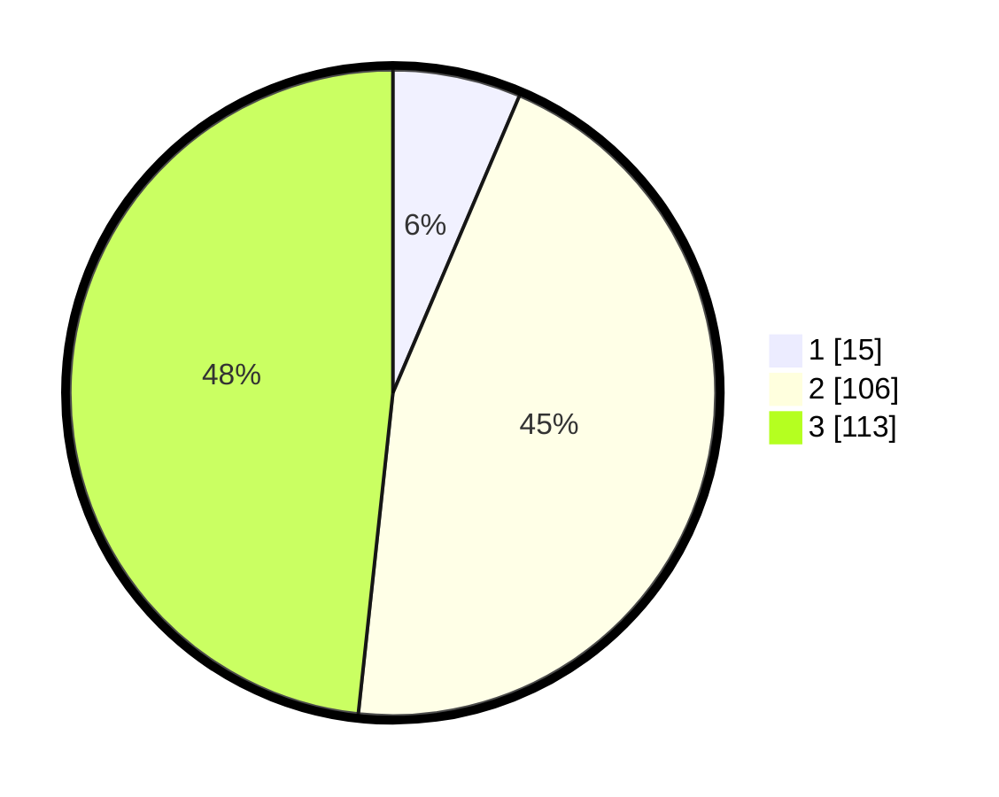

# Hasil

## Grafik

## Tabel

| No. | Nama Paslon    | Suara | Suara (raw) | Persentase |
|:--- |:-------------- | -----:| -----------:| ----------:|
| 1   | ANIES MUHAIMIN | 15    | [15][p-1]   | 6,41       |
| 2   | PRABOWO GIBRAN | 106   | [106][p-2]  | 45,30      |
| 3   | GANJAR MAHFUD  | 113   | [113][p-3]  | 48,29      |

[p-1]: https://github.com/gigit-pemilu/pemilu-2024/blob/main/pilpres/hitung-suara/sub/51-bali/sub/01-jembrana/sub/01-negara/sub/2003-banyubiru/sub/001-tps/sub/paslon-1.txt
[p-2]: https://github.com/gigit-pemilu/pemilu-2024/blob/main/pilpres/hitung-suara/sub/51-bali/sub/01-jembrana/sub/01-negara/sub/2003-banyubiru/sub/001-tps/sub/paslon-2.txt
[p-3]: https://github.com/gigit-pemilu/pemilu-2024/blob/main/pilpres/hitung-suara/sub/51-bali/sub/01-jembrana/sub/01-negara/sub/2003-banyubiru/sub/001-tps/sub/paslon-3.txt

## Foto C Plano

https://sirekap-obj-formc.kpu.go.id/bb4f/pemilu/ppwp/51/01/01/20/03/5101012003001-20240214-211703--f747b03b-7217-4a50-b896-18275575b7cb.jpg

https://sirekap-obj-formc.kpu.go.id/bb4f/pemilu/ppwp/51/01/01/20/03/5101012003001-20240214-211801--5bfa7492-9307-413c-a967-a7d69d9fb975.jpg

https://sirekap-obj-formc.kpu.go.id/bb4f/pemilu/ppwp/51/01/01/20/03/5101012003001-20240214-211903--4b584720-bc0b-42b0-af18-b328559f497a.jpg

## Metadata

| Key        | Value               |
| ---------- | ------------------- |
| Time Stamp | 2024-02-15 12:00:28 |

## DATA PEMILIH TETAP

Jumlah pemilih dalam DPT: **293**.
 * L: **141**.
 * P: **152**.

## DATA PENGGUNA HAK PILIH

Jumlah pengguna hak pilih dalam DPT: **234**.
 * L: **110**.
 * P: **124**.

Jumlah pengguna hak pilih dalam DPTb: **1**.
 * L: **1**.
 * P: **0**.

Jumlah pengguna hak pilih dalam DPK: **2**.
 * L: **0**.
 * P: **2**.

Jumlah pengguna hak pilih: **237**.
 * L: **111**.
 * P: **126**.

## JUMLAH SUARA SAH DAN TIDAK SAH

JUMLAH SELURUH SUARA SAH: **234**.

JUMLAH SUARA TIDAK SAH: **3**.

JUMLAH SELURUH SUARA SAH DAN SUARA TIDAK SAH: **237**.

