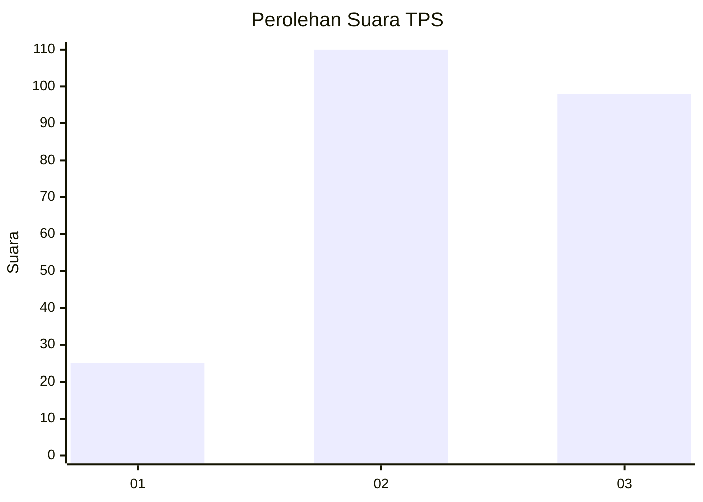
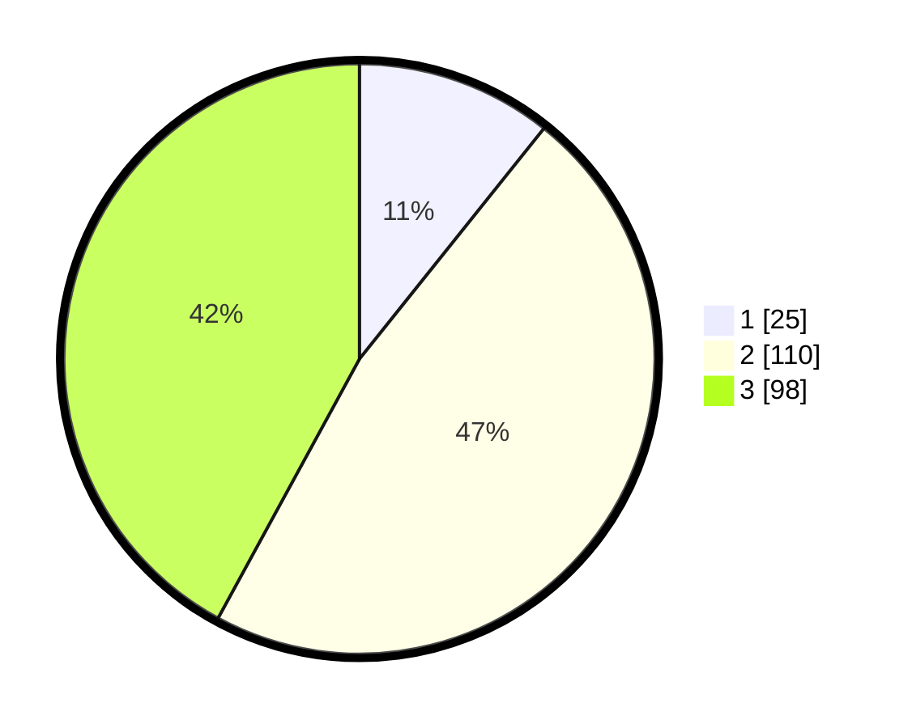

# Hasil

## Grafik

## Tabel

| No. | Nama Paslon    | Suara | Suara (raw) | Persentase |
|:--- |:-------------- | -----:| -----------:| ----------:|
| 1   | ANIES MUHAIMIN | 25    | [25][p-1]   | 10,73      |
| 2   | PRABOWO GIBRAN | 110   | [110][p-2]  | 47,21      |
| 3   | GANJAR MAHFUD  | 98    | [98][p-3]   | 42,06      |

[p-1]: https://github.com/gigit-pemilu/pemilu-2024-51-bali/blob/main/pilpres/hitung-suara/sub/51-bali/sub/01-jembrana/sub/01-negara/sub/2003-banyubiru/sub/004-tps/sub/paslon-1.txt
[p-2]: https://github.com/gigit-pemilu/pemilu-2024-51-bali/blob/main/pilpres/hitung-suara/sub/51-bali/sub/01-jembrana/sub/01-negara/sub/2003-banyubiru/sub/004-tps/sub/paslon-2.txt
[p-3]: https://github.com/gigit-pemilu/pemilu-2024-51-bali/blob/main/pilpres/hitung-suara/sub/51-bali/sub/01-jembrana/sub/01-negara/sub/2003-banyubiru/sub/004-tps/sub/paslon-3.txt

## Foto C Plano

https://sirekap-obj-formc.kpu.go.id/ec17/pemilu/ppwp/51/01/01/20/03/5101012003004-20240214-141108--e60bef29-ae01-430e-9ed9-62f578e1eeb3.jpg

https://sirekap-obj-formc.kpu.go.id/ec17/pemilu/ppwp/51/01/01/20/03/5101012003004-20240214-141123--049e2d62-5664-4300-8a6e-028f9c03ca0f.jpg

https://sirekap-obj-formc.kpu.go.id/ec17/pemilu/ppwp/51/01/01/20/03/5101012003004-20240214-141134--d8e09e94-522a-4d03-9596-6113bf5d9bae.jpg

## Metadata

| Key        | Value               |
| ---------- | ------------------- |
| Time Stamp | 2024-02-16 06:30:27 |

## DATA PEMILIH TETAP

Jumlah pemilih dalam DPT: **295**.
 * L: **149**.
 * P: **146**.

## DATA PENGGUNA HAK PILIH

Jumlah pengguna hak pilih dalam DPT: **234**.
 * L: **122**.
 * P: **112**.

Jumlah pengguna hak pilih dalam DPTb: **5**.
 * L: **4**.
 * P: **1**.

Jumlah pengguna hak pilih dalam DPK: **0**.
 * L: **0**.
 * P: **0**.

Jumlah pengguna hak pilih: **0**.
 * L: **0**.
 * P: **0**.

## JUMLAH SUARA SAH DAN TIDAK SAH

JUMLAH SELURUH SUARA SAH: **233**.

JUMLAH SUARA TIDAK SAH: **6**.

JUMLAH SELURUH SUARA SAH DAN SUARA TIDAK SAH: **239**.

