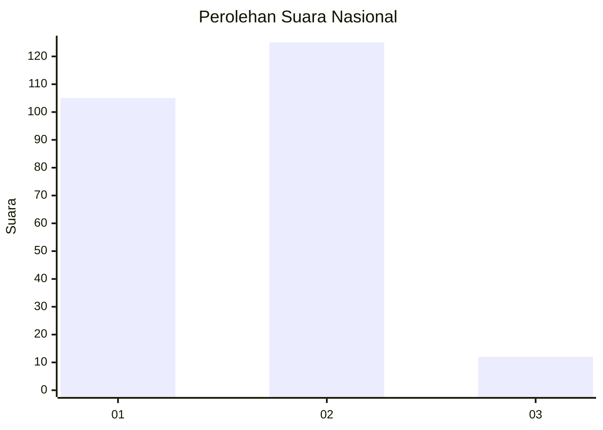
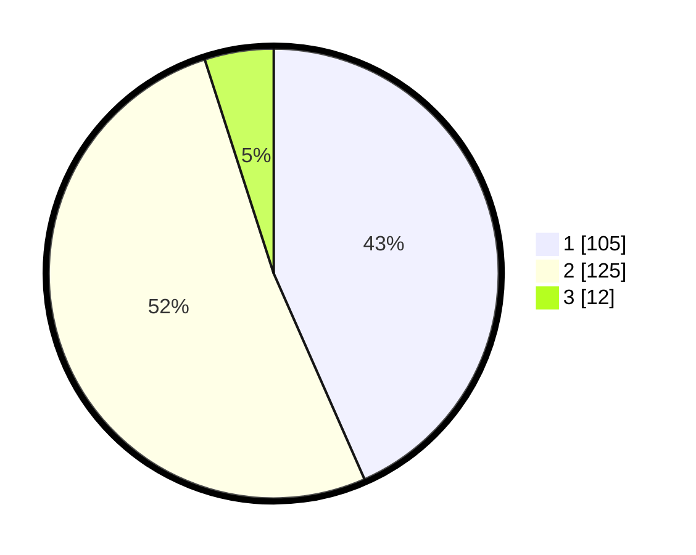

# Hasil

## Grafik

## Tabel

| No. | Nama Paslon    | Suara | Suara (raw) | Persentase |
|:--- |:-------------- | -----:| -----------:| ----------:|
| 1   | ANIES MUHAIMIN | 105   | [105][p-1]  | 43,39      |
| 2   | PRABOWO GIBRAN | 125   | [125][p-2]  | 51,65      |
| 3   | GANJAR MAHFUD  | 12    | [12][p-3]   | 4,96       |

[p-1]: https://github.com/gigit-pemilu/pemilu-2024/blob/main/pilpres/hitung-suara/sub/51-bali/sub/01-jembrana/sub/01-negara/sub/2003-banyubiru/sub/011-tps/sub/paslon-1.txt
[p-2]: https://github.com/gigit-pemilu/pemilu-2024/blob/main/pilpres/hitung-suara/sub/51-bali/sub/01-jembrana/sub/01-negara/sub/2003-banyubiru/sub/011-tps/sub/paslon-2.txt
[p-3]: https://github.com/gigit-pemilu/pemilu-2024/blob/main/pilpres/hitung-suara/sub/51-bali/sub/01-jembrana/sub/01-negara/sub/2003-banyubiru/sub/011-tps/sub/paslon-3.txt

## Foto C Plano

https://sirekap-obj-formc.kpu.go.id/533e/pemilu/ppwp/51/01/01/20/03/5101012003011-20240214-203632--1bb3a070-4c89-4a90-9929-b07de4af0aa4.jpg

https://sirekap-obj-formc.kpu.go.id/533e/pemilu/ppwp/51/01/01/20/03/5101012003011-20240214-190521--97f9dcda-f71f-43b3-a4f2-2c05a2e494f4.jpg

https://sirekap-obj-formc.kpu.go.id/533e/pemilu/ppwp/51/01/01/20/03/5101012003011-20240214-203752--2de1e709-c632-4f47-a840-3bfb10444c34.jpg

## Metadata

| Key        | Value               |
| ---------- | ------------------- |
| Time Stamp | 2024-02-15 15:30:25 |

