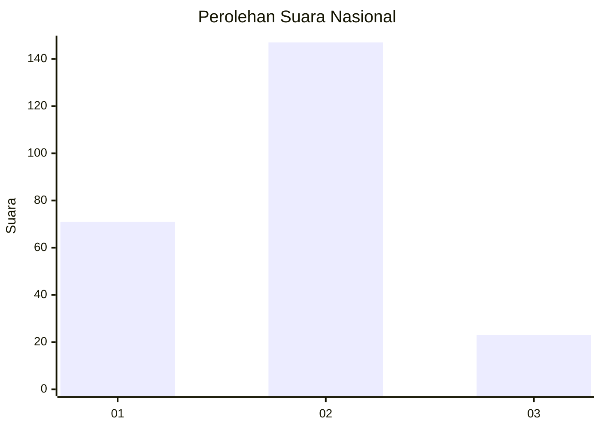
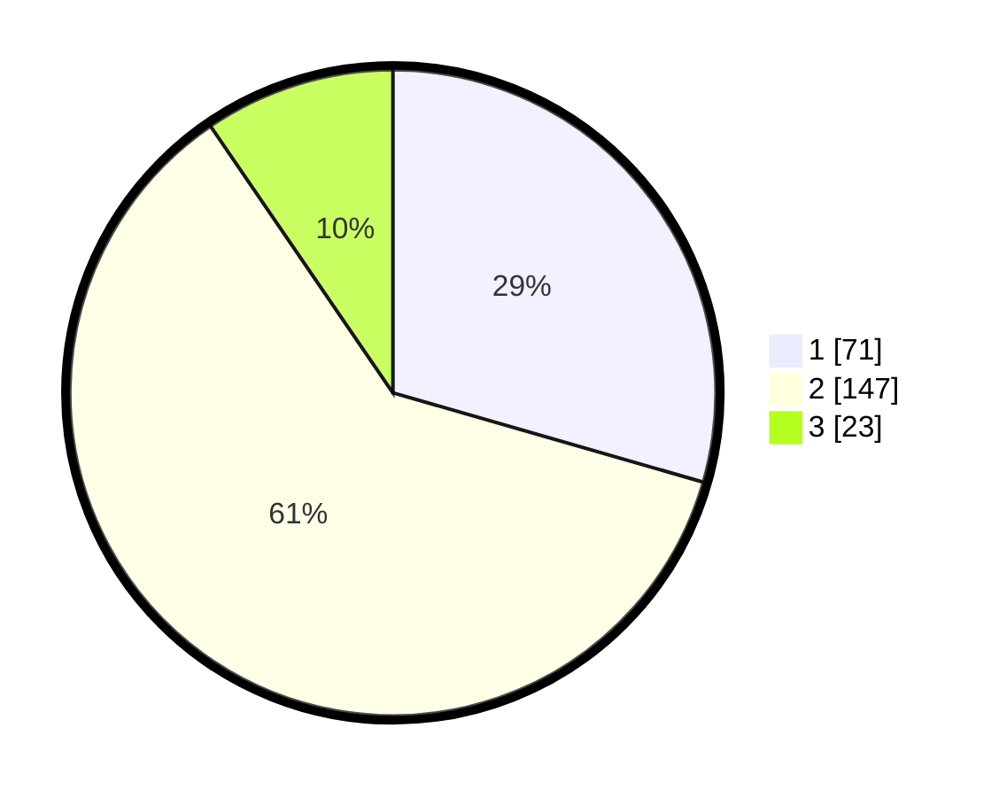

# Hasil

## Grafik

## Tabel

| No. | Nama Paslon    | Suara | Suara (raw) | Persentase |
|:--- |:-------------- | -----:| -----------:| ----------:|
| 1   | ANIES MUHAIMIN | 71    | [71][p-1]   | 29,46      |
| 2   | PRABOWO GIBRAN | 147   | [147][p-2]  | 61,00      |
| 3   | GANJAR MAHFUD  | 23    | [23][p-3]   | 9,54       |

[p-1]: https://github.com/gigit-pemilu/pemilu-2024/blob/main/pilpres/hitung-suara/sub/51-bali/sub/01-jembrana/sub/01-negara/sub/2003-banyubiru/sub/013-tps/sub/paslon-1.txt
[p-2]: https://github.com/gigit-pemilu/pemilu-2024/blob/main/pilpres/hitung-suara/sub/51-bali/sub/01-jembrana/sub/01-negara/sub/2003-banyubiru/sub/013-tps/sub/paslon-2.txt
[p-3]: https://github.com/gigit-pemilu/pemilu-2024/blob/main/pilpres/hitung-suara/sub/51-bali/sub/01-jembrana/sub/01-negara/sub/2003-banyubiru/sub/013-tps/sub/paslon-3.txt

## Foto C Plano

https://sirekap-obj-formc.kpu.go.id/bdce/pemilu/ppwp/51/01/01/20/03/5101012003013-20240215-025211--d113c504-0b5d-4e4b-8e0e-6e8a3b71a700.jpg

https://sirekap-obj-formc.kpu.go.id/bdce/pemilu/ppwp/51/01/01/20/03/5101012003013-20240215-025412--fe4844c3-5ae2-4ef9-9167-1f1100230089.jpg

https://sirekap-obj-formc.kpu.go.id/bdce/pemilu/ppwp/51/01/01/20/03/5101012003013-20240215-025612--f57f57e7-85ed-44a1-b45d-c36b3bb582b5.jpg

## Metadata

| Key        | Value               |
| ---------- | ------------------- |
| Time Stamp | 2024-02-16 06:30:27 |

## DATA PEMILIH TETAP

Jumlah pemilih dalam DPT: **286**.
 * L: **150**.
 * P: **136**.

## DATA PENGGUNA HAK PILIH

Jumlah pengguna hak pilih dalam DPT: **246**.
 * L: **126**.
 * P: **120**.

Jumlah pengguna hak pilih dalam DPTb: **0**.
 * L: **0**.
 * P: **0**.

Jumlah pengguna hak pilih dalam DPK: **0**.
 * L: **0**.
 * P: **0**.

Jumlah pengguna hak pilih: **246**.
 * L: **126**.
 * P: **120**.

## JUMLAH SUARA SAH DAN TIDAK SAH

JUMLAH SELURUH SUARA SAH: **241**.

JUMLAH SUARA TIDAK SAH: **5**.

JUMLAH SELURUH SUARA SAH DAN SUARA TIDAK SAH: **246**.

