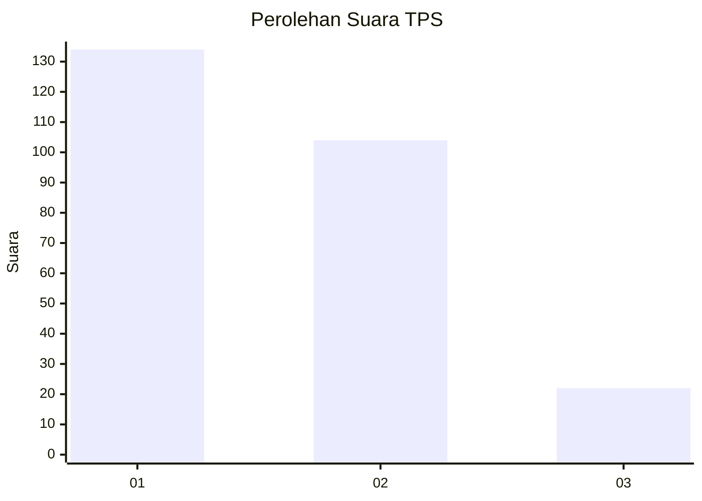
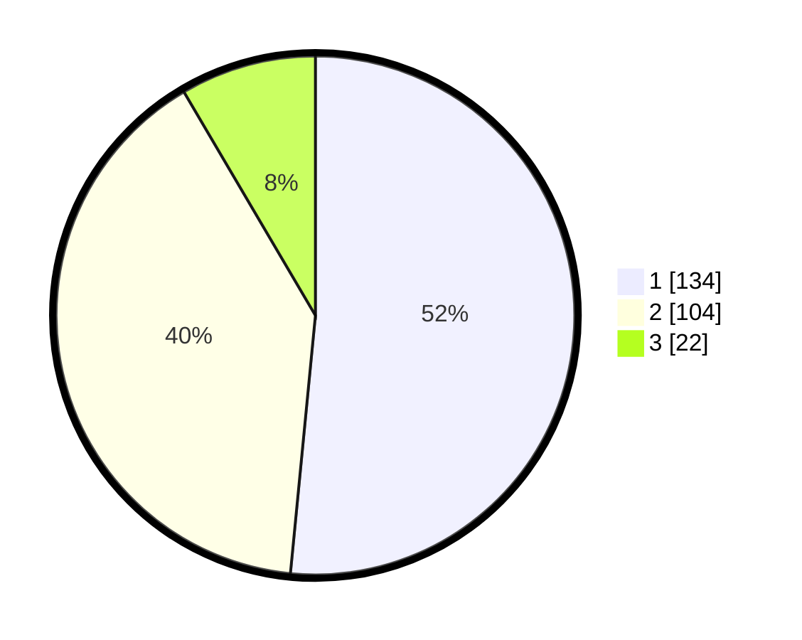

# Hasil

## Grafik

## Tabel

| No. | Nama Paslon    | Suara | Suara (raw) | Persentase |
|:--- |:-------------- | -----:| -----------:| ----------:|
| 1   | ANIES MUHAIMIN | 134   | [134][p-1]  | 51,54      |
| 2   | PRABOWO GIBRAN | 104   | [104][p-2]  | 40,00      |
| 3   | GANJAR MAHFUD  | 22    | [22][p-3]   | 8,46       |

[p-1]: https://github.com/gigit-pemilu/pemilu-2024-51-bali/blob/main/pilpres/hitung-suara/sub/51-bali/sub/01-jembrana/sub/01-negara/sub/2003-banyubiru/sub/015-tps/sub/paslon-1.txt
[p-2]: https://github.com/gigit-pemilu/pemilu-2024-51-bali/blob/main/pilpres/hitung-suara/sub/51-bali/sub/01-jembrana/sub/01-negara/sub/2003-banyubiru/sub/015-tps/sub/paslon-2.txt
[p-3]: https://github.com/gigit-pemilu/pemilu-2024-51-bali/blob/main/pilpres/hitung-suara/sub/51-bali/sub/01-jembrana/sub/01-negara/sub/2003-banyubiru/sub/015-tps/sub/paslon-3.txt

## Foto C Plano

https://sirekap-obj-formc.kpu.go.id/f415/pemilu/ppwp/51/01/01/20/03/5101012003015-20240214-190725--ec23f91f-e5f4-4d82-aeab-ad61e6990740.jpg

https://sirekap-obj-formc.kpu.go.id/f415/pemilu/ppwp/51/01/01/20/03/5101012003015-20240214-155726--09e42923-77e3-4722-9849-088ef91303cd.jpg

https://sirekap-obj-formc.kpu.go.id/f415/pemilu/ppwp/51/01/01/20/03/5101012003015-20240214-191517--50c042f6-16ec-4672-bc52-8c5eba6c64bd.jpg

## Metadata

| Key        | Value               |
| ---------- | ------------------- |
| Time Stamp | 2024-02-14 21:46:01 |

## DATA PEMILIH TETAP

Jumlah pemilih dalam DPT: **287**.
 * L: **134**.
 * P: **153**.

## DATA PENGGUNA HAK PILIH

Jumlah pengguna hak pilih dalam DPT: **247**.
 * L: **111**.
 * P: **136**.

Jumlah pengguna hak pilih dalam DPTb: **9**.
 * L: **5**.
 * P: **4**.

Jumlah pengguna hak pilih dalam DPK: **4**.
 * L: **1**.
 * P: **3**.

Jumlah pengguna hak pilih: **260**.
 * L: **117**.
 * P: **143**.

## JUMLAH SUARA SAH DAN TIDAK SAH

JUMLAH SELURUH SUARA SAH: **260**.

JUMLAH SUARA TIDAK SAH: **0**.

JUMLAH SELURUH SUARA SAH DAN SUARA TIDAK SAH: **260**.

