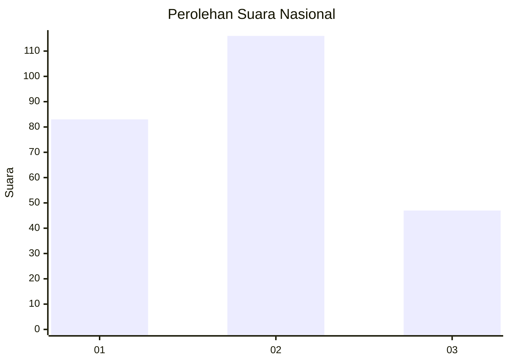
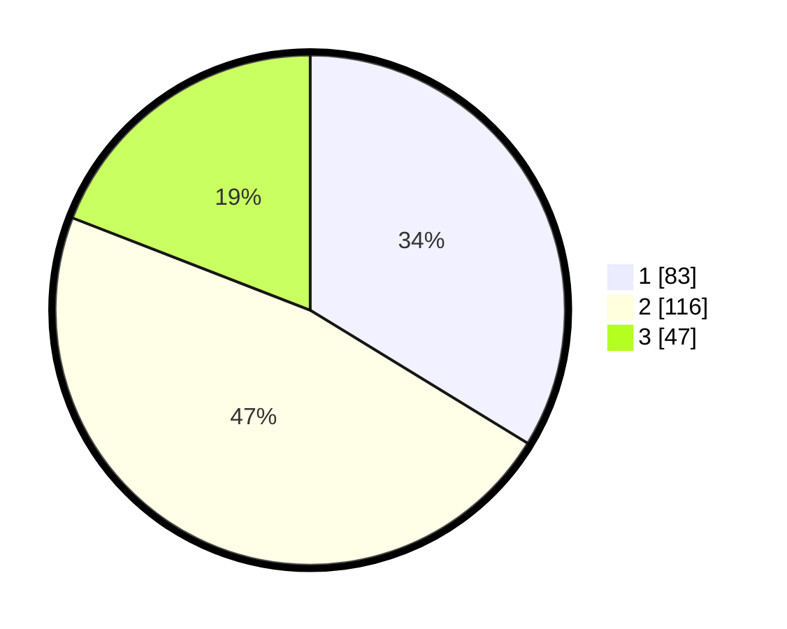

# Hasil

## Grafik

## Tabel

| No. | Nama Paslon    | Suara | Suara (raw) | Persentase |
|:--- |:-------------- | -----:| -----------:| ----------:|
| 1   | ANIES MUHAIMIN | 83    | [83][p-1]   | 33,74      |
| 2   | PRABOWO GIBRAN | 116   | [116][p-2]  | 47,15      |
| 3   | GANJAR MAHFUD  | 47    | [47][p-3]   | 19,11      |

[p-1]: https://github.com/gigit-pemilu/pemilu-2024/blob/main/pilpres/hitung-suara/sub/51-bali/sub/01-jembrana/sub/01-negara/sub/2003-banyubiru/sub/022-tps/sub/paslon-1.txt
[p-2]: https://github.com/gigit-pemilu/pemilu-2024/blob/main/pilpres/hitung-suara/sub/51-bali/sub/01-jembrana/sub/01-negara/sub/2003-banyubiru/sub/022-tps/sub/paslon-2.txt
[p-3]: https://github.com/gigit-pemilu/pemilu-2024/blob/main/pilpres/hitung-suara/sub/51-bali/sub/01-jembrana/sub/01-negara/sub/2003-banyubiru/sub/022-tps/sub/paslon-3.txt

## Foto C Plano

https://sirekap-obj-formc.kpu.go.id/357a/pemilu/ppwp/51/01/01/20/03/5101012003022-20240214-205550--d47fda16-ae7d-4eae-bb90-a230e08dd2c0.jpg

https://sirekap-obj-formc.kpu.go.id/357a/pemilu/ppwp/51/01/01/20/03/5101012003022-20240214-205601--76f311f6-71f7-427d-b567-f6f13be96fff.jpg

https://sirekap-obj-formc.kpu.go.id/357a/pemilu/ppwp/51/01/01/20/03/5101012003022-20240214-205611--a29350eb-7aaf-4b16-913b-22a23eddd8bd.jpg

## Metadata

| Key        | Value               |
| ---------- | ------------------- |
| Time Stamp | 2024-02-15 15:00:29 |

## DATA PEMILIH TETAP

Jumlah pemilih dalam DPT: **287**.
 * L: **148**.
 * P: **139**.

## DATA PENGGUNA HAK PILIH

Jumlah pengguna hak pilih dalam DPT: **243**.
 * L: **121**.
 * P: **122**.

Jumlah pengguna hak pilih dalam DPTb: **0**.
 * L: **0**.
 * P: **0**.

Jumlah pengguna hak pilih dalam DPK: **9**.
 * L: **3**.
 * P: **6**.

Jumlah pengguna hak pilih: **252**.
 * L: **124**.
 * P: **128**.

## JUMLAH SUARA SAH DAN TIDAK SAH

JUMLAH SELURUH SUARA SAH: **246**.

JUMLAH SUARA TIDAK SAH: **6**.

JUMLAH SELURUH SUARA SAH DAN SUARA TIDAK SAH: **252**.

