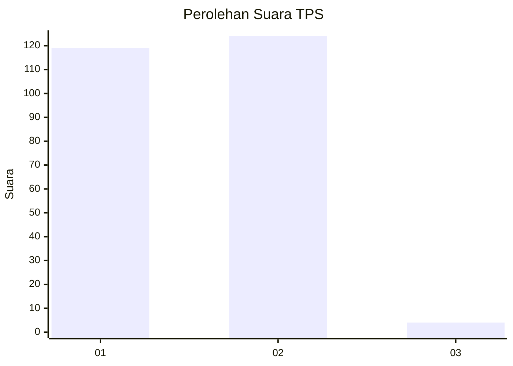
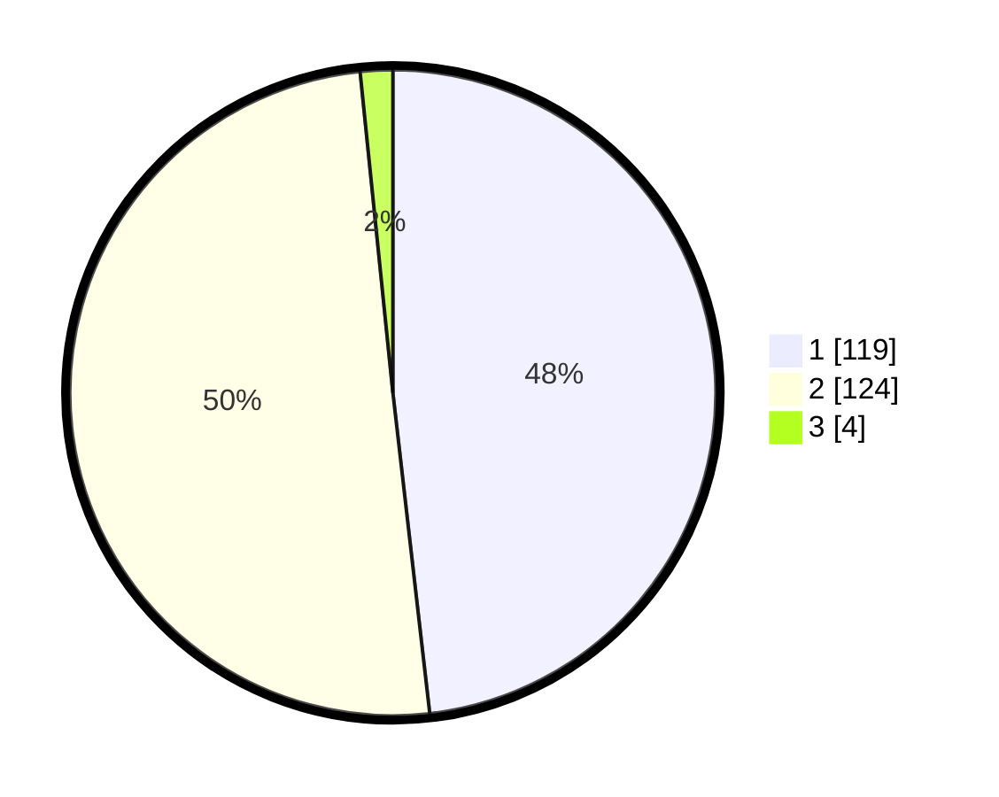

# Hasil

## Grafik

## Tabel

| No. | Nama Paslon    | Suara | Suara (raw) | Persentase |
|:--- |:-------------- | -----:| -----------:| ----------:|
| 1   | ANIES MUHAIMIN | 119   | [119][p-1]  | 48,18      |
| 2   | PRABOWO GIBRAN | 124   | [124][p-2]  | 50,20      |
| 3   | GANJAR MAHFUD  | 4     | [4][p-3]    | 1,62       |

[p-1]: https://github.com/gigit-pemilu/pemilu-2024-51-bali/blob/main/pilpres/hitung-suara/sub/51-bali/sub/01-jembrana/sub/01-negara/sub/2003-banyubiru/sub/024-tps/sub/paslon-1.txt
[p-2]: https://github.com/gigit-pemilu/pemilu-2024-51-bali/blob/main/pilpres/hitung-suara/sub/51-bali/sub/01-jembrana/sub/01-negara/sub/2003-banyubiru/sub/024-tps/sub/paslon-2.txt
[p-3]: https://github.com/gigit-pemilu/pemilu-2024-51-bali/blob/main/pilpres/hitung-suara/sub/51-bali/sub/01-jembrana/sub/01-negara/sub/2003-banyubiru/sub/024-tps/sub/paslon-3.txt

## Foto C Plano

https://sirekap-obj-formc.kpu.go.id/134e/pemilu/ppwp/51/01/01/20/03/5101012003024-20240214-214339--e37007d1-aaf3-4c0f-be48-43d0223ee9af.jpg

https://sirekap-obj-formc.kpu.go.id/134e/pemilu/ppwp/51/01/01/20/03/5101012003024-20240214-214249--f00a8792-395e-4540-bbe9-52d2105bb50f.jpg

## Metadata

| Key        | Value               |
| ---------- | ------------------- |
| Time Stamp | 2024-02-15 09:00:24 |

