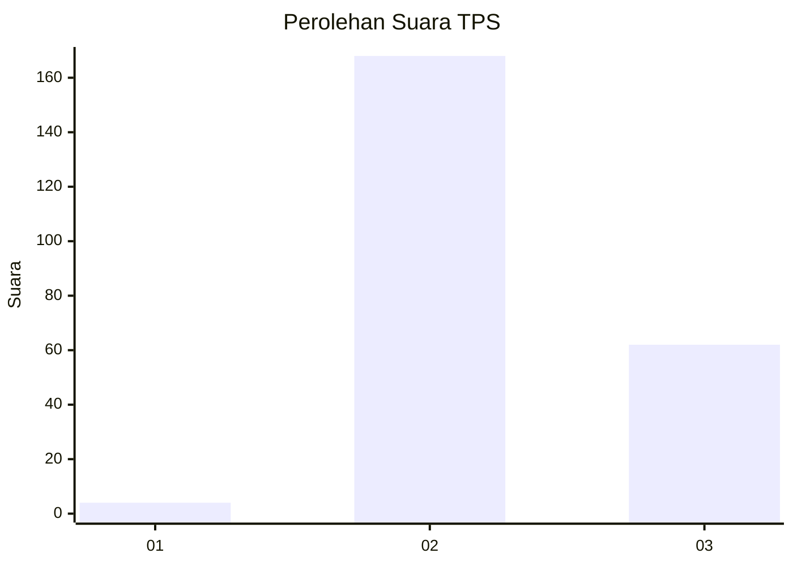
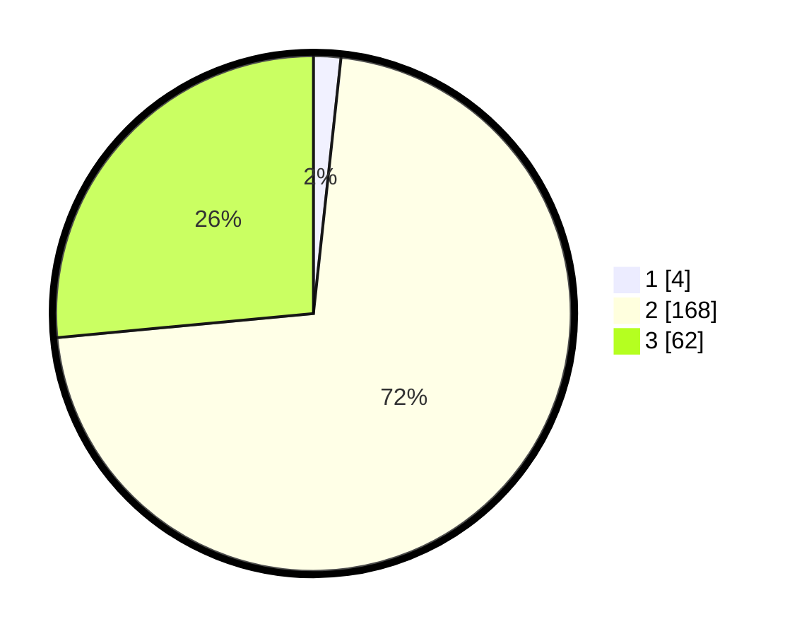

# Hasil

## Grafik

## Tabel

| No. | Nama Paslon    | Suara | Suara (raw) | Persentase |
|:--- |:-------------- | -----:| -----------:| ----------:|
| 1   | ANIES MUHAIMIN | 4     | [4][p-1]    | 1,71       |
| 2   | PRABOWO GIBRAN | 168   | [168][p-2]  | 71,79      |
| 3   | GANJAR MAHFUD  | 62    | [62][p-3]   | 26,50      |

[p-1]: https://github.com/gigit-pemilu/pemilu-2024-51-bali/blob/main/pilpres/hitung-suara/sub/51-bali/sub/01-jembrana/sub/01-negara/sub/2004-kaliakah/sub/002-tps/sub/paslon-1.txt
[p-2]: https://github.com/gigit-pemilu/pemilu-2024-51-bali/blob/main/pilpres/hitung-suara/sub/51-bali/sub/01-jembrana/sub/01-negara/sub/2004-kaliakah/sub/002-tps/sub/paslon-2.txt
[p-3]: https://github.com/gigit-pemilu/pemilu-2024-51-bali/blob/main/pilpres/hitung-suara/sub/51-bali/sub/01-jembrana/sub/01-negara/sub/2004-kaliakah/sub/002-tps/sub/paslon-3.txt

## Foto C Plano

https://sirekap-obj-formc.kpu.go.id/39fc/pemilu/ppwp/51/01/01/20/04/5101012004002-20240216-022248--92568d08-3c73-4e08-bdaf-d3c41d980929.jpg

https://sirekap-obj-formc.kpu.go.id/39fc/pemilu/ppwp/51/01/01/20/04/5101012004002-20240216-022301--bc0b9f36-f40a-4613-b726-7e810fcf7793.jpg

https://sirekap-obj-formc.kpu.go.id/39fc/pemilu/ppwp/51/01/01/20/04/5101012004002-20240216-022255--191e5c73-b7d8-44c7-9162-3ea3cc025f3d.jpg

## Metadata

| Key        | Value               |
| ---------- | ------------------- |
| Time Stamp | 2024-02-16 08:00:28 |

## DATA PEMILIH TETAP

Jumlah pemilih dalam DPT: **297**.
 * L: **147**.
 * P: **150**.

## DATA PENGGUNA HAK PILIH

Jumlah pengguna hak pilih dalam DPT: **234**.
 * L: **114**.
 * P: **120**.

Jumlah pengguna hak pilih dalam DPTb: **0**.
 * L: **0**.
 * P: **0**.

Jumlah pengguna hak pilih dalam DPK: **0**.
 * L: **0**.
 * P: **0**.

Jumlah pengguna hak pilih: **234**.
 * L: **114**.
 * P: **120**.

## JUMLAH SUARA SAH DAN TIDAK SAH

JUMLAH SELURUH SUARA SAH: **234**.

JUMLAH SUARA TIDAK SAH: **0**.

JUMLAH SELURUH SUARA SAH DAN SUARA TIDAK SAH: **234**.

