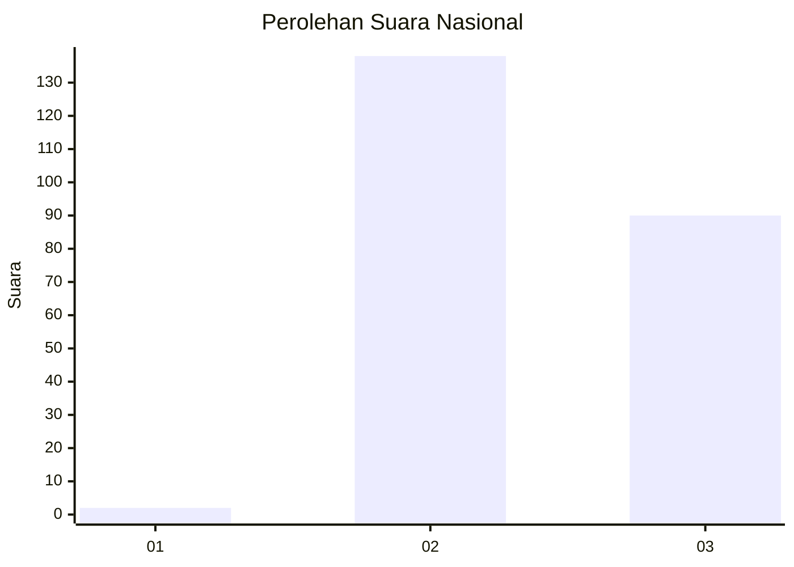
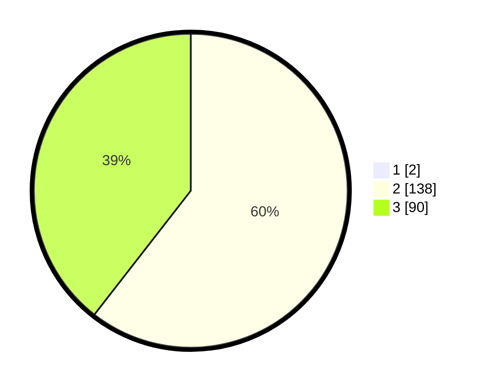

# Hasil

## Grafik

## Tabel

| No. | Nama Paslon    | Suara | Suara (raw) | Persentase |
|:--- |:-------------- | -----:| -----------:| ----------:|
| 1   | ANIES MUHAIMIN | 2     | [2][p-1]    | 0,87       |
| 2   | PRABOWO GIBRAN | 138   | [138][p-2]  | 60,00      |
| 3   | GANJAR MAHFUD  | 90    | [90][p-3]   | 39,13      |

[p-1]: https://github.com/gigit-pemilu/pemilu-2024/blob/main/pilpres/hitung-suara/sub/51-bali/sub/01-jembrana/sub/01-negara/sub/2004-kaliakah/sub/007-tps/sub/paslon-1.txt
[p-2]: https://github.com/gigit-pemilu/pemilu-2024/blob/main/pilpres/hitung-suara/sub/51-bali/sub/01-jembrana/sub/01-negara/sub/2004-kaliakah/sub/007-tps/sub/paslon-2.txt
[p-3]: https://github.com/gigit-pemilu/pemilu-2024/blob/main/pilpres/hitung-suara/sub/51-bali/sub/01-jembrana/sub/01-negara/sub/2004-kaliakah/sub/007-tps/sub/paslon-3.txt

## Foto C Plano

https://sirekap-obj-formc.kpu.go.id/bda9/pemilu/ppwp/51/01/01/20/04/5101012004007-20240216-144421--dadd36c1-5e1a-4b12-a514-c761718ce14d.jpg

https://sirekap-obj-formc.kpu.go.id/bda9/pemilu/ppwp/51/01/01/20/04/5101012004007-20240216-144422--599d76ff-ecb0-42d2-abc5-7387e33636ec.jpg

https://sirekap-obj-formc.kpu.go.id/bda9/pemilu/ppwp/51/01/01/20/04/5101012004007-20240216-144421--3f5e119f-e04d-441a-9207-5ce91815a0e2.jpg

## Metadata

| Key        | Value               |
| ---------- | ------------------- |
| Time Stamp | 2024-02-16 16:25:10 |

## DATA PEMILIH TETAP

Jumlah pemilih dalam DPT: **290**.
 * L: **149**.
 * P: **141**.

## DATA PENGGUNA HAK PILIH

Jumlah pengguna hak pilih dalam DPT: **231**.
 * L: **119**.
 * P: **112**.

Jumlah pengguna hak pilih dalam DPTb: **0**.
 * L: **0**.
 * P: **0**.

Jumlah pengguna hak pilih dalam DPK: **0**.
 * L: **0**.
 * P: **0**.

Jumlah pengguna hak pilih: **231**.
 * L: **119**.
 * P: **112**.

## JUMLAH SUARA SAH DAN TIDAK SAH

JUMLAH SELURUH SUARA SAH: **230**.

JUMLAH SUARA TIDAK SAH: **1**.

JUMLAH SELURUH SUARA SAH DAN SUARA TIDAK SAH: **231**.

