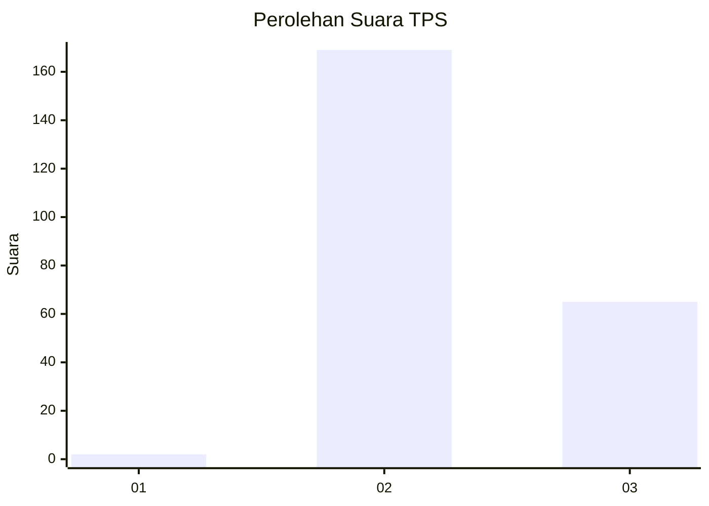
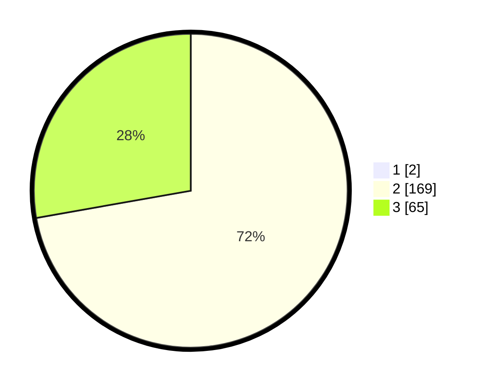

# Hasil

## Grafik

## Tabel

| No. | Nama Paslon    | Suara | Suara (raw) | Persentase |
|:--- |:-------------- | -----:| -----------:| ----------:|
| 1   | ANIES MUHAIMIN | 2     | [2][p-1]    | 0,85       |
| 2   | PRABOWO GIBRAN | 169   | [169][p-2]  | 71,61      |
| 3   | GANJAR MAHFUD  | 65    | [65][p-3]   | 27,54      |

[p-1]: https://github.com/gigit-pemilu/pemilu-2024-51-bali/blob/main/pilpres/hitung-suara/sub/51-bali/sub/01-jembrana/sub/01-negara/sub/2004-kaliakah/sub/010-tps/sub/paslon-1.txt
[p-2]: https://github.com/gigit-pemilu/pemilu-2024-51-bali/blob/main/pilpres/hitung-suara/sub/51-bali/sub/01-jembrana/sub/01-negara/sub/2004-kaliakah/sub/010-tps/sub/paslon-2.txt
[p-3]: https://github.com/gigit-pemilu/pemilu-2024-51-bali/blob/main/pilpres/hitung-suara/sub/51-bali/sub/01-jembrana/sub/01-negara/sub/2004-kaliakah/sub/010-tps/sub/paslon-3.txt

## Foto C Plano

https://sirekap-obj-formc.kpu.go.id/9858/pemilu/ppwp/51/01/01/20/04/5101012004010-20240215-012141--ac8c5f48-af6a-4bd0-8954-b10fcb69df33.jpg

https://sirekap-obj-formc.kpu.go.id/9858/pemilu/ppwp/51/01/01/20/04/5101012004010-20240214-184847--645f8889-d02f-4beb-b77c-e242f42d0b87.jpg

## Metadata

| Key        | Value               |
| ---------- | ------------------- |
| Time Stamp | 2024-02-15 09:00:24 |

