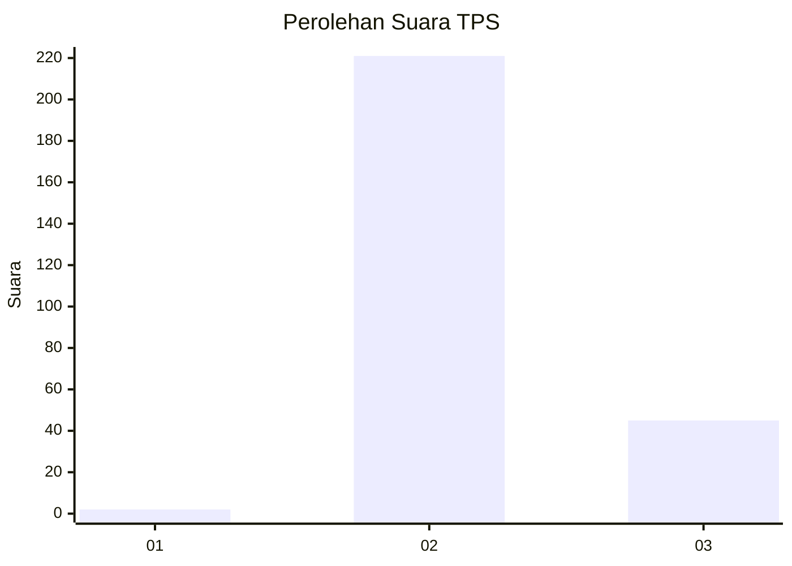
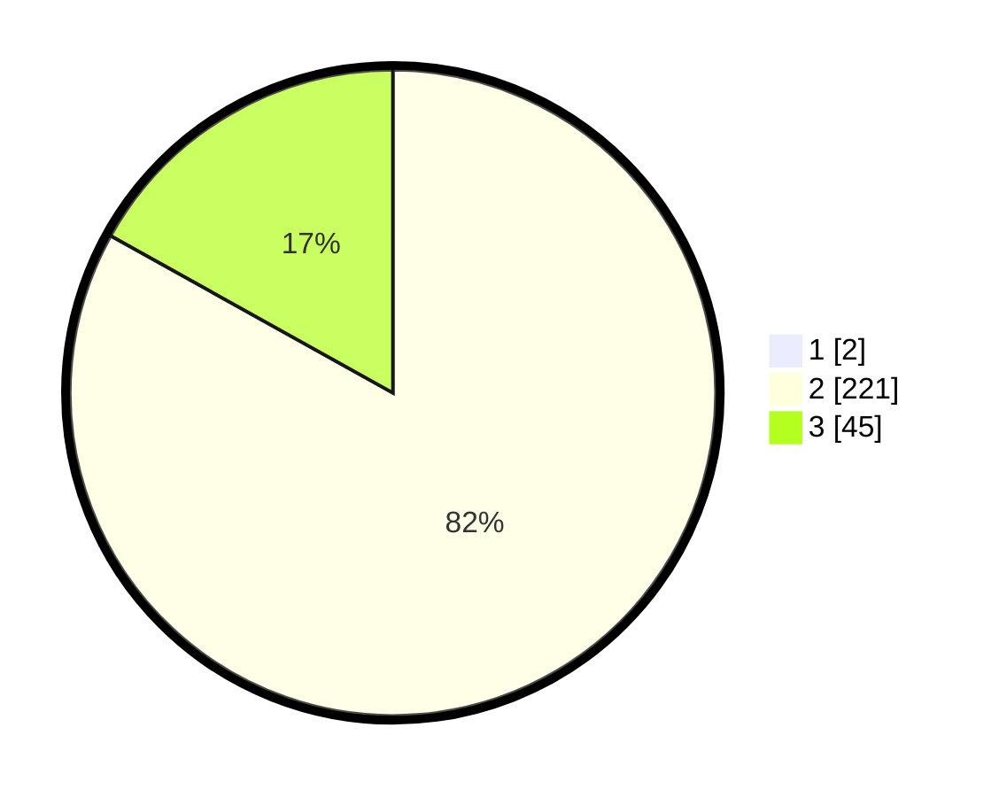

# Hasil

## Grafik

## Tabel

| No. | Nama Paslon    | Suara | Suara (raw) | Persentase |
|:--- |:-------------- | -----:| -----------:| ----------:|
| 1   | ANIES MUHAIMIN | 2     | [2][p-1]    | 0,75       |
| 2   | PRABOWO GIBRAN | 221   | [221][p-2]  | 82,46      |
| 3   | GANJAR MAHFUD  | 45    | [45][p-3]   | 16,79      |

[p-1]: https://github.com/gigit-pemilu/pemilu-2024-51-bali/blob/main/pilpres/hitung-suara/sub/51-bali/sub/01-jembrana/sub/01-negara/sub/2004-kaliakah/sub/013-tps/sub/paslon-1.txt
[p-2]: https://github.com/gigit-pemilu/pemilu-2024-51-bali/blob/main/pilpres/hitung-suara/sub/51-bali/sub/01-jembrana/sub/01-negara/sub/2004-kaliakah/sub/013-tps/sub/paslon-2.txt
[p-3]: https://github.com/gigit-pemilu/pemilu-2024-51-bali/blob/main/pilpres/hitung-suara/sub/51-bali/sub/01-jembrana/sub/01-negara/sub/2004-kaliakah/sub/013-tps/sub/paslon-3.txt

## Foto C Plano

https://sirekap-obj-formc.kpu.go.id/ce9e/pemilu/ppwp/51/01/01/20/04/5101012004013-20240215-002629--3a82c921-b90c-4c22-8cf4-164c7da73ece.jpg

## Metadata

| Key        | Value               |
| ---------- | ------------------- |
| Time Stamp | 2024-02-24 22:31:28 |

